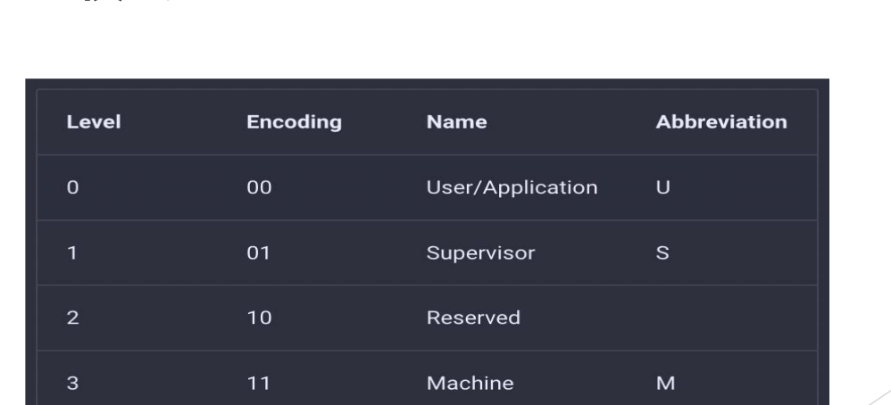
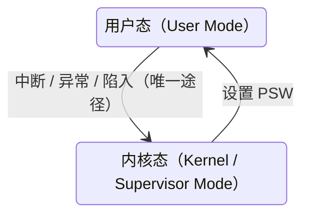

# 07 处理器特权模式

[本讲目录](../index.md) · [课程目录](../../index.md) · [上一节：06 trap 机制总览](06-trap-mechanism-overview-and-guiding-questions.md) · [下一节：08 中断与异常概念](08-interrupt-mechanism-concepts-and-classification.md)

> [!abstract] 本节要点
> - 寄存器分**用户可见寄存器**和**控制和状态寄存器**（PC、IR、PSW）；操作系统关心的是后者，以及内存中的代码、数据、栈。
> - 保护需要硬件支持：处理器提供多种运行模式，不同模式可执行的指令集合不同；硬件提供几种、软件用几种是两回事。
> - 操作系统只需两种状态：**内核态**可执行全部指令（含特权指令），**用户态**只能执行非特权指令；x86 用 R0/R3，RISC-V 用 S/U（M 模式在操作系统之下）。
> - 用户态 → 内核态的**唯一途径**是中断/异常/陷入机制；内核态 → 用户态靠设置 PSW。
> - **陷入指令**（访管指令）是非特权指令：RISC-V 用 `ecall`，Linux/x86 用 `int 0x80`，后来有 `sysenter`/`sysexit`，x86-64 用 `syscall`。

## 处理器与寄存器

操作系统设计者要回答的第一个硬件问题是：处理器与操作系统的接口是什么？[^s2p8]

CPU 有多种示意画法（ICS 的图和其他教材的图），看哪张都不重要，重要的是关注什么：[^s2p9]

- **寄存器**，尤其是**程序计数器 PC**（ICS 的一张图里没有把 PC 单独标出来）；
- **内存**中的内容：代码（Code）、数据（Data）、栈（Stack），以及堆（Heap）。

处理器由运算器、控制器、一系列寄存器和高速缓存构成。[^s2p10] 运算器之类的硬件部件操作系统管不到，它只管到寄存器这一层。寄存器分为两类：[^s2p10] [^s3b6]

| 类别 | 包括 | 谁使用 | 访问条件 |
|---|---|---|---|
| **用户可见寄存器** | 数据寄存器（通用寄存器）、地址寄存器、条件码寄存器（保存 CPU 操作结果的各种标记位） | 机器语言（汇编）可直接引用 | 任何程序 |
| **控制和状态寄存器** | 程序计数器 PC（Program Counter）、指令寄存器 IR（Instruction Register）、程序状态字 PSW（Program Status Word） | 用于控制处理器的操作 | 只能在某种特权级别下访问、修改 |

操作系统重点关注控制和状态寄存器，因为要读取和设置它们；x86 和 RISC-V 各有哪些这类寄存器，是后面读 xv6 代码时必须知道的。

## 保护与处理器模式

**保护**的需求来自操作系统的并发与共享特征：多个程序同时在系统中运行、共享资源，就必须实现保护与控制，而这需要**硬件机制**把操作系统与用户程序**隔离**开。[^s2p11]

隔离和保护是同一件事的两个角度：**隔离是手段，保护是效果**。虚存是一个典型例子：每个进程有自己的虚拟地址空间，范围一直“顶到头”，程序的地址再怎么乱跑也跑不出这个空间，不可能跑到别的进程或操作系统里去。[^s3b6] 需要保护的关系有两层：进程不能干扰操作系统（操作系统可以控制进程，但不会弄坏进程），进程之间也要相互保护。[^s3b7]

硬件提供的基本运行机制是：**处理器具有不同的运行模式（mode），不同运行模式下可执行的指令集合不同**，这就是**特权级别**。[^s2p11] 操作系统权力最大，可以执行所有指令；一些进程只能执行最小的指令集合。要区分两件事：硬件提供了几种模式、提供到什么程度，是硬件的设计；软件用不用、用哪几种，是软件的选择。[^s3b7]

### PSW 与 x86 的 EFLAGS

现代处理器通常把 CPU 状态划分为两种、三种或四种。处理器在**程序状态字寄存器 PSW** 中专门设置一个位置，根据运行程序对资源和指令的使用权限设置不同的 CPU 状态；x86 的描述符中也设置了权限级别。[^s2p12]

“程序状态字”是抽象出来的通用名，不特指某台机器，x86 和 RISC-V 的对应寄存器各有自己的名字；“专门设置一位”中的“一”是虚指，意思是设置这样一个字段，不一定只有 1 位。x86 的例子是 **EFLAGS** 寄存器，其中的 **IOPL**（I/O Privilege Level）字段占两位，可以表示 4 个级别。[^s3b7] EFLAGS 各位的布局见 Intel 手册；可以延伸了解的是：ARM、RISC-V 的状态控制寄存器是什么（可参考 xv6-book 4.1 节）。[^s2p13]

> [!note] 补充解释
> 在 x86 中，**当前特权级**（CPL，Current Privilege Level）实际保存在代码段寄存器 CS 的低两位；EFLAGS 中的 IOPL 规定的是执行 I/O 指令（如 `in`、`out`、`cli`、`sti`）所需的特权级，当 CPL 的数值不大于 IOPL 时才允许执行。两者都是 2 位、都对应 R0~R3，上文用 IOPL 举例说明“特权主要体现在 I/O 操作上”，但它不是 CPU 当前所处模式本身。参见 [Intel SDM 第 3 卷](https://www.intel.com/content/www/us/en/developer/articles/technical/intel-sdm.html)。

## 特权指令与两种 CPU 状态

**特权指令**（privileged instruction）是只能由操作系统使用、用户程序不能使用的指令；**非特权指令**是用户程序可以使用的指令。[^s2p14] 判断原则是：如果普通用户能随便执行某条指令就会导致系统混乱，它就是特权指令；谁执行都不影响系统的，就是非特权指令。[^s3b7]

硬件可能提供多种模式，但操作系统只需要**两种 CPU 状态**：[^s2p14]

- **内核态**（Kernel Mode）：运行操作系统程序，可以执行全部指令，包括特权指令；
- **用户态**（User Mode）：运行用户程序，只能执行非特权指令。

内核态也称 **supervisor mode**（监管态），supervisor 是操作系统的传统称呼。[^s2p17]

> [!example] 例：下列功能对应的指令哪些是特权指令？
> 启动 I/O、控制转移、内存清零、修改程序状态字、设置时钟、算术运算、允许/禁止中断、访管指令、取数指令、停机。[^s2p16]
>
> 1. **特权指令**：启动 I/O、内存清零、修改程序状态字、设置时钟、允许/禁止中断、停机。它们一旦被普通程序随意执行，就会破坏设备、他人数据、保护机制或整个系统的运行。用户修改系统时间，也是通过接口请操作系统去改，而不是自己直接执行设置时钟的指令。[^s3b8]
> 2. **非特权指令**：控制转移、算术运算、取数指令、访管指令。
> 3. 访管指令是刻意安排的一项：它的作用正是让用户程序从用户态进入内核态，是用户程序请求操作系统服务的“敲门砖”，所以用户态必须能执行它，它是**非特权指令**。[^s3b7]

> [!warning] 易错点
> 访管指令（陷入指令）会让 CPU 进入内核态，但它本身是**非特权指令**。如果它是特权指令，用户程序就永远无法请求系统服务。

## x86 特权环与 RISC-V 特权模式

**x86** 支持 4 个处理器特权级别，称为**特权环** R0、R1、R2、R3，特权能力从 R0 到 R3 由高到低。R0 相当于内核态，运行操作系统；R3 相当于用户态，运行用户进程；R1、R2 介于两者之间。不同级别能运行的指令集合不同，目前大多数基于 x86 的操作系统只用了 R0 和 R3。[^s2p14]

模式切换还牵涉到**栈**。用户进程运行时用自己的栈，操作系统运行时也要用栈，两者不能混用，否则会相互破坏。因此 x86 为特权级准备了各自的栈指针（SS0:ESP0、SS1:ESP1 ……），**模式一切换，栈也要跟着切换**，这由硬件保证。[^s3b7]

> [!note] 补充解释
> 更准确地说，x86 在任务状态段（TSS）中只保存 R0、R1、R2 三套栈指针（SS0:ESP0、SS1:ESP1、SS2:ESP2）；R3 的栈就是用户程序当前使用的 SS:ESP。从低特权级进入高特权级时，硬件从 TSS 取出目标级别的栈指针，并把原来的 SS:ESP 压入新栈，返回时再恢复。“四套栈指针”是概括说法。

**RISC-V** 定义了三种特权模式：[^s2p15]

- **用户模式**（U 模式，User/Application）：等同于用户态；
- **监管模式**（S 模式，Supervisor）：就是操作系统所在的内核态；
- **机器模式**（M 模式，Machine）：在操作系统之下，操作系统控制不了它，只能向它发出请求，就像用户程序向操作系统发请求一样。[^s3b7]

图：RISC-V 用 2 位编码特权级：00 为用户模式 U，01 为监管模式 S，10 保留，11 为机器模式 M。

RISC-V 用 2 位编码特权级，四种取值中 `10` 暂未使用（保留），编码数值越大特权越高。[^s2p15]

| 对比项 | x86 | RISC-V |
|---|---|---|
| 硬件提供的级别 | 4 个：R0~R3 | 3 个：U、S、M（另有 1 个保留编码） |
| 特权最高 | R0 | M 模式 |
| 操作系统运行在 | R0 | S 模式 |
| 用户程序运行在 | R3 | U 模式 |
| 很少使用 / 操作系统之下 | R1、R2 很少使用 | M 模式在操作系统之下 |

注意编号方向相反：x86 数字越小特权越高，RISC-V 数字越大特权越高。

## 用户态与内核态的转换

系统时时刻刻都在发生用户态与内核态之间的转换，转换路径是固定的：[^s2p17]

1. **用户态 → 内核态**：**唯一途径**是中断/异常/陷入机制。叫中断、异常还是陷入都可以：广义的“中断”包括异常和陷入，ICS 统称异常，xv6 叫 trap。[^s3b8]
2. **内核态 → 用户态**：通过**设置程序状态字 PSW**。进程进入内核办完事就要离开，不能一直留在内核里，就像去银行办完业务就走。[^s3b8]

### 陷入指令

用户程序主动请求操作系统服务时，需要一条特殊的指令：**陷入指令**，又称**访管指令**。它是提供给用户程序的接口，用于调用操作系统的功能（服务）；用它进入内核是一种**主动**行为。[^s2p17] 常见的陷入指令有 `int`、`trap`、`syscall`、`sysenter`/`sysexit`、`ecall`，它们分别属于：[^s3b8]

- **RISC-V**：`ecall`。
- **x86 + Linux**：`int 0x80`。Intel 处理器共有 256 个中断向量，Linux 选定 `0x80` 作为系统调用入口；Windows 等系统可以选别的号。
- **x86（Pentium II 之后）**：增加了 `sysenter`/`sysexit` 这一对指令。此前没有它们，只能用 `int` 经过中断描述符表进入内核；之后硬件提供了这对指令，有的系统用，有的不用。
- **x86-64**：`syscall`。

进入和退出总是成对的，例如 `int` 与 `iret`、`sysenter` 与 `sysexit`。为什么 x86 已有 `int 0x80` 还要增加 `sysenter`/`sysexit`、二者有何不同，是[问题 2](06-trap-mechanism-overview-and-guiding-questions.md) 中留待 L03「07 Linux 系统调用执行」回答的问题。

硬件和软件的这种协作就像跳华尔兹的一对舞伴：你进我退，必须协调，不能两个人同时向前。硬件提供机制，软件选择用或不用。[^s3b8]

> [!note] 补充解释
> 从内核态返回用户态时，“设置 PSW”通常由专门的返回指令完成：x86 的 `iret` 从内核栈恢复 EIP、CS、EFLAGS 等（CS 低两位决定返回后的特权级），`sysexit` 直接切换回 R3；RISC-V 的 `sret` 依据 `sstatus` 中记录的先前模式（SPP 位）回到 U 模式。`sysexit` 和 `sret` 只能在内核态执行；`iret` 在用户态也能执行，但不能借它提升特权级。

> [!question]- 自测：一个用户程序想关闭中断以防止被打断，于是直接执行“禁止中断”指令，会发生什么？
> “允许/禁止中断”是特权指令，用户态不能执行。CPU 检测到用户态执行特权指令会产生异常，控制权经异常机制转入内核，由操作系统处理（通常终止该程序）。

> [!question]- 自测：某操作系统运行在 RISC-V 上，内核要读取机器的一些底层信息，但这些信息只有 M 模式能访问。内核能直接修改 M 模式的状态吗？
> 不能。M 模式在操作系统（S 模式）之下，操作系统控制不了它，只能向它发出请求，类似用户程序向操作系统发请求。

> [!question]- 自测：为什么 x86 切换到 R0 时必须同时切换栈？
> 用户进程的栈不可信，也不能和内核共用，否则内核数据可能被用户破坏，或用户栈不够用导致内核出错。因此硬件在模式切换时自动换到该特权级预设的内核栈。

> [!info]- 来源
> - slides02.pdf：PDF p.7–17
> - L02.docx：DOCX body 146–224

[^s2p8]: slides02.pdf-PDF p.8
[^s2p9]: slides02.pdf-PDF p.9
[^s2p10]: slides02.pdf-PDF p.10
[^s3b6]: L02.docx-DOCX body 146-170
[^s2p11]: slides02.pdf-PDF p.11
[^s3b7]: L02.docx-DOCX body 171-194
[^s2p12]: slides02.pdf-PDF p.12
[^s2p13]: slides02.pdf-PDF p.13
[^s2p14]: slides02.pdf-PDF p.14
[^s2p17]: slides02.pdf-PDF p.17
[^s2p16]: slides02.pdf-PDF p.16
[^s3b8]: L02.docx-DOCX body 195-224
[^s2p15]: slides02.pdf-PDF p.15

[本讲目录](../index.md) · [课程目录](../../index.md) · [上一节：06 trap 机制总览](06-trap-mechanism-overview-and-guiding-questions.md) · [下一节：08 中断与异常概念](08-interrupt-mechanism-concepts-and-classification.md)
