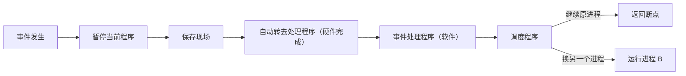
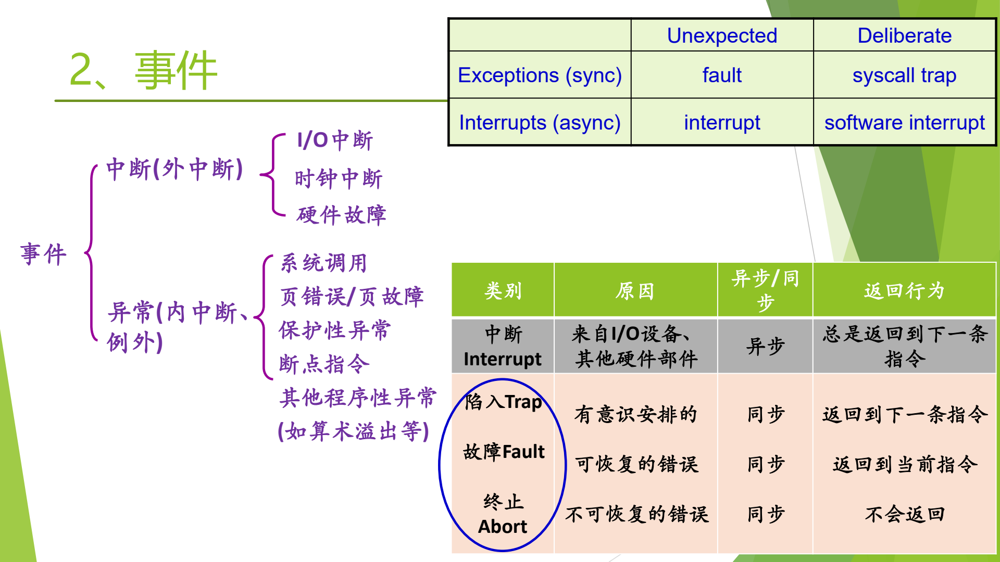

# 08 中断与异常概念

[本讲目录](../index.md) · [课程目录](../../index.md) · [上一节：07 处理器特权模式](07-processor-modes-and-privileged-instructions.md)

> [!abstract] 本节要点
> - 中断之于操作系统，如同发动机之于汽车、引擎之于飞机：操作系统是**中断驱动**（事件驱动）的，没有事件时它可以什么都不做。
> - 中断机制的三个主要作用：及时处理设备的中断请求、捕获用户程序的服务请求（系统调用）、防止用户程序的破坏性活动。
> - **中断/异常**是 CPU 对系统中发生的事件作出的反应：暂停当前程序 → 保存现场 → **自动**（硬件）转去事件处理程序（软件）→ 处理完返回断点；它改变了处理器的控制流。
> - 特点：随机发生、自动处理、可恢复。
> - 来源不同：**中断**来自 CPU 之外（I/O、时钟、硬件故障），为 CPU 与设备并行而引入；**异常**来自 CPU 执行指令本身（系统调用、缺页、保护性异常、断点、算术溢出）。

## 中断与事件驱动

如果设计 CPU，就一定要设计中断/异常机制；它是硬件设计者交给操作系统的一套基础设施。对操作系统来说，中断的重要性就如同汽车的发动机、飞机的引擎：有了它，飞机才能飞、汽车才能跑。因此说操作系统是由“**中断驱动**”或“**事件驱动**”的。[^s2p18] 中断是中断事件，异常是异常事件，统称**事件**也可以。[^s3b8]

“事件驱动”的含义可以这样体会：早上开机后去吃早点，这段时间没有任何事件，操作系统基本不干活；动了鼠标或键盘，这就是一个中断，操作系统才可能干活；随便晃动鼠标它不予理会，点击某个图标，它才帮你办事。**没有事件时，操作系统可以什么都不做**。时钟一直在走，定时器到时也会驱动某个进程开始工作，这同样是一种驱动方式。[^s3b8]

### 中断机制的三个主要作用

中断机制的主要作用有以下三点（不止这些）：[^s2p18]

1. **及时处理设备发来的中断请求**。例如磁盘由磁盘控制器/DMA 控制，CPU 只是布置任务（把某个文件读到某处），然后去做别的事；磁盘做完后必须向 CPU 汇报。键盘、鼠标、打印机的正常或异常结束、扫描仪等 CPU 之外的设备发来的请求，统称**中断请求**。[^s3b8]
2. **使操作系统能捕获用户程序提出的服务请求**。`open`、`fork`、打印等系统调用最终都由操作系统完成，用户程序只是发起请求，例如 `fork` 是操作系统替你创建进程；操作系统必须能捕获这些调用。[^s3b8]
3. **防止用户程序执行过程中的破坏性活动**。例如某块内存被标记为只读，页表项中有一位表示 read-only；用户程序对它做写操作时，硬件检查发现违规就报错，阻止这种破坏性活动。[^s3b8]

## 中断/异常的概念与特点

**中断/异常**是 CPU 对系统中发生的某个事件作出的一种反应：CPU 暂停正在执行的程序，保留现场后**自动**转去执行相应事件的处理程序，处理完成后返回断点，继续执行被打断的程序。事件的发生**改变了处理器的控制流**，这和 ICS 中“异常控制流”强调控制流改变的含义完全一致。[^s2p19]

按定义中的关键词拆成步骤：[^s3b9]

1. **暂停当前程序**：控制流改变了，PC 要换成别的地址，CPU 不能再接着执行原程序。
2. **保存现场**：不能停下就直接换别人，必须保存寄存器等上下文。
3. **自动转去处理程序**：“自动”指这一步由**硬件**完成，即硬件做完一系列动作后把控制权交给软件。
4. **执行处理程序**：处理程序是**软件**；不同事件对应不同处理程序，例如键盘的 Ctrl+C/Ctrl+Z、网卡到来的数据、`fork`/`open` 调用。
5. **返回断点**：处理完后被打断的程序继续执行。

### “返回断点”的准确含义

按照[trap 整体模型](06-trap-mechanism-overview-and-guiding-questions.md)，处理完事件后统一先回到**调度程序**，由它决定：继续原进程，就返回断点；或者换成进程 B。所以“处理完返回断点”并不总是立刻发生。但这句话也没错：除非发生了严重错误导致程序被终止，被打断的程序之后总能回到断点继续执行，只是可能要等一会儿（“让子弹飞一会儿”）。整个模型是闭环的。[^s3b9]

### 三个特点

中断/异常有三个特点，并要琢磨它**何时**发生、**何处**发生：[^s2p19]

- **随机发生**：无法预知用户何时按鼠标、何时敲键盘、网卡何时来数据。
- **自动处理**：由硬件先响应，兵来将挡、水来土掩，硬件完成转交控制权的过程。
- **可恢复**：处理完后在以后某个时刻回到被打断的地方继续执行。[^s3b9]

> [!warning] 易错点
> “自动”不是“由操作系统自动处理”，而是指从暂停到转入处理程序这一段由**硬件**完成；处理程序本身是软件。这正是[先硬件后软件](06-trap-mechanism-overview-and-guiding-questions.md)的体现。

## 为什么分中断和异常

“中断”和“异常”两个词是术语演化的结果。两者来源确实不同，处理方式却大同小异。[^s3b9]

**中断的引入：为了支持 CPU 与设备之间的并行操作**。最早只有中断。I/O 慢、CPU 快，为了让 CPU 摆脱 I/O，每个设备配一个控制器（如 DMA），CPU 只和控制器打交道。CPU 启动设备进行输入/输出后，设备独立工作，CPU 转去处理与这次 I/O 无关的事情；设备完成后向 CPU 发出中断，报告这次 I/O 的结果，由 CPU 决定接下来如何处理。[^s2p20]

**异常的引入：表示 CPU 执行指令时自身出现的问题**。后来发现，CPU 执行指令本身也会出问题，例如算术溢出、除零、取数时的奇偶错、访存地址越界（当时的地址保护不像今天的虚存这样完善），或者执行了“陷入指令”。这时硬件改变 CPU 当前的执行流程，转到相应的错误处理程序、异常处理程序，或者去执行系统调用。[^s2p20] 这些事件不是外部设备发来的，而是执行这条指令本身产生的，所以另称**异常**。[^s3b9]

| 对比项 | 中断（interrupt） | 异常（exception） |
|---|---|---|
| 引入原因 | 支持 CPU 与设备并行 | 表示 CPU 执行指令时自身出现的问题 |
| 来源 | CPU 之外：设备控制器、时钟、其他硬件部件 | CPU 内部：正在执行的指令 |
| 典型例子 | 磁盘完成读写、键盘输入、时钟到时 | 算术溢出、除零、缺页、越界、陷入指令 |

## 事件分类

把中断和异常统称为**事件**，可以分为两大类：[^s2p21]

- **中断**（外中断）：
  - **I/O 中断**：打印机、扫描仪、键盘、鼠标等设备发来的中断；
  - **时钟中断**：比较特殊的一类；
  - **硬件故障**：如笔记本电量低时提醒赶紧保存、奇偶校验错、内存过热（有的老机器内存一热就会报告甚至宕机）。[^s3b9]
- **异常**（内中断、例外）：
  - **系统调用**；
  - **页错误 / 页故障**（page fault）；
  - **保护性异常**；
  - **断点指令**；
  - **其他程序性异常**，如算术溢出。

图：左侧把事件分为中断（I/O、时钟、硬件故障）和异常（系统调用、页错误、保护性异常、断点指令等）；右上按同步/异步与有意/意外两维划分 fault、syscall trap、interrupt、software interrupt；下方表格对比各类事件的原因、同步性和返回行为。

上图左侧是本课的事件分类树；右侧是 ICS 的分类，它把异常细分为**中断**（Interrupt）、**陷入**（Trap）、**故障**（Fault）、**终止**（Abort）四类，与本课的分法大同小异，其中中断来自 I/O 设备和其他硬件部件，是**异步**的。[^s3b9] 图中各类的同步/异步属性、返回行为（返回下一条指令、返回当前指令或不返回）以及 Unexpected/Deliberate 对照表，见 L03「01 中断异常事件分类」。

> [!warning] 易错点
> 系统调用是由用户程序执行陷入指令**有意**引起的，归入**异常**而不是中断，尽管它的处理方式和中断很相似。另外，奇偶错要看它在哪里被发现：“取数时的奇偶错”是执行指令时出现的异常示例，而奇偶校验错也可作为硬件故障类中断的例子；按本课的分类原则，判断依据始终是事件来自 CPU 执行的指令本身，还是来自 CPU 之外的部件。

> [!question]- 自测：判断下列事件属于中断还是异常：①磁盘 DMA 传输结束；②程序执行 `ecall`；③程序访问一个尚未调入内存的页；④定时器到时；⑤程序执行除零。
> 中断：①（I/O 中断）、④（时钟中断），它们来自 CPU 之外。异常：②（系统调用）、③（页故障）、⑤（算术类程序性异常），它们由正在执行的指令引起。

> [!question]- 自测：进程 A 执行时被时钟中断打断，处理结束后调度程序选择了进程 B。A 的“断点”丢失了吗？
> 没有。A 的现场在中断时已经保存；之后调度程序再次选中 A 时，A 从断点继续执行。“返回断点”不一定立刻发生，但只要 A 没有因严重错误被终止，就一定会回到断点。

> [!question]- 自测：用户程序向只读页写数据，这一事件由谁发现、属于哪一类？
> 由硬件根据页表项中的只读权限位检查发现，属于异常（保护性异常），对应中断机制“防止破坏性活动”的作用；随后控制权转给操作系统的处理程序。

> [!info]- 来源
> - slides02.pdf：PDF p.18–21
> - L02.docx：DOCX body 195–254

[^s2p18]: slides02.pdf-PDF p.18
[^s3b8]: L02.docx-DOCX body 195-224
[^s2p19]: slides02.pdf-PDF p.19
[^s3b9]: L02.docx-DOCX body 225-254
[^s2p20]: slides02.pdf-PDF p.20
[^s2p21]: slides02.pdf-PDF p.21

[本讲目录](../index.md) · [课程目录](../../index.md) · [上一节：07 处理器特权模式](07-processor-modes-and-privileged-instructions.md)
