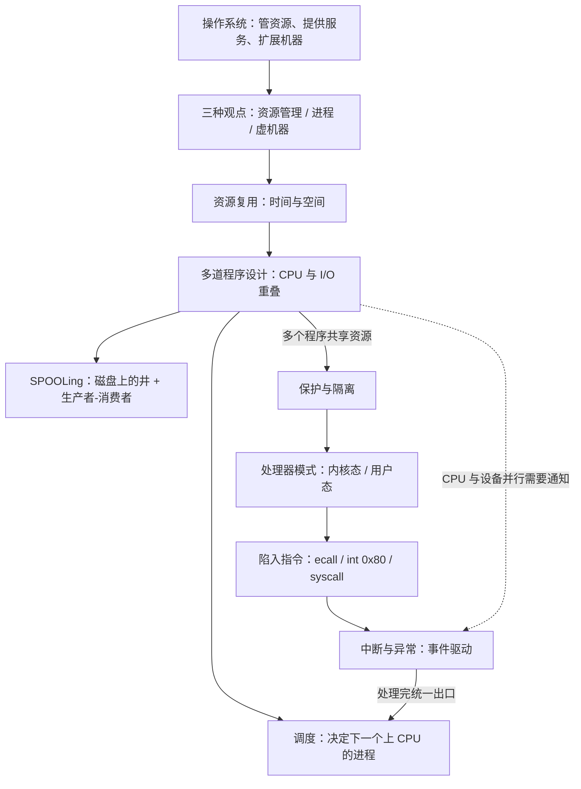

# L02 操作系统概述与中断机制入门

[课程目录](../index.md)

本讲先回答“操作系统是什么”，再从资源管理、进程、虚机器三个角度认识它，并借 MULTICS、UNIX 等历史说明旧思想如何以新名词回归；概述部分的重点是多道批处理和 SPOOLing 技术。下半讲转入 xv6 的 trap 机制：先建立“因事件进入内核、统一经调度离开”的整体模型，再讲控制和状态寄存器、处理器特权模式与陷入指令，最后给出中断与异常的概念、特点和分类。阅读前应熟悉 ICS 中的异常控制流、生产者-消费者模型和虚拟内存，以及 L01「03 hello world 的运行」中程序的执行过程。

## 章节导航

- [01 操作系统是什么](chapters/01-what-is-an-operating-system.md)：最底层系统软件：管资源、提供服务、扩展机器能力
- [02 认知操作系统的三种观点](chapters/02-three-views-of-operating-systems.md)：资源管理、进程、虚机器三种观点与 OS 四大特征
- [03 历史的启示](chapters/03-history-lessons-multics-and-unix.md)：旧思想的回归：MULTICS、UNIX 与七个发展阶段
- [04 批处理系统与多道程序设计](chapters/04-batch-systems-and-multiprogramming.md)：批处理作业流程，单道到多道：利用率翻倍、调度由此产生
- [05 卫星机与 SPOOLing 技术](chapters/05-satellite-machines-and-spooling.md)：卫星机脱机 I/O → 纯软件 SPOOLing，及其他 OS 类型
- [06 trap 机制总览](chapters/06-trap-mechanism-overview-and-guiding-questions.md)：trap 整体模型：事件驱动进核、统一经调度返回；先硬件后软件
- [07 处理器特权模式](chapters/07-processor-modes-and-privileged-instructions.md)：控制状态寄存器、内核态/用户态、特权指令与陷入指令
- [08 中断与异常概念](chapters/08-interrupt-mechanism-concepts-and-classification.md)：事件驱动的 OS：中断/异常的定义、特点、引入原因与分类

## 本讲小结

本讲有两条线。概述部分沿着“资源管理”展开：为了提高利用率，CPU 与 I/O 要重叠，于是出现多道程序设计，再到用纯软件组织输入、计算、输出的 SPOOLing；多个程序同时驻留内存，又带来调度和保护两个新问题。trap 部分接住“保护”这条线：硬件提供特权模式，用户态只能经中断、异常或陷入进入内核，处理完统一经调度模块离开，所以说操作系统是事件驱动的。

## 不确定事项

- SPOOLing 首次出现于“1961 年 Atlas 机”（s1p41）与“Atlas 1962 年投入运行”（s1p25）均按讲义保留；按史实，Atlas 1962 年投入使用，因此 1961 这一年份存疑。
- MULTICS 开始年份按讲义写为 1963 年；常见史料记为 1964–1965 年（Project MAC），未做改动。
- 转写把“最早的批处理操作系统用 SPOOLing 实现”作为教师观点保留，这一说法属于简化的历史表述。
- s2p21 只讲了开头，同步/异步与返回行为留待 L03；s2p13 的 EFLAGS 位布局只有图片，正文未逐位展开。

> [!info]- 来源
> - slides01.pdf：PDF p.5–19, 21–59
> - L02.docx：DOCX body 1–254
> - slides02.pdf：PDF p.2–21
