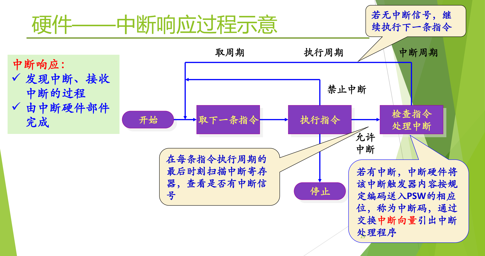
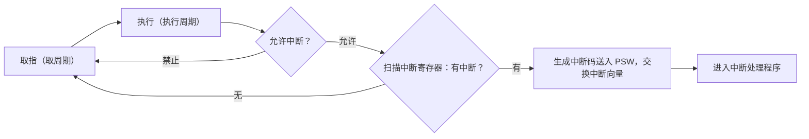
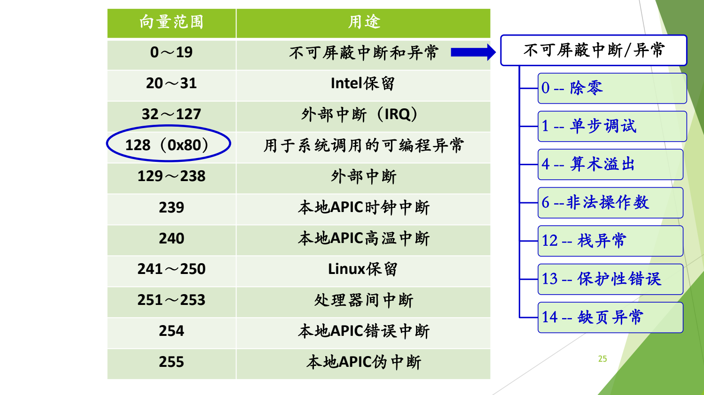

# 02 中断响应与中断向量

[本讲目录](../index.md) · [课程目录](../../index.md) · [上一节：01 中断异常事件分类](01-interrupt-and-exception-classification.md) · [下一节：03 中断处理完整流程](03-hardware-software-handoff-in-interrupt-handling.md)

> [!abstract] 本节要点
> - 在取指周期、执行周期之后增加**中断周期**：开中断时，硬件在每条指令执行周期的最后时刻扫描中断寄存器；没有中断就继续取下一条指令。
> - 有中断时，硬件把中断触发器的内容编码为**中断码**送入 PSW 的相应位，再用中断码查**中断向量表**，交换中断向量，引出中断处理程序。这些全由硬件完成。
> - **中断向量**是存放中断处理程序入口地址和所需 PSW 的内存单元；中断向量表本质上是一张由硬件查找的跳转表，由软硬件共同约定。
> - 操作系统在引导初始化时编好各处理程序、放到内存固定位置，并把入口地址填入中断向量表。
> - x86 向量表共 256 项：0–19 由硬件定义（0 除零、1 单步调试、4 溢出、14 缺页等），Linux 选用 128（0x80）号作为系统调用入口。

## 中断周期：硬件如何发现中断

CPU 的基本工作就是周而复始地取指令、执行指令。要让外部事件能打断这个循环，硬件必须在某个固定时刻主动去看一眼有没有请求。为此，在指令周期中增加一个环节：

图：指令周期由取指、执行和中断周期组成；在允许中断时，每条指令执行完都会扫描中断寄存器，有中断就把中断码送入 PSW、经中断向量转入处理程序，没有中断就继续取下一条指令。

示意图把一条指令的处理分成三个阶段：**取周期**（取下一条指令）、**执行周期**（执行指令）和**中断周期**（检查中断）。“检查中断”这一步受开关控制：禁止中断时直接回到取指；允许中断时才去检查，有中断就转入“处理中断”。

**中断响应**是发现中断、接收中断的过程，由中断硬件部件完成。[^s2p23] 具体过程如下：

1. **判断是否允许中断**：只有处于开中断（允许中断）状态，硬件才去检查。中断可以不响应，就像手机响了也可以不接。[^s4b2]
2. **扫描中断寄存器**：在每条指令执行周期的最后时刻扫描中断寄存器，查看是否有中断信号。
3. **无中断**：继续执行下一条指令。
4. **有中断**：中断硬件把该中断触发器的内容按规定编码，送入 PSW 的相应位，这个编码称为**中断码**；然后通过交换中断向量，引出中断处理程序。[^s2p23]

**中断码为什么要先存下来**：中断码标识“是哪一个设备、哪一类事件”，例如打印机中断有它的编码。它必须放在硬件和软件以后都找得到的地方（这里是 PSW），否则中断寄存器的状态一变，就无从知道刚才响应的是哪个中断。[^s4b2]

检查中断是在一条指令执行完之后进行的，这也解释了上一章的结论：中断总是返回到下一条指令（见 [中断异常事件分类](01-interrupt-and-exception-classification.md)）。

## 中断向量与中断向量表

硬件拿到中断码之后，要知道“该跳到哪段代码去”。不同的中断/异常需要不同的处理程序，硬件不可能把每段程序的地址都固化在电路里，于是用一张表在两者之间搭桥。

**中断向量**（interrupt vector）是一个内存单元，存放中断处理程序的入口地址和程序运行所需的处理机状态字（PSW）。把所有中断向量按中断号排成一张表，就是**中断向量表**。硬件按中断号/异常类型的不同，通过中断向量表把控制权转移给相应的中断处理程序。[^s2p24]

所谓“交换中断向量”，就是把表中这一项给出的新 PSW 和处理程序入口地址装入处理器，取代被打断程序当时的 PSW 和 PC。从这个角度看，中断向量表实质上是一张**跳转表**：表的每一行给出一个目标地址，查到哪一行就跳到哪里。与程序里的跳转表不同的是，查表和跳转由**硬件**完成。这张表由软件填写、由硬件读取，是软硬件共同约定的数据结构。[^s4b2]

## 操作系统初始化与中断向量表

操作系统初始化与中断/异常有什么关联？[^s2p24] 答案就是这张表。

硬件只会“按中断码查表、按表项跳转”，表里的内容必须由操作系统事先准备好：

1. **编写处理程序**：设计操作系统时，为每一类中断/异常事件编好相应的处理程序。
2. **放入内存固定位置**：引导启动初始化时，把这些处理程序装到内存中固定的位置，每段程序因此有了确定的入口地址。
3. **填表**：把各处理程序的入口地址（以及所需的 PSW）填入中断向量表，并把表的起始地址放在硬件找得到的地方。

此后系统运行中一旦响应中断，硬件就能直接查表跳转。读操作系统的引导代码时要留意建立这张表的那一段，不必看得太细，知道有这件事即可。[^s4b2]

中断向量表是本课正式讲解的第一个内核数据结构（此前只非正式地提过进程控制块 PCB）。后面讲系统调用时还会出现第二张表，即系统调用表，两张表不能混为一谈（见 [系统调用机制设计](06-system-call-mechanism-design.md)）。

> [!warning] 易错点
> 中断向量表由操作系统在初始化时**填写**，由硬件在响应中断时**查找**。说“硬件建立中断向量表”或“软件查中断向量表找到处理程序”都不对。

## Linux 在 x86 上的中断向量分配

中断向量表的具体格式与硬件架构有关。以 x86 为例，表共有 256 项，多年来一直够用。前面若干项由硬件定义，各操作系统直接沿用；其余由操作系统自行分配。[^s4b2]

图：x86 上 Linux 的 256 个向量中，0～19 为不可屏蔽中断和异常（如 0 除零、14 缺页异常），32～127 为外部中断，128（0x80）专用于系统调用。

| 向量范围 | 用途 |
| --- | --- |
| 0～19 | 不可屏蔽中断和异常 |
| 20～31 | Intel 保留 |
| 32～127 | 外部中断（IRQ） |
| 128（0x80） | 用于系统调用的可编程异常 |
| 129～238 | 外部中断 |
| 239 | 本地 APIC 时钟中断 |
| 240 | 本地 APIC 高温中断 |
| 241～250 | Linux 保留 |
| 251～253 | 处理器间中断 |
| 254 | 本地 APIC 错误中断 |
| 255 | 本地 APIC 伪中断 |

[^s2p25]

0～19 号中较常见的几项是：0 除零，1 单步调试，4 算术溢出，6 非法操作数，12 栈异常，13 保护性错误，14 缺页异常。[^s2p25] 这些项的含义由硬件规定，大家公认，因此汇编里常说“int 0 是除零”“int 1 是调试”“int 14 是缺页”。

**0x80 的来历**：128 号不是硬件规定的，而是 Linux 在表中间一段空闲位置自己选定的，专门用作系统调用入口。[^s4b2] 这一项在 IDT 中如何初始化、用户程序怎样通过它进入内核，见 [Linux 系统调用执行](07-linux-x86-system-call-execution.md)。

5–12、16–17 号向量只要求了解。[^s2p26]

> [!note] 补充解释
> 按 Intel 手册，5–12、16–17 号向量依次大致为：5 BOUND 越界，6 无效操作码（即上表的“非法操作数”），7 设备不可用（无数学协处理器），8 双重故障，9 协处理器段越界（已不使用），10 无效 TSS，11 段不存在，12 栈段故障，16 x87 浮点错误，17 对齐检查。详细定义见 [Intel SDM 第 3 卷](https://www.intel.com/content/www/us/en/developer/articles/technical/intel-sdm.html) 的中断与异常一章。

> [!question]- 自测：CPU 处于关中断状态时，磁盘发出了中断请求。会发生什么？
> 硬件在指令周期末不去检查中断，CPU 继续取下一条指令；请求仍记录在中断寄存器里，等到开中断后的某个指令周期末才被发现和响应（同类请求重复到来则可能丢失）。

> [!question]- 自测：如果操作系统没有填写中断向量表的第 14 项，程序第一次缺页时会怎样？
> 硬件照样用 14 去查表，但表项里没有有效的处理程序入口，控制无法转到缺页处理程序，缺页得不到处理。这说明中断机制能工作，依赖操作系统在初始化时把表准备好。

> [!info]- 来源
> - slides02.pdf：PDF p.23–26
> - L03.docx：DOCX body 1–67

[^s2p23]: slides02.pdf-PDF p.23
[^s4b2]: L03.docx-DOCX body 42-67
[^s2p24]: slides02.pdf-PDF p.24
[^s2p25]: slides02.pdf-PDF p.25
[^s2p26]: slides02.pdf-PDF p.26

[本讲目录](../index.md) · [课程目录](../../index.md) · [上一节：01 中断异常事件分类](01-interrupt-and-exception-classification.md) · [下一节：03 中断处理完整流程](03-hardware-software-handoff-in-interrupt-handling.md)
