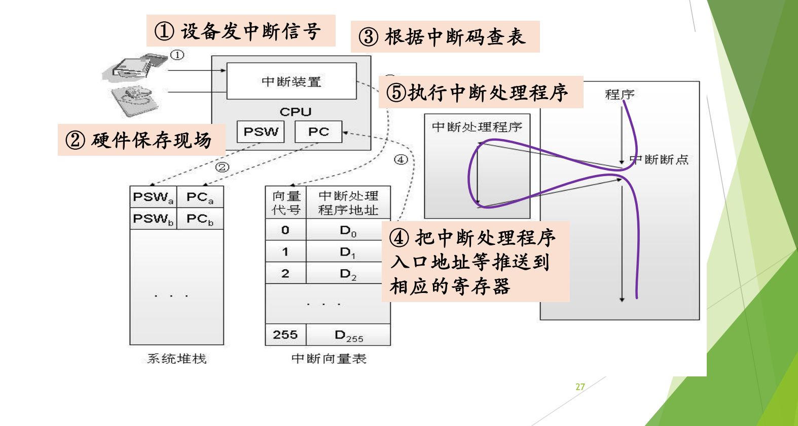
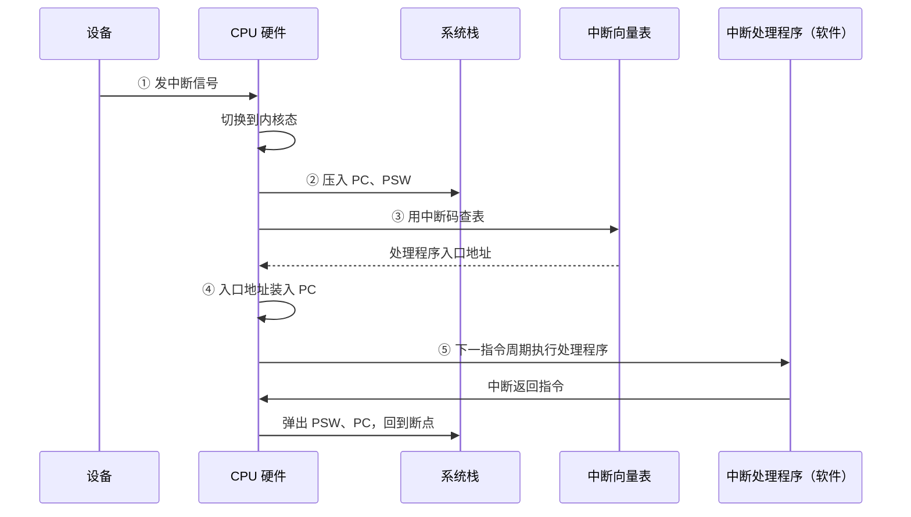

# 03 中断处理完整流程

[本讲目录](../index.md) · [课程目录](../../index.md) · [上一节：02 中断响应与中断向量](02-interrupt-response-and-vector-table.md) · [下一节：04 x86 中断支持](04-x86-protected-mode-interrupt-support.md)

> [!abstract] 本节要点
> - 中断响应五步：① 设备发中断信号；② 硬件保存现场；③ 根据中断码查表；④ 把处理程序入口地址等推送到相应寄存器；⑤ 执行中断处理程序。①–④ 是硬件，⑤ 是软件。
> - 软硬交接的约定是**改写 PC**：硬件把 PC 设为处理程序入口，下一个指令周期执行的就必然是软件。
> - 硬件保存现场时先切换到内核态，在**系统栈**（内核栈，不同于用户栈）中只保存 PC、PSW 等少数关键寄存器。
> - 软件处理程序的第一件事是**继续保存其余全部上下文**，然后分析原因、执行处理、恢复现场；最后由一条中断返回指令（硬件）恢复 PSW 和 PC。
> - Linux 把中断处理分为**上半部**（关中断，立即做紧急部分）和**下半部**（开中断，做不紧急部分）。

## 中断响应五步流程

上一章讲了硬件在何时发现中断、凭什么找到处理程序。把这些动作按时间顺序连起来，就是完整的中断响应流程。画这个流程的目的是弄清三件事：哪部分由硬件做；硬件交给软件后软件做什么；为了让流程走通，必须事先准备什么（初始化中断向量表）。步骤的编号就是顺序，不能颠倒。[^s4b2]

图：按编号顺序追踪一次中断：①设备发出中断信号，②硬件把 PSW 和 PC 压入系统栈保存现场，③根据中断码查中断向量表，④把处理程序入口送入寄存器，⑤执行中断处理程序后返回断点。

图中左侧是设备和 CPU（含中断装置、PSW、PC），下方是系统堆栈和中断向量表（向量代号 0～255，每项是处理程序地址 $D_0, D_1, \ldots, D_{255}$），右侧是被打断的程序和中断处理程序。紫色曲线表示控制流：程序在“中断断点”处离开，执行完处理程序后回到断点继续执行。[^s2p27]

1. **① 设备发中断信号**：例如磁盘完成了一次传输，向 CPU 的中断装置发出信号，中断装置把它记录下来。这是一个异步事件。
2. **② 硬件保存现场**：硬件响应中断，首先切换到内核态（原本就在内核态则不必切换）；然后把被打断程序的 PSW 和 PC（图中的 $\mathrm{PSW}_a, \mathrm{PC}_a$）压入**系统堆栈**。[^s4b2]
3. **③ 根据中断码查表**：用中断码作下标查中断向量表。表已在初始化时建好，表的起始地址也放在硬件找得到的地方。[^s4b3]
4. **④ 把中断处理程序入口地址等推送到相应的寄存器**：把查到的入口地址装入 PC（以及新的 PSW）。
5. **⑤ 执行中断处理程序**：下一个指令周期开始，CPU 执行的就是处理程序的第一条指令。

其中 ①–④ 由硬件完成，⑤ 由软件完成。[^s4b3]

### 硬件保存现场：为什么只存少数寄存器

处理器里有大量寄存器：通用寄存器、各种控制寄存器等，硬件不可能全部保存。硬件只保存最重要的几个，至少是 PC 和 PSW，有的架构会再多存一两个。[^s4b2] 这两个之所以必须由硬件保存，是因为接下来硬件自己就要改写它们（第 ④ 步把新的入口地址装入 PC），不先存下来，被打断的程序就再也回不去了。

### 用户栈与系统栈

硬件压栈用的是**系统栈**（内核栈），而不是用户程序正在使用的用户栈，两者是不同的栈。处理器在用户态运行时栈指针指向用户栈，进入内核态时栈指针要切换到内核栈。[^s4b2] 这也是第 ② 步要先切换到内核态、再压栈的原因。x86 上栈指针从哪里取得，见 [Linux 系统调用执行](07-linux-x86-system-call-execution.md) 中 TSS 的部分。

## 软硬交接：改写 PC

软件和硬件之间怎么“交接”？约定非常简单：**硬件只要把 PC 改成中断处理程序的入口地址，下一个指令周期执行的就一定是这段代码**。[^s4b3] 硬件不需要“调用”软件，也不需要通知软件；改写 PC 这一个动作就完成了控制权的移交。

所以第 ④ 步是硬件的最后一步，第 ⑤ 步是软件的第一步。从这里开始到处理结束，都是软件的事；只有最后的返回，又是一条硬件指令。[^s4b3]

> [!tip] 课堂强调
> 每次考试总有同学把软硬件步骤交叉着写。下面的小结表为每一步都标出了由硬件还是软件完成，对照记住这个分工，就不会把步骤交来交去。[^s4b3]

## 中断处理程序做什么

软件部分的逻辑是“兵来将挡”：什么样的事件，就做什么样的处理，结构并不复杂。[^s2p28]

**事先准备**：设计操作系统时，为每一类中断/异常事件编好相应的处理程序，并设置好中断向量表。操作系统引导启动之后，这些准备就已经完成。

**运行时**：硬件响应中断、把 CPU 控制权转给中断处理程序后，处理程序依次：[^s2p28]

1. **保存相关寄存器信息**：硬件只保存了 PC、PSW 等少数寄存器，软件要把其余的全部上下文（context）继续保存到系统栈中。这是软件的**第一件事**，一定要记清，它体现的正是软硬件的分工。[^s4b3]
2. **分析中断/异常的具体原因**：例如打印机中断，到底是打印结束、缺纸、缺墨还是卡纸。
3. **执行对应的处理功能**：例如缺纸时显示提示，让用户加纸。
4. **恢复现场，返回被事件打断的程序**：把软件保存的寄存器恢复，再执行中断返回指令。

> [!warning] 易错点
> “保存现场”分两段：硬件在第 ② 步保存 PC、PSW 等少数关键寄存器；软件处理程序开头再保存其余全部寄存器。只写其中一段，或说“硬件保存全部寄存器”，都是错的。

## 以打印机中断为例的完整小结

把上面的步骤套到一个具体设备上，并标出每一步由谁完成：[^s2p29] [^s2p30]

| 阶段 | 动作 | 执行者 |
| --- | --- | --- |
| 发出请求 | 打印机给 CPU 发中断信号 | 设备 |
| 检测与确认 | CPU 处理完当前指令后检测到中断，判断中断来源，向相关设备发确认信号 | 硬件 |
| 准备 | 处理器状态切换到内核态；在系统栈中保存被中断程序的重要上下文，主要是 PC 和 PSW | 硬件 |
| 查表转移 | 根据中断码查中断向量表，取得处理程序入口地址，把 PC 设置成该地址；新的指令周期开始时，控制转到中断处理程序 | 硬件 |
| 处理 | 在系统栈中保存现场信息；检查 I/O 设备的状态信息，操纵 I/O 设备或在设备和内存之间传送数据等 | 软件 |
| 返回 | CPU 检测到中断返回指令，从系统栈中恢复被中断程序的上下文，CPU 状态恢复，PSW 和 PC 恢复成中断前的值，开始新的指令周期 | 硬件 |

注意“检测到中断”发生在 CPU **处理完当前指令之后**，与 [中断周期](02-interrupt-response-and-vector-table.md) 一致。返回时恢复的 PSW 中包含原来的处理器状态，因此程序回到中断前的特权级（例如用户态）继续执行。

这一流程以后还会在 x86 硬件（[x86 中断支持](04-x86-protected-mode-interrupt-support.md)）、系统调用（[Linux 系统调用执行](07-linux-x86-system-call-execution.md)）等场景下反复出现，最后在 [低层步骤与机制策略](08-low-level-steps-and-mechanism-policy-separation.md) 中按硬件、汇编、C 三层总结。

## 上半部与下半部

前面说第 ⑤ 步“执行中断处理程序”，好像处理程序是一口气执行完的。实际上 Linux 的中断处理程序又分成两部分：**上半部**（top half）和**下半部**（bottom half）。[^s4b3]

- **上半部**：在关中断状态下，立即完成特别重要、特别紧急的工作。此时 CPU 不再理会其他中断，必须把这部分做完。
- **下半部**：打开中断以后，再去完成不那么紧急的工作。这期间即使再被别的中断打断，也没有关系。

可以用战地救护作类比：前线打仗时随队的医生、护士遇到伤员，第一步是做紧急包扎处理，然后把伤员抬下战场，送到医院再做手术。不可能一上来就在战场上做手术。把一件事分成“先紧急处理、再从容完成”两步，这种思路在日常决策中也很常见。[^s4b3]

> [!question] 思考题：为什么 Linux 的中断处理要引入上半部和下半部？
> 理解 Linux 的中断处理流程，解释为什么引入上半部和下半部处理？
>
> **提示**：从“中断处理期间中断是开还是关”入手，想一想关中断的时间太长会对其他设备的中断造成什么影响。
>
> > [!success]- 解答（老师课上给出）
> > Linux 把一次中断处理分成两部分：**上半部**在关中断状态下立即完成特别重要、紧急的事，这期间 CPU 不理会其他中断，必须把这部分做完；做完后打开中断，由**下半部**完成其余不那么紧急的工作，期间即使被新的中断打断也没有关系。这就像战地救护：先在前线做紧急包扎，再把伤员抬下战场送到医院做手术，不可能一上来就在战场上做手术。
> >
> > 这样分的原因在于关中断的代价：关中断期间 CPU 不响应任何其他中断，如果整个处理程序都关着中断执行，其他设备的请求就要长时间等待，同类请求重复到来时还可能丢失（见 [中断异常事件分类](01-interrupt-and-exception-classification.md)）。只在上半部关中断，既保证紧急工作及时、完整地完成，又让系统能尽快响应其他中断。

> [!question]- 自测：有人写出中断响应流程为“设备发信号 → 硬件保存全部寄存器 → 软件查中断向量表 → 软件改写 PC → 执行处理程序”。指出错误。
> 有三处错误：硬件只保存 PC、PSW 等少数寄存器，其余由软件处理程序保存；查中断向量表是硬件做的；改写 PC 也是硬件做的，它正是软硬交接的那一步。①–④ 都是硬件，只有 ⑤ 是软件。

> [!question]- 自测：中断处理程序的第一条指令执行时，栈指针指向哪个栈？栈顶附近存着什么？
> 指向系统栈（内核栈）。硬件在第 ② 步已切换到内核态并把被打断程序的 PC、PSW 压入系统栈，所以栈顶附近是这些由硬件保存的少数关键寄存器；软件接下来要把其余寄存器继续压到这个栈上。

> [!info]- 来源
> - slides02.pdf：PDF p.27–30
> - L03.docx：DOCX body 42–96

[^s4b2]: L03.docx-DOCX body 42-67
[^s2p27]: slides02.pdf-PDF p.27
[^s4b3]: L03.docx-DOCX body 68-96
[^s2p28]: slides02.pdf-PDF p.28
[^s2p29]: slides02.pdf-PDF p.29
[^s2p30]: slides02.pdf-PDF p.30

[本讲目录](../index.md) · [课程目录](../../index.md) · [上一节：02 中断响应与中断向量](02-interrupt-response-and-vector-table.md) · [下一节：04 x86 中断支持](04-x86-protected-mode-interrupt-support.md)
