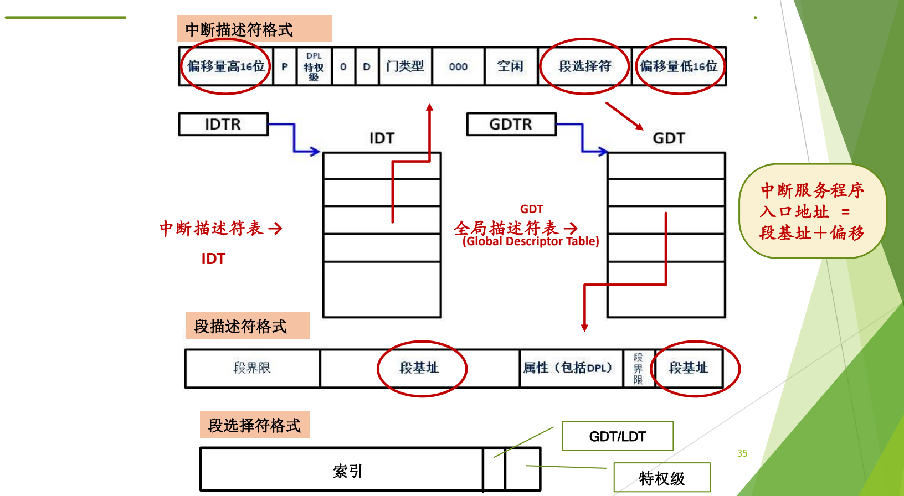
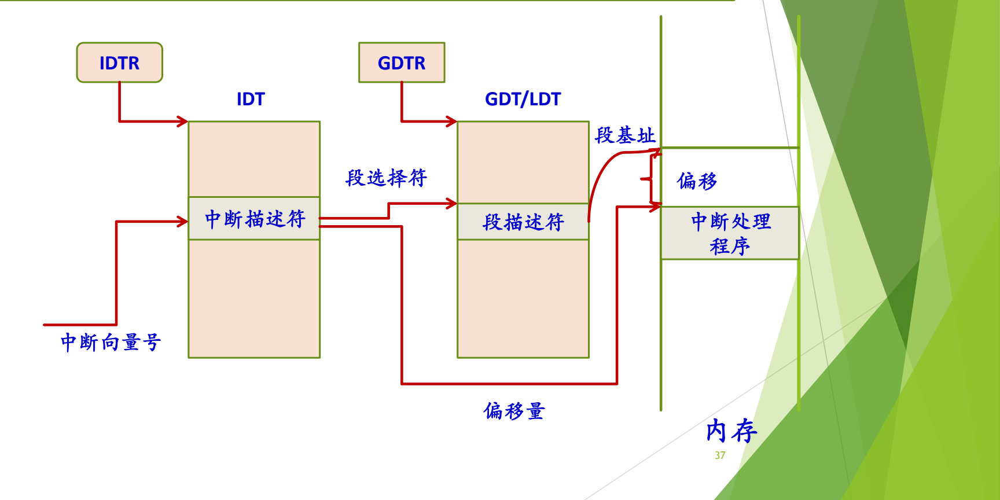
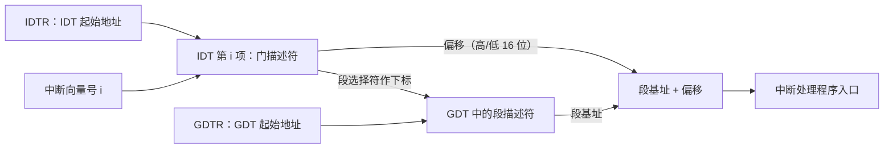

# 04 x86 中断支持

[本讲目录](../index.md) · [课程目录](../../index.md) · [上一节：03 中断处理完整流程](03-hardware-software-handoff-in-interrupt-handling.md) · [下一节：05 系统调用概念辨析](05-system-call-concept-and-related-notions.md)

> [!abstract] 本节要点
> - x86 中断由硬件信号引发，分可屏蔽和不可屏蔽；异常由指令执行引发，约 20 种，其中部分异常会产生硬件**出错码**压入内核栈，导致栈帧大小不一，需要对齐；系统调用是异常的一种。
> - 中断控制器（PIC/APIC）把硬件中断信号转换为中断向量。实模式用中断向量表（入口 = 段地址左移 4 位 + 偏移，不切换 CPU 状态），保护模式用**中断描述符表 IDT**，表项是**门描述符**。
> - 四种门：任务门（Linux 不用）、**中断门**（通过后自动关中断）、**陷阱门**（不自动关中断）、调用门。选哪种门取决于处理期间是否接受新中断。
> - 查找过程：IDTR 给出 IDT 起址，以向量号为下标取门描述符；其中的段选择符作 GDT 下标取段描述符得段基址；段基址 + 门描述符中的偏移 = 处理程序入口。
> - 查表全由硬件完成，表由操作系统事先建好。这个例子用来验证前面的通用流程，细节不要求掌握。

## 用 IA32 验证通用流程

前三章讲的是与具体硬件无关的通用模型。这里以 IA32（x86 32 位）为例看真实处理器怎么实现它。这个例子比较复杂，数据结构的名称也和前面不同，**不要求掌握**；看完它只为确认前面讲的流程没有问题。[^s4b3] [^s2p31]

x86 中与中断相关的基本概念如下：[^s2p32]

- **中断**：由硬件信号引发，分为**可屏蔽中断**和**不可屏蔽中断**。屏蔽了的中断来了也不处理；不可屏蔽的中断来了必须处理。
- **异常**：由指令执行引发，比如除零异常。80x86 处理器定义了大约 20 种不同的异常。
- **硬件出错码**：对于某些异常，CPU 会在执行异常处理程序之前产生一个硬件出错码，并压入内核态堆栈。
- **系统调用**：异常的一种，是用户态到系统态的唯一入口。

### 出错码与栈帧对齐

中断都有中断码：中断请求记录在寄存器中，多个请求按优先级先后响应，必须靠编码区分。异常则是当前指令当场出的问题、立即处理，一般不需要额外的码；但有些异常需要报告错误细节，于是有的异常有出错码、有的没有。[^s4b3]

这就带来**不对齐**的问题：同样是进入异常处理程序，有出错码的异常在内核栈上比没有出错码的多压一项，栈帧大小不一致，处理程序就不知道从哪个位置取保存的现场。解决办法是对齐，让所有栈帧形状一致。[^s4b3]

> [!note] 补充解释
> 源材料只说“对齐就行”。Linux 的常见做法是：对于硬件不压出错码的异常，处理程序入口先由软件压入一个占位值（如 0），使所有异常的栈帧布局相同，后续代码就能用统一的偏移取出各个字段。

## 中断控制器与两种表

**中断控制器**（PIC 或 APIC）负责把硬件的中断信号转换为**中断向量**，引发 CPU 中断。[^s2p33] 它就是前面通用模型中的“中断装置”。

x86 有实模式和保护模式两种运行模式，两种模式下的表不同：[^s2p33]

| | 实模式 | 保护模式 |
| --- | --- | --- |
| 表的名称 | 中断向量表（Interrupt Vector） | 中断描述符表 IDT（Interrupt Descriptor Table） |
| 表项内容 | 中断服务程序的入口地址 | 门（gate）描述符 |
| 入口地址计算 | 段地址左移 4 位 + 偏移地址 | 段基址 + 偏移（段基址经 GDT 取得） |
| CPU 运行状态切换 | 不支持，中断处理与一般的过程调用相似 | 支持，可以进行特权级检查与切换 |

现在的操作系统都运行在保护模式下。名字从“中断向量表”改成“中断描述符表”，作用相同，只是每一项的内容更多。两者本质上都是大数组。[^s4b3]

实模式入口地址的计算可写成

$$
\text{入口地址} = \text{段地址} \times 16 + \text{偏移地址}
$$

左移 4 位即乘以 16。

## 门描述符与四种门

在 IDT 中，每一项是一个结构，x86 称之为**门描述符**（gate descriptor）。它就是“中断向量表中的一行”，只是换了 x86 自己的术语。[^s4b4] x86 提供四种类型的门：[^s2p34]

1. **任务门**（Task Gate）：中断发生时，必须取代当前进程的那个进程的 TSS 选择符存放在任务门中。Linux 没有使用任务门。
2. **中断门**（Interrupt Gate）：给出段选择符（Segment Selector）和中断/异常处理程序的段内偏移量（Offset）。通过中断门后，系统会**自动禁止中断**。
3. **陷阱门**（Trap Gate）：与中断门类似，但通过陷阱门后系统**不会自动关中断**。
4. **调用门**（Call Gate）。

硬件和软件之间既像博弈也像协同：硬件预想软件可能需要什么，提供四种门；软件不必全用。Linux、Windows 主要使用中断门和陷阱门。[^s4b4]

### 中断门与陷阱门怎么选

两者唯一的区别在于进入处理程序后中断是否自动关闭：[^s4b4]

| | 中断门 | 陷阱门 |
| --- | --- | --- |
| 进入后中断状态 | 自动关中断 | 不自动关中断 |
| 处理期间 | 不接受新的中断 | 可能有新的中断或异常进来 |

选哪种门没有硬性规定，选哪个都可以，但要给出理由。基本依据就是：处理这件事期间，是否允许接受新的中断。[^s4b4] 例如，Linux 的 0x80 系统调用入口用的是陷阱门，进入内核执行系统调用时中断仍然开着（见 [Linux 系统调用执行](07-linux-x86-system-call-execution.md)）。

> [!warning] 易错点
> “中断门”和“陷阱门”的名字不表示它只能用于中断或只能用于陷入。门的类型只决定进入时是否自动关中断，异常、中断都可以选用任意一种，由操作系统按需要设置。

## IDT、GDT 与处理程序入口的查找

保护模式下，处理程序的入口地址不直接写在 IDT 里，而是由“段基址 + 偏移”两部分拼出来，分别从两张表中取得。

图：IDTR 指向 IDT，中断描述符中的段选择符到 GDT 中找到段描述符取得段基址，再加上描述符中的偏移量，得到中断服务程序入口地址。

图中给出了三种格式和两张表：

- **中断描述符格式**：包含偏移量高 16 位、P、DPL（特权级）、门类型、段选择符、偏移量低 16 位等字段，图中圈出的是段选择符和两段偏移量。
- **段描述符格式**：包含段界限、段基址、属性（包括 DPL）等字段，段基址也分成两段存放。
- **段选择符格式**：由索引、GDT/LDT 选择位和特权级组成，主要当索引用。
- **IDT**（中断描述符表）由寄存器 **IDTR** 给出起始地址；**GDT**（全局描述符表，Global Descriptor Table）由寄存器 **GDTR** 给出起始地址。

中断服务程序入口地址 = 段基址 + 偏移。[^s2p35]

段基址和偏移分开存放，偏移又拆成高、低两个 16 位，是 x86 从 8086 起一路向后兼容、不断扩展留下的痕迹：原有字段不变，扩展的位就另找位置添上。[^s4b4]

图：中断向量号索引 IDT 中的中断描述符，其段选择符索引 GDT/LDT 中的段描述符得到段基址，段基址加偏移量即内存中的中断处理程序。

查找过程是一条路径：中断向量号 → IDTR 指向的 IDT 中的中断描述符 → 其中的段选择符 → GDTR 指向的 GDT 中的段描述符 → 段基址；段基址加上中断描述符中的偏移量，指向内存中的中断处理程序。[^s2p37]

查找可写成

$$
\text{入口地址} = \mathrm{GDT}\big[\,\mathrm{IDT}[i].\text{段选择符}\,\big].\text{段基址} + \mathrm{IDT}[i].\text{偏移}
$$

其中 $i$ 是中断向量号，$\mathrm{IDT}[i]$ 表示以 $i$ 为下标、从 IDTR 给出的起始地址处取出的门描述符。向量号、中断号、中断码在这里指同一个东西，就是这张表的下标。[^s4b4]

**所有处理程序共用一个段基址**：各中断处理程序的门描述符通常选中同一个内核代码段，段基址只有一个，各处理程序靠不同的偏移区分。这相当于把所有中断处理程序连续放在内存中一块固定的区域里，记好基址和各自的偏移就都能找到。[^s4b4]

**查表是硬件做的**：系统运行前，操作系统已经建好 IDT 和 GDT，并把它们的起始地址装入 IDTR 和 GDTR；之后来了中断，整个查表过程都由硬件完成，不需要软件参与。[^s4b4] 这与通用模型中“操作系统初始化时建表、硬件响应时查表”完全一致。

## x86 中断/异常的硬件处理过程

把查表和前面的“硬件保存现场”合起来，x86 硬件处理一次中断或异常的完整步骤如下（这是上图查找过程的文字版，图和文字看懂一种即可）：[^s2p36]

1. 确定与中断或异常关联的向量 $i$。
2. 通过 IDTR 寄存器找到 IDT，取得中断描述符（表中第 $i$ 项）。
3. 从 GDTR 寄存器获得 GDT 的地址；结合中断描述符中的段选择符，在 GDT 中取得对应的段描述符，从中得到处理程序所在段的段基址。
4. **特权级检查**。
5. 检查是否发生了特权级变化；如果是，进行**堆栈切换**，必须使用与新特权级相关的栈。
6. **硬件压栈**，保存上下文环境；如果异常产生了硬件出错码，也把它保存在栈中。
7. 如果是经中断门进入，清 IF 位（关中断）。
8. 通过中断描述符中的段内偏移量和段描述符中的段基址，找到处理程序的入口地址，执行其第一条指令。

与通用模型对照：第 1 步对应“得到中断码”，第 2、3、8 步对应“查表并改写 PC”，第 5、6 步对应“切换到内核态、在系统栈中保存 PC/PSW”（x86 中 PSW 对应 EFLAGS 寄存器）。第 8 步执行处理程序的第一条指令，就是交给软件的时刻。系统调用 `int 0x80` 时硬件具体压入哪些寄存器、从哪里取内核栈指针，见 [Linux 系统调用执行](07-linux-x86-system-call-execution.md)。

> [!note] 补充解释
> 讲义原文第 7 步写作“如果是中断，清 IF 位”。按 Intel 规范，是否清 IF 取决于**门的类型**而不是事件是中断还是异常：经中断门进入时处理器清 IF，经陷阱门进入时 IF 保持不变。这与上文对两种门的描述一致，此处已按门类型改写。参见 [Intel SDM 第 3 卷](https://www.intel.com/content/www/us/en/developer/articles/technical/intel-sdm.html) 中断与异常处理一章。

> [!question]- 自测：某处理程序要求处理期间不能被其他中断打断，它在 IDT 中应设成哪种门？为什么？
> 中断门。经中断门进入时硬件自动清 IF、关中断，处理期间不接受新的中断；陷阱门不会自动关中断。

> [!question]- 自测：已知某门描述符的段选择符指向 GDT 中段基址为 $B$ 的代码段，偏移量高 16 位为 $H$、低 16 位为 $L$。处理程序入口地址是多少？
> 偏移 $= H \times 2^{16} + L$，入口地址 $= B + H \times 2^{16} + L$。偏移拆成两段存放是向后兼容造成的，拼接时高 16 位要左移 16 位。

> [!question]- 自测：为什么同一个处理程序框架要处理“有出错码”和“无出错码”两种异常时，必须先做对齐？
> 有出错码的异常比无出错码的在内核栈上多一项，栈帧大小不同，后续代码无法用固定偏移找到保存的寄存器。补齐成统一的栈帧后，才能用同一套代码访问现场。

> [!info]- 来源
> - slides02.pdf：PDF p.31–37
> - L03.docx：DOCX body 68–119

[^s4b3]: L03.docx-DOCX body 68-96
[^s2p31]: slides02.pdf-PDF p.31
[^s2p32]: slides02.pdf-PDF p.32
[^s2p33]: slides02.pdf-PDF p.33
[^s4b4]: L03.docx-DOCX body 97-119
[^s2p34]: slides02.pdf-PDF p.34
[^s2p35]: slides02.pdf-PDF p.35
[^s2p37]: slides02.pdf-PDF p.37
[^s2p36]: slides02.pdf-PDF p.36

[本讲目录](../index.md) · [课程目录](../../index.md) · [上一节：03 中断处理完整流程](03-hardware-software-handoff-in-interrupt-handling.md) · [下一节：05 系统调用概念辨析](05-system-call-concept-and-related-notions.md)
