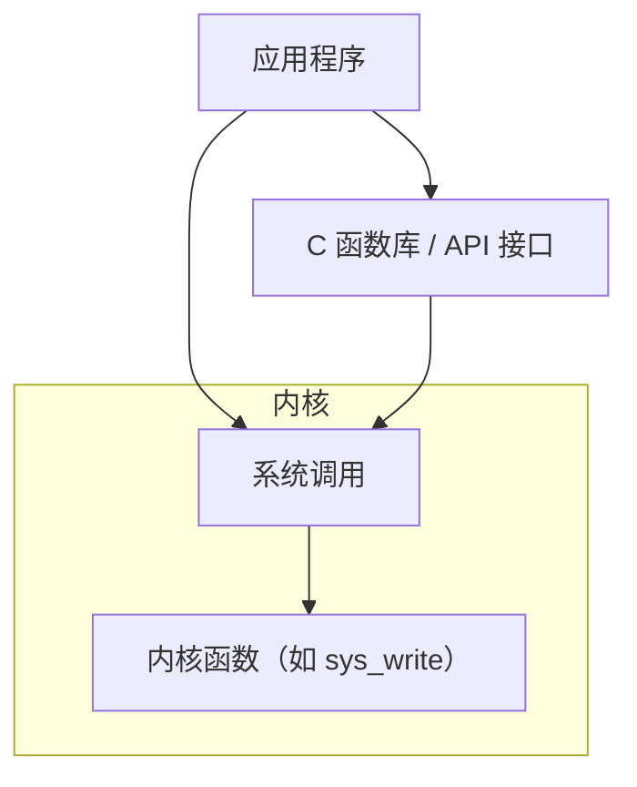
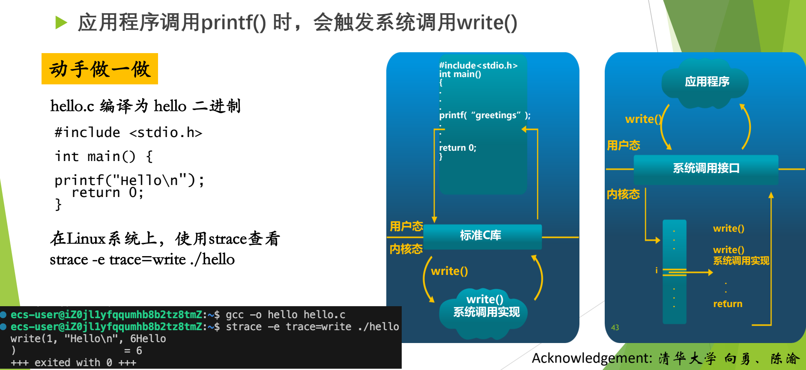

# 05 系统调用概念辨析

[本讲目录](../index.md) · [课程目录](../../index.md) · [上一节：04 x86 中断支持](04-x86-protected-mode-interrupt-support.md) · [下一节：06 系统调用机制设计](06-system-call-mechanism-design.md)

> [!abstract] 本节要点
> - **系统调用**是用户编程时调用的操作系统功能，是操作系统提供给编程人员的唯一接口；它的作用是让 CPU 从用户态陷入内核态。
> - 命令行里敲的命令不是系统调用；系统调用出现在程序代码里（如 `fork`、`open`、`read`、`write`）。
> - 层次关系：内核函数（内核里的一段代码）→ 封装为系统调用 → 再封装进 C 库/API；应用程序既可直接调用系统调用，也可调用库函数。
> - `printf` 是 C 库函数，不是系统调用，但它最终一定调用 `write` 系统调用，可用 `strace -e trace=write ./hello` 验证。

## 为什么需要系统调用

用户程序运行在用户态，不能执行特权指令，也不能直接操作设备和内核数据（见 L02「07 处理器特权模式」）。可程序又确实需要读文件、创建进程、向屏幕输出，这些工作只能由操作系统在内核态完成。系统调用就是用户程序“请求操作系统替我做事”的那条受控通道。

**系统调用**（system call）是用户在编程时可以调用的操作系统功能。[^s2p40] 它原名“操作系统功能调用”，因为名字太长才简称为系统调用。它有两个要点：

1. **唯一接口**：系统调用是操作系统提供给编程人员的唯一接口。程序想用操作系统的服务，最终都要走这条路。
2. **改变 CPU 状态**：系统调用使 CPU 状态从用户态陷入内核态。设计它的根本目的，就是让程序经由这条路径进入内核态。[^s4b4]

每个操作系统都提供几百种系统调用，按功能大致分为进程控制、进程通信、文件使用、目录操作、设备管理、信息维护等类别。[^s2p40]

> [!warning] 易错点
> 系统调用是**编程时**在代码里调用的（如 `fork`、`open`）；在命令行里敲的 `ls`、`cp` 是**命令**，不是系统调用。命令对应的程序在运行时会去调用系统调用，但命令本身不是。[^s4b4]

> [!note] 补充解释
> 两个课后自学问题：Linux 提供多少个系统调用？怎样新增一个系统调用？以当前 x86-64 Linux 为例，系统调用表大约有四百多项；新增一个系统调用，大致要实现内核函数（用 `SYSCALL_DEFINEn` 宏定义）、在体系结构的系统调用表中登记一个新编号、补充头文件声明，再重新编译内核。具体步骤见内核文档 [Adding a New System Call](https://docs.kernel.org/process/adding-syscalls.html)。

## 系统调用、库函数、API 与内核函数

这四个概念经常混用，面试也爱问它们的区别。[^s4b4] 理解它们的关键是：每个系统调用在内核里都对应**一段代码**。

1. **内核函数**：内核中真正干活的那段代码。它的名字和系统调用不完全一样，通常加了前缀或下划线，例如 `write` 对应内核里的 `sys_write`。
2. **系统调用**：内核函数经过一层封装后，对外提供的入口。
3. **库函数 / API**：系统调用再被封装进 C 函数库或 API 接口。例如 `fopen` 是对 `open` 的封装，`printf` 是 libc 中的库函数。[^s4b5]

应用程序有两条路：可以直接在 C 代码里写 `open`、`fork` 这样的系统调用，也可以调用 `fopen`、`printf` 这样的库函数，由库函数再去调用系统调用。[^s2p42]



| 概念 | 在哪里 | 运行在什么状态 | 例子 |
| --- | --- | --- | --- |
| 库函数 / API | C 库等用户空间库 | 用户态 | `printf`、`fopen` |
| 系统调用 | 用户与内核的边界 | 由用户态陷入内核态 | `write`、`open`、`fork` |
| 内核函数 | 内核代码 | 内核态 | `sys_write`、`sys_open` |

> [!warning] 易错点
> 库函数不一定调用系统调用：例如 `strlen`、`abs` 只在用户态做计算，不需要内核服务。只有涉及 I/O、进程、内存分配等需要操作系统参与的库函数，才会在内部发出系统调用。

## printf 与 write

`printf` 是最常见的例子。应用程序调用 `printf()` 时，会触发系统调用 `write()`。[^s2p43] 过程如下：

1. 用户程序调用标准 C 库中的 `printf("greetings")`，格式化工作在用户态的库里完成。
2. C 库内部调用 `write()`，通过系统调用接口从用户态进入内核态。
3. 在内核中，系统调用接口根据 `write` 的编号（图中的 $i$）找到 `write()` 的系统调用实现并执行。
4. 执行完毕后 `return`，从内核态回到用户态，再回到 `printf`，最后回到 `main`。



图：hello.c 调用 printf，标准 C 库最终调用 write，经系统调用接口进入内核执行 write 的实现；用 strace -e trace=write 可以看到这次 write 调用及其返回值 6。

图左半部分画的是“应用程序 → 标准 C 库 → `write()` 系统调用实现”这条纵向调用链，用户态和内核态的分界线在 C 库下方；右半部分把系统调用接口画成一张按编号 $i$ 索引的表，`write()` 调用进入接口后在表中第 $i$ 项找到实现，执行后 `return`。

用 `strace` 跟踪程序发出的系统调用，可以直接验证这一点：

```bash
gcc -o hello hello.c
strace -e trace=write ./hello
```

其中 `hello.c` 只有一句 `printf("Hello\n");`。输出为：

```text
write(1, "Hello\n", 6Hello
)                       = 6
+++ exited with 0 +++
```

逐项解读：`strace` 只跟踪 `write` 这一种系统调用；`write(1, "Hello\n", 6)` 表示向文件描述符 1（标准输出）写 6 个字节；`= 6` 是返回值，即实际写出的字节数。中间夹着的 `Hello` 是程序自己真正输出到终端的内容，它和 `strace` 打印的跟踪信息混在了同一个终端上。程序里只写了 `printf`，跟踪到的却是 `write`，说明 `printf` 和 `write` “不是一回事，但又是一回事”。[^s4b5]

## 系统调用与过程调用的区别

“系统调用与 C 函数调用（过程调用）的区别”是经典问题，也是面试常题。[^s2p42] 常见的标准答案从四个方面阐述。[^s4b5]

> [!note] 补充解释
> 常见答案可归纳为四个方面（结合本讲后面的内容）：
> 1. **进入方式**：过程调用用 `call` 指令直接跳到函数地址；系统调用用陷入指令（如 `int $0x80`），先经中断向量表进入总入口，再按编号查系统调用表，调用者不知道内核函数的地址。
> 2. **运行状态**：过程调用前后都在同一特权级（用户态）；系统调用要从用户态切换到内核态，返回时再切回。
> 3. **栈与开销**：过程调用只用用户栈；系统调用要切换到内核栈，并保存全部现场，开销明显更大。
> 4. **返回方式**：过程调用执行完直接返回调用者；系统调用返回用户态前要检查是否需要重新调度、是否有未决信号，调用进程未必马上继续运行（见 [Linux 系统调用执行](07-linux-x86-system-call-execution.md)）。

> [!question]- 自测：在 shell 里输入 `cat a.txt` 并回车，“cat”是系统调用吗？整个过程中有没有系统调用发生？
> `cat` 是命令，不是系统调用。但 `cat` 程序运行时会调用 `open`、`read`、`write` 等系统调用来打开文件、读取内容并输出到终端，所以过程中有系统调用发生。

> [!question]- 自测：程序先调用 `fopen` 打开文件，再调用 `fprintf` 写入。哪些是系统调用？哪些代码在内核态执行？
> `fopen`、`fprintf` 都是 C 库函数，在用户态执行。它们内部分别调用 `open` 和 `write` 系统调用；只有陷入之后执行的内核函数（如 `sys_open`、`sys_write`）运行在内核态。

> [!question]- 自测：把 hello 程序改成 `printf("Hi!\n"); printf("Bye\n");`，用 `strace -e trace=write` 跟踪，你预计会看到几次 `write`？
> 输出到终端时，标准输出按行缓冲，每遇到 `\n` 刷新一次，预计看到两次 `write(1, ...)`，返回值分别是 4。若把输出重定向到文件，变成全缓冲，可能只看到一次 `write`，写入 8 个字节。这说明库函数调用次数和系统调用次数不必一一对应。

> [!info]- 来源
> - slides02.pdf：PDF p.38–43
> - L03.docx：DOCX body 97–148

[^s2p40]: slides02.pdf-PDF p.40
[^s4b4]: L03.docx-DOCX body 97-119
[^s4b5]: L03.docx-DOCX body 120-148
[^s2p42]: slides02.pdf-PDF p.42
[^s2p43]: slides02.pdf-PDF p.43

[本讲目录](../index.md) · [课程目录](../../index.md) · [上一节：04 x86 中断支持](04-x86-protected-mode-interrupt-support.md) · [下一节：06 系统调用机制设计](06-system-call-mechanism-design.md)
