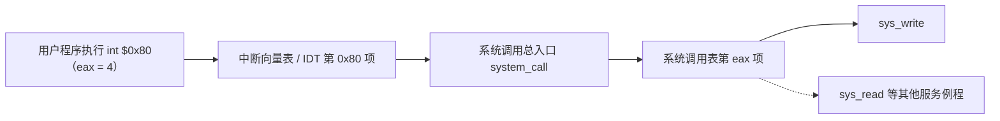

# 06 系统调用机制设计

[本讲目录](../index.md) · [课程目录](../../index.md) · [上一节：05 系统调用概念辨析](05-system-call-concept-and-related-notions.md) · [下一节：07 Linux 系统调用执行](07-linux-x86-system-call-execution.md)

> [!abstract] 本节要点
> - 系统调用不另建新机制，而是建立在中断/异常机制之上；操作系统要事先准备四样东西：中断异常机制、陷入指令、系统调用号与参数约定、系统调用表。
> - 陷入指令也叫访管指令（“管”指管态，即内核态）：x86 Linux 用 `int $0x80`，RISC-V 用 `ecall`，奔腾 II 之后的 x86 还有 `sysenter`/`sysexit`。
> - 参数传递有三种方法：陷入指令自带、通用寄存器、内存中的专用栈区；最常用的是寄存器，具体放法由编译器生成。
> - x86 Linux 约定：`eax` 放系统调用号（write 为 4，exit 为 1）和返回值，参数依次放 `ebx`、`ecx`、`edx`、`esi`、`edi`。
> - 系统调用表与中断向量表是**两张表**：所有系统调用在中断向量表里只占 0x80 一行，进入后再按调用号查系统调用表。

## 在中断异常机制之上设计

设计系统调用分两部分：**静态部分**是事先设计好、准备好的东西，**动态部分**是程序执行到系统调用时实际发生的过程。[^s4b5] 本节讲静态部分，动态部分见 [Linux 系统调用执行](07-linux-x86-system-call-execution.md)。

系统调用不需要另造一套新机制。任何一种体系结构都已经提供了中断/异常机制，系统调用只是在它之上实现，属于异常中的陷入（trap）一类，返回到下一条指令（分类见 [中断异常事件分类](01-interrupt-and-exception-classification.md)）。在此基础上，还要准备以下几样东西：[^s2p45]

1. **中断/异常机制**：硬件已经准备好，直接使用。
2. **陷入指令**（亦称访管指令）：选定一条特殊指令，执行它就引发异常，完成用户态到内核态的切换。
3. **系统调用号和参数**：每个系统调用事先给定一个编号（功能号），并约定参数如何传递。
4. **系统调用表**：存放各系统调用服务例程的入口地址。

系统调用是**机制与策略分离**的典型例子：所有系统调用都从同一条途径进入内核，这是机制；进入以后按编号选择不同的服务例程，这是策略。[^s4b5] 这一原则在 [低层步骤与机制策略](08-low-level-steps-and-mechanism-policy-separation.md) 中展开。

## 陷入指令（访管指令）

**陷入指令**（trap instruction）也叫**访管指令**。“管”指管态，即 supervisor 模式、内核态；“访管”就是访问内核态，这是较老的叫法。[^s4b5]

不同体系结构选用的指令不同：

- **x86 上的 Linux**：选 `int $0x80`，即 `int` 指令配合 128 号中断向量（向量分配见 [中断响应与中断向量](02-interrupt-response-and-vector-table.md)）。
- **RISC-V**：用 `ecall` 指令。
- **奔腾 II 之后的 x86**：新增了 `sysenter`/`sysexit`。它和 `int`/`iret` 一样，是一进一出的一对指令。老代码仍然可以用 `int $0x80`，程序最终编译成哪一种由编译器决定。[^s4b5]

> [!note] 补充解释
> 在 x86-64 上，Linux 的标准入口是 `syscall`/`sysret` 指令；`int $0x80` 仍保留，用于兼容 32 位程序。本讲的例子都是 32 位 x86。

## 系统调用号与参数传递

**系统调用号**（功能号）告诉内核“要哪一项服务”。支持多少个系统调用、每个用什么编号，有 POSIX 标准可循。按标准编号就符合标准；自己另编也能运行，但就不符合标准了。[^s4b5]

系统调用是函数，可能带零个、一个或多个参数。参数在用户空间，怎样带进内核？常用的三种方法如下：[^s2p46]

| 方法 | 做法 | 局限 | 实际使用 |
| --- | --- | --- | --- |
| 陷入指令自带参数 | 参数编码在指令里 | 指令长度有限，还要携带功能号，只能带很少的参数；指令也会变复杂 | 不现实 |
| 通用寄存器 | 把参数放进操作系统和用户程序都能访问的寄存器 | 寄存器个数限制参数数量 | 最常用；64 位机通用寄存器多，已不成问题 |
| 内存中的专用栈区 | 参数多时打包放在内存（栈）中，只把指针传进去 | 内核需要再去内存读取 | 参数太多时使用 |

参数怎样放置，由**编译器**负责生成相应代码。代码中的一个系统调用要变成真正可执行的陷入序列，编译器必须参与。[^s4b5]

### 示例：write 与 exit 的汇编

高级语言里的一次 `write()`，编译后会变成“先把调用号放进 `eax`，再执行 `int $0x80`”：[^s2p47]

```asm
    ……
    movl $4, %eax
    ……
    int  $0x80
    ……
```

看一个完整例子。C 语言版本：[^s2p48]

```c
#include <unistd.h>
int main(){
    char string[7] = {'H', 'e', 'l', 'l', 'o', '!', '\n'};
    write(1, string, 7);
    return 0;
}
```

它向屏幕输出 `Hello!`。这段代码里有两个系统调用：`write` 和 `return 0` 最终引起的 `exit`。[^s4b6] 对应的 x86 Linux 汇编（AT&T 语法）如下：[^s2p49]

```asm
    .section .data
output:
    .ascii "Hello!\n"
output_end:
    .equ len, output_end - output   # 字符串长度 = 7

    .section .text
    .globl _start
_start:
    movl $4, %eax        # eax 存放系统调用号：4 = write
    movl $1, %ebx        # 第 1 个参数：文件描述符 1（标准输出）
    movl $output, %ecx   # 第 2 个参数：字符串首地址
    movl $len, %edx      # 第 3 个参数：字节数
    int  $0x80           # 引发一次系统调用
end:
    movl $1, %eax        # 系统调用号 1 = exit
    movl $0, %ebx        # 参数：退出状态 0
    int  $0x80
```

逐段解释：

1. `.data` 段定义字符串 `"Hello!\n"`，`len` 用两个标号的地址差算出长度 7。
2. 第一次系统调用：编译器按规则先把系统调用号 4（write）放进 `eax`，再把三个参数 `1`、`output`、`len` 依次放进 `ebx`、`ecx`、`edx`，最后执行 `int $0x80`。这正对应 `write(1, string, 7)`。
3. 第二次系统调用：`eax = 1` 是 exit，`ebx = 0` 是退出状态，对应 C 代码里的 `return 0`。代码注释里的问题“1 这个系统调用的作用？”，答案就是 exit。[^s4b6]

规律是：**先传系统调用号，再传参数，然后陷入**。执行到 `int $0x80` 时，参数已经在寄存器里准备好了。

### 参数传递的寄存器约定

> [!info] 依据讲义整理
> 本小节的寄存器约定与 C 库封装例程示例没有在课上展开，内容与上面的汇编示例相互印证。

x86 Linux 的系统调用用寄存器传递两类信息：系统调用号，以及系统调用所需的参数。[^s2p61]

- `eax`：保存系统调用号；系统调用返回时，也用它保存返回值。
- `ebx`、`ecx`、`edx`、`esi`、`edi`：依次保存第 1 到第 5 个参数。
- 进入内核态后，`system_call` 再把这些寄存器保存到内核栈中，参数也就随之进入了内核栈（见 [Linux 系统调用执行](07-linux-x86-system-call-execution.md)）。

> [!note] 补充解释
> 讲义写“参数个数不超过 6 个”，但只列了 5 个寄存器。在后来的 i386 Linux 内核中，第 6 个参数放在 `ebp` 中；参数更多时，就按上表第三种方法打包放进内存，只传指针。

C 库中的封装例程负责把参数从用户栈搬进寄存器。假设 C 库封装了一个系统调用号为 3 的函数（这里只是示意，并不是真实的 3 号调用），原型为：[^s2p62]

```c
int sys_func(int para1, int para2);
```

C 编译器为它产生的汇编伪码如下：

```asm
    …
    movl 0x8(%esp), %ecx   # 将用户态堆栈中的 para2 放入 ecx
    movl 0x4(%esp), %ebx   # 将用户态堆栈中的 para1 放入 ebx
    movl $0x3, %eax        # 系统调用号保存在 eax 中
    int  $0x80             # 引发系统调用
    …
    movl %eax, errno       # 将结果存入全局变量 errno 中
    movl $-1, %eax         # eax 置为 -1，表示出错
```

逐行解释：

1. 按 C 的调用约定，调用者把参数压在用户栈上；进入封装例程时，`0(%esp)` 是返回地址，`0x4(%esp)` 是第一个参数 `para1`，`0x8(%esp)` 是第二个参数 `para2`。
2. 封装例程把它们分别搬进 `ebx`、`ecx`，这正是系统调用约定的第 1、第 2 个参数寄存器。
3. 把调用号 3 放进 `eax`，执行 `int $0x80` 陷入内核。
4. 返回后，`eax` 中是内核的返回值。省略号之后的两行是出错分支：把错误信息存入全局变量 `errno`，并把 `eax` 置为 $-1$ 作为函数返回值，这就是 C 程序看到“系统调用返回 $-1$、具体原因查 `errno`”的由来。

> [!note] 补充解释
> 讲义的伪码省略了判断，看上去像是无条件执行最后两行。实际的 C 库会先检查返回值：内核出错时返回一个负的错误码（如 $-\text{ENOSYS}$），C 库只在返回值落在 $[-4095, -1]$ 区间时，才把它取反后存入 `errno`（即 `errno` 中是正的错误码），再返回 $-1$；成功时直接把 `eax` 原样返回。

## 系统调用表

操作系统要支持几百个系统调用，每个系统调用都有一段代码。需要一张表，按编号找到每段代码的入口，这就是**系统调用表**（system call table）。它的作用和 ICS 里学过的跳转表一样，是本课正式讲的第二个数据结构（第一个是中断向量表）。[^s4b5]

关键在于：**系统调用表和中断向量表不是一张表**。几百个系统调用在中断向量表里只占一行（0x80 号）；从这一行进入总入口程序后，再用 `eax` 中的调用号去查第二张表，才能找到具体的服务例程。



> [!tip] 课堂强调
> 以往考试中至少有百分之三四十的同学认为中断向量表和系统调用表是同一张表。一张表不可能包打天下：中断向量表只负责把所有系统调用引到 0x80 这一个入口，进来之后还要再查系统调用表。[^s4b5]

在整个设计中，操作系统真正新做的事情只有两件：确定支持哪些系统调用（编号和参数约定），以及在初始化时建好系统调用表。其余都利用现成的中断异常机制。[^s4b5]

> [!question]- 自测：某 32 位 x86 Linux 程序执行 `int $0x80` 前，`eax = 3`，`ebx = 0`，`ecx` 指向一个缓冲区，`edx = 100`。它在请求什么服务？
> 调用号 3 是 `read`，三个参数依次是文件描述符 0（标准输入）、缓冲区地址、最多读 100 字节，即 `read(0, buf, 100)`。

> [!question]- 自测：同学说“Linux 有三百多个系统调用，所以中断向量表里有三百多项是系统调用”。错在哪里？
> 所有系统调用在中断向量表中只占 0x80 一项。三百多个服务例程的入口放在另一张表，即系统调用表中，由总入口程序按 `eax` 中的调用号查找。

> [!question]- 自测：为什么不把系统调用的参数直接编码在 `int` 指令里？
> 陷入指令长度有限，还要携带功能号，能带的参数很少，指令也会变复杂；改用通用寄存器传参，或在参数多时把参数打包放进内存再传指针，更简单通用。

> [!info]- 来源
> - slides02.pdf：PDF p.44–49, 61–62
> - L03.docx：DOCX body 120–174

[^s4b5]: L03.docx-DOCX body 120-148
[^s2p45]: slides02.pdf-PDF p.45
[^s2p46]: slides02.pdf-PDF p.46
[^s2p47]: slides02.pdf-PDF p.47
[^s2p48]: slides02.pdf-PDF p.48
[^s4b6]: L03.docx-DOCX body 149-174
[^s2p49]: slides02.pdf-PDF p.49
[^s2p61]: slides02.pdf-PDF p.61
[^s2p62]: slides02.pdf-PDF p.62

[本讲目录](../index.md) · [课程目录](../../index.md) · [上一节：05 系统调用概念辨析](05-system-call-concept-and-related-notions.md) · [下一节：07 Linux 系统调用执行](07-linux-x86-system-call-execution.md)
