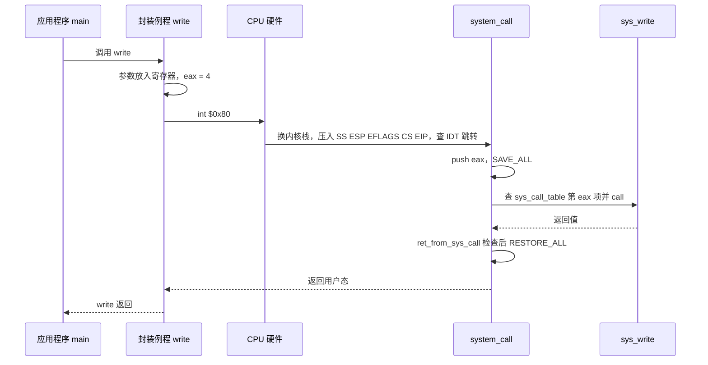
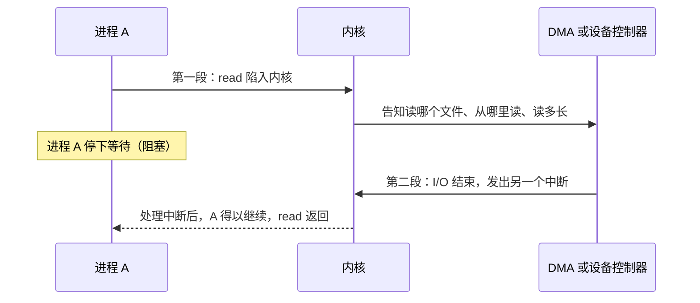

# 07 Linux 系统调用执行

[本讲目录](../index.md) · [课程目录](../../index.md) · [上一节：06 系统调用机制设计](06-system-call-mechanism-design.md) · [下一节：08 低层步骤与机制策略](08-low-level-steps-and-mechanism-policy-separation.md)

> [!abstract] 本节要点
> - 执行陷入指令后：硬件保存现场并查中断向量表，把控制权交给系统调用总入口 `system_call`；总入口**第一件事是进一步保存现场**（参数随之进入内核栈），再用 `eax` 中的调用号查系统调用表，执行服务例程，最后恢复现场返回。与普通中断相比只多了一步查系统调用表。
> - Linux 在初始化时调用 `set_system_gate(0x80, &system_call)`：门类型 15 是陷阱门（进入后不关中断），DPL 设为 3，用户态才能通过这扇门。
> - `int $0x80` 的硬件动作：从 TSS 装入内核栈指针，压入用户的 SS、ESP、EFLAGS、CS、EIP，复位 TF，IF 不变，再经 IDT/GDT 定位 `system_call`。
> - `system_call` 依次 `push %eax`、`SAVE_ALL`，检查调用号合法后执行 `call *sys_call_table(,%eax,4)`，把返回值写回栈中的 eax 位置。
> - `ret_from_sys_call` 先 `cli` 关中断，再检查 `need_resched`（是否重新调度）和 `sigpending`（是否有未决信号），最后 `RESTORE_ALL` 返回用户态；`read` 等阻塞的系统调用是两段过程。

## 执行过程总览

> [!info] 可视化资源
> - [OSTEP 第 6 章 Limited Direct Execution（PDF）](https://pages.cs.wisc.edu/~remzi/OSTEP/cpu-mechanisms.pdf)：Figure 6.2 以操作系统、硬件、程序三列时间线展示系统调用陷入与返回的协议，可与本节 int $0x80 的执行过程对照。

静态部分都准备好后（见 [系统调用机制设计](section:section-6)），剩下的是运行。运行的实体是进程：进程执行到 `int $0x80` 时，调用号和参数已经由编译器生成的代码放进寄存器了。[^s4b6] 接下来的过程是前面中断过程在系统调用场景下的重复：[^s2p50]

1. **中断/异常机制（硬件）**：保护现场；用 0x80 查中断向量表，把控制权转给**系统调用总入口程序**。
2. **系统调用总入口程序（软件）**：保存现场，把参数保存在内核栈里；然后查系统调用表，把控制权转给相应的系统调用处理例程（内核函数）。
3. **执行系统调用例程**。
4. **恢复现场，返回用户程序**。

“总入口程序”只是提示性的叫法，不是专有名称：所有系统调用都先进入这一个程序，再由它分派到 `read`、`write` 等不同的代码。它本身就是 0x80 号的中断处理程序。[^s4b6]

> [!tip] 课堂强调
> 中断处理程序（这里就是系统调用总入口程序）的第一件事是**进一步保存现场**。这一点一定不要忘：硬件只保存了极少数寄存器，剩下的现场要由软件保存。保存现场的同时，放在寄存器里的参数也就进入了系统栈。[^s4b6]

与普通中断处理相比，系统调用只多了一步：在总入口程序里用 `eax` 中的调用号查系统调用表。硬件保存现场与软件保存现场的分工见 [中断处理完整流程](section:section-3)。

## 0x80 号门与 int $0x80

用户程序能用 `int $0x80` 进入内核，前提是 IDT 第 128 项已经按系统调用的需要设置好；执行这条指令时，硬件再按这一项完成换栈、压栈和跳转。

### 门描述符的初始化

Linux 在 x86 上选用 `int $0x80`（十进制 128）作为陷入指令。系统初始化时，要对 IDT 的第 128 号门描述符进行初始化，这一步在 `sched_init()` 中完成：[^s2p52]

```c
set_system_gate(0x80, &system_call);
```

这个门描述符（8 个字节）的关键内容如下（IDT 和门描述符的一般结构见 [x86 中断支持](04-x86-protected-mode-interrupt-support.md)）：

- **第 2、3 字节**：内核代码段选择符 `__KERNEL_CS`。用它在 GDT 中找到内核代码段，得到段基址。
- **第 0、1、6、7 字节**：偏移量，即 `system_call()` 第一条指令在段内的偏移。段基址加偏移，就是 `system_call` 的入口。
- **门类型 15**：陷阱门。为什么用陷阱门？因为系统调用进来之后仍然可以接受中断，陷阱门不会自动关中断。
- **DPL = 3**：与用户特权级相同，允许用户进程使用这个门描述符。如果 DPL 是 0，用户态权限不够，就进不来了；系统调用本来就是要让用户进入内核，所以必须设 3。[^s4b6]

这些细节不要求掌握，看代码时能照着认出来即可。

> [!note] 补充解释
> `set_system_gate` 写在 `sched_init()` 中是 Linux 0.11 的代码；Linux 2.x 的 i386 内核把它放在 `arch/i386/kernel/traps.c` 的 `trap_init()` 中，作用相同。

系统调用号在头文件 `include/asm-i386/unistd.h` 中定义：[^s2p53]

```c
#define __NR_exit      1
#define __NR_fork      2
#define __NR_read      3
#define __NR_write     4
#define __NR_open      5
#define __NR_close     6
#define __NR_waitpid   7
#define __NR_creat     8
#define __NR_link      9
#define __NR_unlink   10
#define __NR_execve   11
#define __NR_chdir    12
#define __NR_time     13
/* … */
```

不同体系结构的编号可能不同，查对应平台的头文件即可。[^s4b6]

### int $0x80 的硬件动作

CPU 执行 `int $0x80` 时，硬件依次完成下列动作：[^s2p54]

1. **切换栈**：特权级从用户态（R3）变为内核态（R0），栈必须从用户栈换成内核栈。CPU 从任务状态段 TSS 中装入新的栈指针 `SS:ESP`，指向内核栈。TSS 中存有四对栈指针（`SS0:ESP0` 到 `SS3:ESP3`），分别对应 R0–R3 四个特权级。[^s4b7]
2. **压栈保存**：把用户栈的 `SS:ESP`、`EFLAGS`、用户态的 `CS`、`EIP` 压入内核栈，供返回时使用。
3. **修改标志位**：`EFLAGS` 压栈后，复位 TF（单步标志），IF 保持不变（因为走的是陷阱门，不关中断）。
4. **查 IDT**：用 128 在 IDT 中找到门描述符，把其中的段选择符装入代码段寄存器 `CS`。
5. **定位入口**：代码段描述符中的基地址加上陷阱门描述符中的偏移量，得到 `system_call()` 的入口地址。
6. **特权级检查**：规则是代码只能访问相同或较低特权级的数据。[^s2p55]

这时调用号和参数仍在寄存器里：`EAX` 放调用号，`EBX`、`ECX`、`EDX`、`ESI`、`EDI` 放参数。[^s2p55] 这些都是 x86 的细节，不要求掌握，但要有“特权级改变就要换栈”的意识。

## system_call 总入口与分派

整个执行流程可以用四段代码串起来：[^s2p56]

1. **应用程序**（用户态）：`main` 中调用 `write(...)`。
2. **封装例程**（用户态）：C 库中封装后的 `write()` 先做好参数传递工作，然后执行 `int $0x80` 产生一次异常。
3. **陷入处理**（内核态）：CPU 通过 0x80 号在 IDT 中找到 `system_call()` 并调用；`system_call()` 执行 `push %eax`、`SAVE_ALL`，把参数保存在内核栈，再根据系统调用号索引系统调用表，找到入口并 `call sys_write`。
4. **内核函数**（内核态）：`asmlinkage long sys_write()` 执行完毕后 `return`，经过 `ret_from_sys_call()` 的 `restore all` 返回用户程序。


图：用户态的 main 调用封装例程 write，后者把系统调用号放入 eax 并执行 int $0x80；内核入口 system_call 保存现场、按号调用 sys_write，返回时经 ret_from_sys_call 恢复现场回到用户程序。

图中四个方框从左到右是应用程序、封装例程、陷入处理、内核函数，箭头表示调用与返回；前两个属于用户态，后两个属于内核态。红色标出的 `SAVE_ALL` 和 `call sys_write` 是陷入处理中的两个关键动作。



### SAVE_ALL：软件保存现场

陷入之后，先要用一段汇编保存现场。`system_call` 先执行 `push %eax`，把系统调用号压栈；然后执行宏 `SAVE_ALL`，把其余上下文全部压栈：[^s2p57]

```asm
#define SAVE_ALL \
    cld;                        \
    pushl %es;                  \
    pushl %ds;                  \
    pushl %eax;                 \
    pushl %ebp;                 \
    pushl %edi;                 \
    pushl %esi;                 \
    pushl %edx;                 \
    pushl %ecx;                 \
    pushl %ebx;                 \
    movl $(__KERNEL_DS), %edx;  \
    movl %edx, %ds;             \
    movl %edx, %es;
```

`cld` 清方向标志；接着依次压入段寄存器 `es`、`ds` 和通用寄存器 `eax`、`ebp`、`edi`、`esi`、`edx`、`ecx`、`ebx`；最后三行把 `ds`、`es` 换成内核数据段 `__KERNEL_DS`，让后续内核代码访问内核数据。

于是内核栈中从高地址到低地址依次是：硬件压入的 `SS`、`ESP`、`EFLAGS`、`CS`、`EIP`，`push %eax` 压入的调用号，然后是 `SAVE_ALL` 压入的内容。[^s4b7] 按这个顺序可以推算出 `SAVE_ALL` 之后各项相对 `%esp` 的偏移（每项 4 字节）：

| 偏移 | 内容 | 压入者 |
| --- | --- | --- |
| 0 – 20 | `ebx`、`ecx`、`edx`、`esi`、`edi`、`ebp`（每项相差 4） | `SAVE_ALL` |
| 24 | `eax`（之后用来存放返回值） | `SAVE_ALL` |
| 28、32 | `ds`、`es` | `SAVE_ALL` |
| 36 | 系统调用号（原 `eax`） | `push %eax` |
| 40 – 56 | `EIP`、`CS`、`EFLAGS`、用户 `ESP`、用户 `SS` | 硬件 |

注意 `ebx`、`ecx`、`edx`、`esi`、`edi` 正好位于栈顶，并按第 1 到第 5 个参数的顺序排列。这样，内核函数可以像普通 C 函数一样从栈上取参数，这就是“参数保存在内核栈里”的含义。

### 合法性检查与查表分派

`system_call` 的后续片段如下：[^s2p63]

```asm
system_call:
    pushl %eax                  # 将系统调用号压栈
    SAVE_ALL
    ...
    cmpl $(NR_syscalls), %eax   # 检查是否是合法的系统调用号
    jb   nobadsys
    movl $(-ENOSYS), 24(%esp)   # 堆栈中的 eax 设置为 -ENOSYS，作为返回值
    jmp  ret_from_sys_call
```

1. `cmpl $(NR_syscalls), %eax` 把调用号与系统调用总数 `NR_syscalls` 比较。表里假如只有 200 项，却要访问第 208 项，就找不到对应代码，所以必须检查。[^s4b7]
2. `jb nobadsys`：调用号小于总数（`jb` 是无符号比较，负数会被当作很大的数，同样不合法），说明是合法的系统调用（“no bad sys”），跳到 `nobadsys`。
3. 否则把栈中 eax 位置（偏移 24）设为 $-\text{ENOSYS}$（“没有这个系统调用”的错误码），跳到 `ret_from_sys_call` 出错返回。

合法时继续执行：[^s2p64]

```asm
nobadsys:
    …
    call *SYMBOL_NAME(sys_call_table)(,%eax,4)
                                # 调用系统调用表中调用号为 eax 的系统调用例程
    movl %eax, EAX(%esp)        # 将返回值存入堆栈中 eax 中
    jmp  ret_from_sys_call
```

- `sys_call_table(,%eax,4)` 是 AT&T 语法的寻址方式“基址 + 下标 × 比例”，地址为 `sys_call_table + eax*4`。4 是表中每项的字节数，这是 32 位的痕迹，64 位下应为 8。[^s4b7]
- 前面的 `*` 表示间接调用：先从这个地址取出函数入口，再跳过去。跳出去一定会回来。
- 返回值在 `eax` 中，`movl %eax, EAX(%esp)` 把它写进栈中保存 eax 的位置（`EAX` 是偏移 24 的符号名）。这样 `RESTORE_ALL` 恢复寄存器时，用户程序拿到的 `eax` 就是系统调用的返回值。

系统调用表本身在 `entry.S` 中定义，描述系统调用号与内核处理函数的对应关系；表中第 $n$ 项（偏移 $4n$ 字节）存放 $n$ 号调用的内核函数地址：[^s2p59]

```asm
.data
ENTRY(sys_call_table)
    .long SYMBOL_NAME(sys_exit)    # 1
    .long SYMBOL_NAME(sys_fork)    # 2
    .long SYMBOL_NAME(sys_read)    # 3
    .long SYMBOL_NAME(sys_write)   # 4
    … …
```

用文字再串一遍：用户态调用 C 库函数 `func()`，`func()` 做好参数传递后执行 `int $0x80` 产生异常；CPU 用 0x80 在 IDT 中找到 `system_call()` 并调用；`system_call()` 按系统调用号索引系统调用表，找到 `sys_func()`；`sys_func()` 执行完后，经 `ret_from_sys_call()` 返回用户程序。[^s2p60]

> [!note] 补充解释
> xv6-riscv 中对应的保存寄存器代码在 `trampoline.S`（用户态陷入时）和 `kernelvec.S`（内核态被中断时），系统调用分派在 `syscall.c` 中，可参考 xv6-book 4.2–4.3 节。[^s2p58] 读 xv6 代码时再细看。

## ret_from_sys_call：返回前的检查

返回用户态不是简单地弹栈，还要和 ICS 学过的内容对上：[^s2p65]

```asm
ret_from_sys_call:
    cli                          # 关中断
    cmpl $0, need_resched(%ebx)
    jne  reschedule              # 如果进程描述符中的 need_resched 位不为 0，则重新调度
    cmpl $0, sigpending(%ebx)
    jne  signal_return           # 若有未处理完的信号，则处理
restore_all:
    RESTORE_ALL                  # 堆栈弹栈，返回用户态
```

（`%ebx` 此时指向当前进程的进程描述符，`need_resched` 和 `sigpending` 是其中字段的偏移。）

1. **`cli` 关中断**：进来时走的是陷阱门，中断一直开着，前面开着没有问题；但到了返回阶段，检查标志和恢复现场必须一气呵成，不能再被打断。[^s4b7]
2. **检查 `need_resched`**：如果进程描述符中的 `need_resched` 不为 0（`jne` 即 not equal），说明需要重新调度，跳到 `reschedule` 去调度程序换进程。这印证了一条规律：任何处理做完后都要回到调度，由调度决定谁上 CPU。[^s4b8]
3. **检查 `sigpending`**：不需要换进程时，当前进程马上要回到用户态继续运行。此前要检查有没有发给它的未决信号，有就跳到 `signal_return` 全部处理完，进程才“轻装上阵”。这正是 ICS 第 8 章讲的：内核在从内核态返回用户态的时刻处理信号。信号用位向量记录，不是队列，每种信号对应一位，所以用 0 比较即可判断有无信号。[^s4b8]
4. **`RESTORE_ALL`**：既不换进程、也没有信号时，把压栈的内容全部弹回寄存器，执行中断返回指令回到用户态，继续执行 `int $0x80` 的下一条指令。

> [!tip] 课堂强调
> `ret_from_sys_call` 的第一条指令 `cli` 很重要：进入时中断是开着的，返回时必须先关中断。[^s4b7]

> [!note] 补充解释
> 说跳到 `reschedule` 后“就走了，不回来了”，指的是当前进程交出 CPU，由调度程序选中的另一个进程运行。在 Linux 2.x 中，`reschedule` 的代码是 `call schedule` 后再 `jmp ret_from_sys_call`：等原进程以后再次被调度上 CPU 时，会从 `schedule()` 返回，重新执行一遍返回检查，最终仍经 `RESTORE_ALL` 回到用户态。

## 阻塞的系统调用

前面只讲了从 `int $0x80` 进入到调用具体服务例程这一段。对于 `read`、`write` 这类涉及 I/O 的慢速操作，还有后半段。[^s4b6]

以进程 A 执行 `read` 为例：读文件的工作（从哪个字节开始、读多长）最终交给 DMA 或设备控制器完成，而不是 CPU。CPU 一碰到 I/O 就把事情交出去，进程 A 只能停下来等待。这类调用称为**阻塞的系统调用**（blocking system call）：执行后进程停在那里，直到 I/O 结束；I/O 结束时设备通过**另一个中断**通知 CPU，进程才能继续。所以 `read` 是**两段**过程。



> [!tip] 课堂强调
> 以前考试考过 `read` 的这两段过程，很多同学只写了一段。宁可别的不管，也要把这个细节抠清楚。[^s4b6]

> [!question]- 自测：用户程序以 `eax = 500` 执行 `int $0x80`，而该内核只有 300 个系统调用。会发生什么？用户程序最终看到什么？
> `cmpl $(NR_syscalls), %eax` 后 `jb` 不成立，不会跳到 `nobadsys`；内核把栈中 eax 位置设为 $-\text{ENOSYS}$，经 `ret_from_sys_call` 返回。`RESTORE_ALL` 后用户的 `eax` 为 $-\text{ENOSYS}$，C 库据此返回 $-1$ 并设置 `errno` 为 `ENOSYS`。

> [!question]- 自测：如果把 0x80 号门的 DPL 设为 0，用户程序执行 `int $0x80` 会怎样？如果把门类型改成中断门呢？
> DPL 为 0 时，用户态（特权级 3）的权限不够，无法通过这扇门，系统调用进不了内核。改成中断门则仍能进入，但进门后会自动关中断，整个系统调用处理期间不响应新的中断。

> [!question]- 自测：进程 A 调用 `write` 后，在 `ret_from_sys_call` 中发现 `need_resched` 为 0、`sigpending` 不为 0。接下来按什么顺序发生什么？
> 不换进程；跳到 `signal_return`，把发给 A 的未决信号全部处理完，然后执行 `RESTORE_ALL`，恢复寄存器并返回用户态，`eax` 中是 `write` 的返回值。

> [!info]- 来源
> - slides02.pdf：PDF p.50–60, 63–65
> - L03.docx：DOCX body 149–224

[^s4b6]: L03.docx-DOCX body 149-174
[^s2p50]: slides02.pdf-PDF p.50
[^s2p52]: slides02.pdf-PDF p.52
[^s2p53]: slides02.pdf-PDF p.53
[^s2p54]: slides02.pdf-PDF p.54
[^s4b7]: L03.docx-DOCX body 175-192
[^s2p55]: slides02.pdf-PDF p.55
[^s2p56]: slides02.pdf-PDF p.56
[^s2p57]: slides02.pdf-PDF p.57
[^s2p63]: slides02.pdf-PDF p.63
[^s2p64]: slides02.pdf-PDF p.64
[^s2p59]: slides02.pdf-PDF p.59
[^s2p60]: slides02.pdf-PDF p.60
[^s2p58]: slides02.pdf-PDF p.58
[^s2p65]: slides02.pdf-PDF p.65
[^s4b8]: L03.docx-DOCX body 193-224

[本讲目录](../index.md) · [课程目录](../../index.md) · [上一节：06 系统调用机制设计](06-system-call-mechanism-design.md) · [下一节：08 低层步骤与机制策略](08-low-level-steps-and-mechanism-policy-separation.md)
