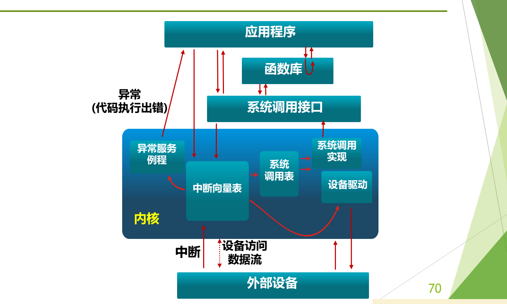

# 08 低层步骤与机制策略

[本讲目录](../index.md) · [课程目录](../../index.md) · [上一节：07 Linux 系统调用执行](07-linux-x86-system-call-execution.md)

> [!abstract] 本节要点
> - 系统调用是用户程序调用操作系统子功能的特殊过程调用，由访管指令实现，是唯一接口，使 CPU 从目态（用户态）转入管态（内核态），可用来动态申请和释放系统资源。
> - 完成系统调用的条件分两部分。静态：封装内核函数为库函数/API、访管指令与陷入机制、编译器、OS 初始化（编号与参数约定、系统调用表）。动态：陷入、总入口、保存现场（压栈）、查表分派、执行、返回。
> - 中断后 OS 低层工作八步：1–2 硬件压栈并装入新 PC；3–4 汇编保存寄存器、设置新栈；5 C 语言中断服务程序；6 进程调度；7–8 回到汇编并运行新的当前进程。顺序不能错，软硬件步骤不能交叉。
> - **机制与策略分离**：机制不变（为了性能），策略可调（为了灵活）。中断异常机制是机制，中断向量表及处理程序、系统调用表是策略。

## 系统调用小结

把前三章的内容收拢起来：[^s2p66]

- **系统调用**是用户在程序中调用操作系统提供的一些子功能，原名“操作系统功能调用”。[^s4b8]
- 它是一种**特殊的过程调用**，由特殊的机器指令实现。每种机器的指令集都支持这样的指令，即访管指令。
- 它是操作系统提供给编程人员的**唯一接口**。
- 它使 CPU 状态从**目态**转入**管态**（老说法；即从用户态转入内核态）。
- 利用系统调用，可以动态请求和释放系统资源，完成与硬件相关的工作，以及控制程序的执行等。
- 每个操作系统都提供几百种系统调用，编号遵循 POSIX 标准。

系统调用与 C 函数调用的区别见 [系统调用概念辨析](05-system-call-concept-and-related-notions.md)。

### 完成系统调用需要哪些条件

“完成系统调用机制的运行需要什么条件（准备工作）？”可以分静态和动态两部分来回答：[^s2p67]

**静态部分**（事先准备好）：

1. **封装内核函数**：把内核函数封装成库函数或 API 接口，供程序调用。
2. **访管指令与陷入机制**：选定陷入指令，并借用中断异常机制（见 [系统调用机制设计](06-system-call-mechanism-design.md)）。
3. **编译器**：把代码中的系统调用编译成符合约定的陷入序列（调用号放哪里、参数怎么传）。
4. **操作系统初始化**：确定系统调用编号及参数传递方式；建好系统调用表，并在中断向量表（IDT）中设置好 0x80 号入口。

**动态部分**（执行时，与中断过程一样）：陷入内核 → 进入总入口程序 → 保存现场（压栈）→ 查表分派 → 执行 → 返回（返回前还要检查调度和信号，见 [Linux 系统调用执行](07-linux-x86-system-call-execution.md)）。

> [!tip] 课堂强调
> 复习时要注意这道题应写哪些内容：静态部分要细化到初始化哪些表、系统调用编号和参数放在哪里、参数怎样传递、系统调用表怎样建立；动态部分要写出陷入、总入口、压栈、分派、执行、返回。[^s4b8]

## 中断发生后 OS 低层工作步骤

下表用另一种方式概括整个过程：哪些步骤由硬件完成，哪些必须由汇编完成，哪些由 C 这样的高级语言完成。[^s2p68]

| 步骤 | 内容 | 由谁完成 |
| --- | --- | --- |
| 1 | 硬件压栈：程序计数器等 | 硬件 |
| 2 | 硬件从中断向量装入新的程序计数器等 | 硬件 |
| 3 | 汇编语言过程保存寄存器值 | 汇编 |
| 4 | 汇编语言过程设置新的堆栈 | 汇编 |
| 5 | C 语言中断服务程序运行（例：读并缓冲输入） | C |
| 6 | 进程调度程序决定下一个将运行的进程 | C |
| 7 | C 语言过程返回至汇编代码 | C → 汇编 |
| 8 | 汇编语言过程开始运行新的当前进程 | 汇编 |

几个要点：[^s4b8]

1. **硬件先做，做完交给软件**：硬件只压入少数重要寄存器，然后把中断处理程序的入口装入 PC，把“接力棒”交给软件。
2. **汇编保存现场**：保存其余寄存器、设置内核栈，这部分只能用汇编写，对应 x86 Linux 中的 `push %eax` 和 `SAVE_ALL`。
3. **中断服务程序用高级语言写**：对应系统调用中的 `sys_write` 等内核函数。
4. **处理完一定转到调度**：不是处理完就直接回去，而是由调度程序决定下一个运行谁，对应 `ret_from_sys_call` 中对 `need_resched` 的检查。
5. **最终停留在汇编层面**：最后要做上下文切换、恢复寄存器，只能由汇编完成，对应 `RESTORE_ALL`。

> [!tip] 课堂强调
> 同一个流程到这里已经在不同场景下重复了六七遍：中断响应流程图、硬件/软件分工的文字、x86 实例、保护模式下的图和表、系统调用、这页小结。顺序绝对不能错，回答时不能把硬件步骤和软件步骤交叉着写，因为每次考试总有人出错。[^s4b8]

## 机制与策略分离

操作系统设计者经常要回答一个问题：哪些部分应当固定下来，哪些部分应当留给使用者调整？[^s2p69] **机制与策略分离**（separation of mechanism and policy）是操作系统设计中最常用的原则。**机制**规定“怎么做”，保持不变；**策略**决定“做什么、选哪个”，可以调整。机制不变是为了性能，策略可调是为了灵活。[^s4b9]

写软件时大家其实都有这种潜意识。最简单的例子是一个加法函数：把 $x$ 和 $y$ 相加是机制；传入不同的 $x$、$y$，结果就不同。[^s4b8]

本讲中的例子：

| 场景 | 机制（不变） | 策略（可调） |
| --- | --- | --- |
| 中断优先级 | 硬件按优先级固定的响应顺序 | 软件屏蔽高优先级中断、打开低优先级中断，微调实际响应顺序 |
| 中断与异常 | 中断异常机制本身（检测、保存、查表、跳转） | 中断向量表及其中的处理程序，可以替换 |
| 系统调用 | 统一经 `int $0x80` 进入总入口 | 系统调用表，进入后按编号选择不同的服务例程，可以调整 |
| 进程调度 | 基于优先级的调度：谁优先级高就选谁 | 想让某个进程马上上 CPU，就提升它的优先级 |

以中断优先级为例：硬件已经按优先级定好了先响应谁、后响应谁。若想调整顺序，可以把高优先级的中断屏蔽掉、让低一点的开着，硬件只看到开着的中断，就会先响应它。大的调整做不了，微调可以。[^s4b9]

再如想改变某个中断的处理方式，只需替换那段处理程序，并把新的入口地址填进中断向量表；机制照旧，只是按表跳到了新代码。[^s4b9]

> [!warning] 易错点
> 不要把“中断向量表”当成机制的一部分。查表、跳转这一动作是机制，由硬件固定；表里填什么、指向哪段处理程序是策略，由操作系统决定，可以更换。系统调用表同理。

## 内核的进入与退出

最后用一张图把应用程序、内核和外部设备之间的所有通道放在一起。[^s2p70]

进入内核有三条路：

1. **异常**（代码执行出错）：经中断向量表转到**异常服务例程**处理，处理完返回应用程序。
2. **中断**：外部设备发出中断，经中断向量表转到**设备驱动**中的处理程序。
3. **系统调用**：应用程序直接或经函数库调用系统调用接口，陷入后经中断向量表（0x80 项）进入，再查**系统调用表**，转到相应的**系统调用实现**，执行后经系统调用接口返回。

此外，设备驱动与外部设备之间还有设备访问和数据流。

图：应用程序经函数库、系统调用接口进入内核的系统调用实现；外部设备以中断方式经中断向量表进入内核；代码执行出错则以异常方式进入异常服务例程，三条路径最后都从内核返回。

图的上方是应用程序、函数库、系统调用接口，下方是外部设备，中间的方框是内核。可以看到，三条入口都要先经过中断向量表；只有系统调用还要再经过系统调用表，这正是“两张表”的直观体现。

### xv6-riscv 源代码阅读要求

> [!info] 依据讲义整理
> 这是一份课后源代码阅读作业，课上没有讲解。

这份 xv6-riscv 源代码阅读作业的主题是启动与中断异常机制。[^s2p71] 参考 xv6-book 第 2.6、4.1–4.5、5.1–5.4 节，以及 `kernel` 目录下的 `entry.S`、`start.c`、`main.c`、`trap.c`、`trampoline.S`、`syscall.h`、`syscall.c`、`kernelvec.S`、`uart.c`、`console.c`。要回答的问题是：

1. **（boot）** xv6-riscv 有几个特权模式，分别是什么？结合 `entry.S`、`start.c`、`main.c` 和 xv6-book 2.6 节，给出启动阶段特权模式的转换过程（在哪个函数内从哪个模式转到哪个模式）。
2. **（syscall）** 进行系统调用时，系统调用号、参数和返回值分别通过哪些寄存器传递？
3. **（trap）** 进程上下文切换时，需要保存和恢复哪些寄存器？
4. **（trap）** 阅读 xv6-book 4.1 节和 `trap.c`，简要说明控制寄存器 `stvec`、`sepc`、`scause`、`sstatus` 的作用。
5. **（interrupt）** 阅读 `uart.c`、`trap.c` 和 xv6-book 5.1–5.2 节，总结 `devintr` 和 `uartintr` 两个函数的内部流程，以及 `devintr` 调用 `uartintr` 的判断条件。

> [!note] 补充解释
> 以下是阅读时可以对照的要点，具体以源码为准。讲义第 4 题把 `sepc` 误写成了 “spec”。
> - RISC-V 有三个特权模式：机器模式（M）、监管者模式（S）、用户模式（U）。xv6 从 `entry.S` 以 M 模式开始，进入 `start()` 后设置 `mstatus` 并执行 `mret`，转到 S 模式运行 `main()`；第一个用户进程经 `sret` 进入 U 模式。
> - 系统调用：调用号放在 `a7`，参数放在 `a0`–`a5`，返回值写回 `a0`；用户态执行 `ecall` 陷入。
> - 上下文切换：`swtch` 只保存和恢复 callee-saved 寄存器 `ra`、`sp`、`s0`–`s11`（`struct context`）；陷入时 `trampoline.S` 则把用户态的全部通用寄存器存入 trapframe。
> - `stvec`：陷阱处理程序的入口地址，相当于 x86 中“查 IDT 得到的入口”；`sepc`：陷入时被打断指令的 PC，`sret` 据此返回；`scause`：陷入原因编码（系统调用、缺页、设备中断等）；`sstatus`：状态位，如 SIE（S 模式中断使能）和 SPP（陷入前处于 U 还是 S 模式）。
> - `devintr()` 读取 `scause` 判断是否为外部设备中断，是则向 PLIC 查询中断号，若为 UART 的中断号就调用 `uartintr()`；`uartintr()` 循环读出 UART 收到的字符交给 `consoleintr()` 处理，再继续发送缓冲区中的待发字符。

> [!question]- 自测：x86 Linux 上一次 `write` 系统调用中，`SAVE_ALL`、`sys_write`、`schedule`、`RESTORE_ALL` 分别对应“低层工作八步”的哪几步？
> `SAVE_ALL` 是第 3–4 步（汇编保存寄存器、内核栈）；`sys_write` 是第 5 步（C 语言服务程序）；`ret_from_sys_call` 中 `need_resched` 置位时调用的 `schedule` 是第 6 步；`RESTORE_ALL` 恢复现场并返回，是第 7–8 步。第 1–2 步是 `int $0x80` 的硬件压栈和跳转。

> [!question]- 自测：某同学这样回答中断处理顺序：“硬件压栈 → 软件保存寄存器 → 硬件查中断向量表改 PC → 运行中断服务程序”。错在哪里？
> 软硬件步骤交叉了。查中断向量表、装入新 PC 是硬件完成的第 2 步，必须在软件保存寄存器（第 3 步）之前；正是硬件改写了 PC，软件处理程序才得以开始执行。

> [!question]- 自测：系统中想让某个后台备份进程尽快运行，又不想修改调度程序代码，该怎么做？这体现了什么原则？
> 提升该进程的优先级即可。基于优先级的调度算法是机制，保持不变；某个进程的优先级取值是策略，可以调整。这体现了机制与策略分离。

> [!info]- 来源
> - slides02.pdf：PDF p.66–71
> - L03.docx：DOCX body 193–249

[^s2p66]: slides02.pdf-PDF p.66
[^s4b8]: L03.docx-DOCX body 193-224
[^s2p67]: slides02.pdf-PDF p.67
[^s2p68]: slides02.pdf-PDF p.68
[^s2p69]: slides02.pdf-PDF p.69
[^s4b9]: L03.docx-DOCX body 225-249
[^s2p70]: slides02.pdf-PDF p.70
[^s2p71]: slides02.pdf-PDF p.71

[本讲目录](../index.md) · [课程目录](../../index.md) · [上一节：07 Linux 系统调用执行](07-linux-x86-system-call-execution.md)
