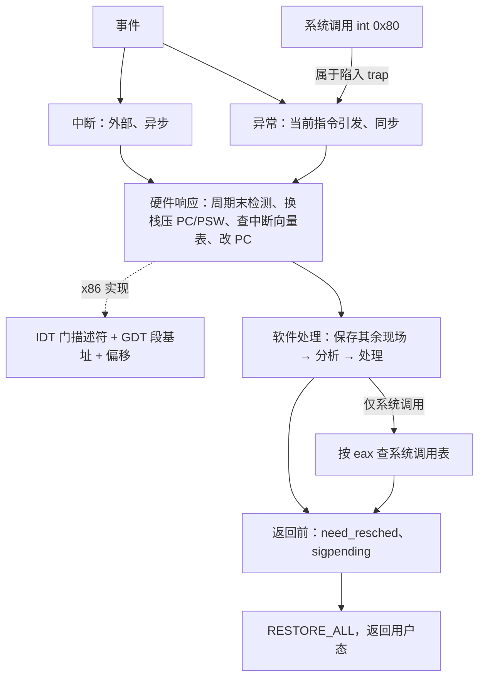

# L03 中断异常机制与系统调用

[课程目录](../index.md)

CPU 既要及时应对外部设备和程序执行中随时出现的事件，又要让用户程序经一个受控的入口请求内核服务；本讲讲清中断异常机制，以及建在它之上的系统调用。路线是：先给事件分类，再沿中断响应与中断向量、中断处理完整流程弄清“硬件先做、做完交给软件”的分工，并用 x86 的 IDT/GDT 验证；然后辨析系统调用的概念、设计它的静态部分，以 Linux x86 的 `int $0x80` 走完执行全过程，最后用低层工作步骤与机制策略分离原则收束。前置知识是 L02「07 处理器特权模式」「08 中断与异常概念」中的用户态/内核态与中断概念，以及 ICS 中的栈、跳转表和信号。

## 章节导航

- [01 中断异常事件分类](chapters/01-interrupt-and-exception-classification.md)：中断异步、异常同步；陷入/故障/终止的返回行为
- [02 中断响应与中断向量](chapters/02-interrupt-response-and-vector-table.md)：指令周期末检测中断，凭中断码查中断向量表
- [03 中断处理完整流程](chapters/03-hardware-software-handoff-in-interrupt-handling.md)：五步中①–④硬件、⑤软件；改写 PC 即软硬交接
- [04 x86 中断支持](chapters/04-x86-protected-mode-interrupt-support.md)：IDTR→IDT 门描述符→GDT 段基址+偏移得入口
- [05 系统调用概念辨析](chapters/05-system-call-concept-and-related-notions.md)：系统调用的定义、作用，及与库函数/API/内核函数的关系
- [06 系统调用机制设计](chapters/06-system-call-mechanism-design.md)：陷入指令、调用号、参数传递与系统调用表的设计
- [07 Linux 系统调用执行](chapters/07-linux-x86-system-call-execution.md)：int 0x80 陷入、查表分派与返回检查全过程
- [08 低层步骤与机制策略](chapters/08-low-level-steps-and-mechanism-policy-separation.md)：系统调用小结、OS 低层八步与机制策略分离

## 思考题汇总

- [03 中断处理完整流程](chapters/03-hardware-software-handoff-in-interrupt-handling.md)：为什么引入中断处理的上半部和下半部

## 本讲小结

三类入口（中断、异常、系统调用）共用同一套中断异常机制：硬件负责到“改写 PC”为止，之后全归软件；系统调用只是在这条路上多查一张系统调用表，并在返回前多做调度与信号检查。

| 对象 | 机制（固定） | 策略（可调） |
| --- | --- | --- |
| 进入内核 | 中断异常机制：检测、保存、查表、跳转 | 中断向量表中的各处理程序 |
| 系统调用 | 统一经 0x80 进入总入口 | 系统调用表中的服务例程 |
| 门的选择 | 中断门自动关中断、陷阱门不关 | 操作系统按“处理期间是否接受新中断”选门 |

### 核心公式

| 场合 | 公式 |
| --- | --- |
| 实模式入口地址 | $\text{入口} = \text{段地址} \times 16 + \text{偏移}$ |
| 保护模式入口地址 | $\text{入口} = \mathrm{GDT}[\mathrm{IDT}[i].\text{段选择符}].\text{段基址} + \mathrm{IDT}[i].\text{偏移}$ |
| 门描述符中的偏移 | $\text{偏移} = H \times 2^{16} + L$（$H$、$L$ 为高、低 16 位） |
| 系统调用表项地址 | $\text{sys\_call\_table} + 4 \times \text{eax}$（64 位每项 8 字节） |

## 不确定事项

- 转写稿把 sysenter 的引入时间说成“奔腾three之后”（ASR 识别结果），笔记沿用 plan 中的 Pentium II（与 Intel 史实一致）；讲义本身没有给出版本。
- s4b2 对“第一/第二个数据结构”的说法前后不一（PCB 算不算正式讲过的第一个）；笔记沿用 plan：中断向量表是正式讲的第一个，系统调用表是第二个。
- p61–62 和 p71 为 slide-only，按讲义整理；xv6 阅读题的参考要点和 Intel/Linux 版本细节属于补充解释，没有经课堂核实。

> [!info]- 来源
> - slides02.pdf：PDF p.21–71
> - L03.docx：DOCX body 1–249
