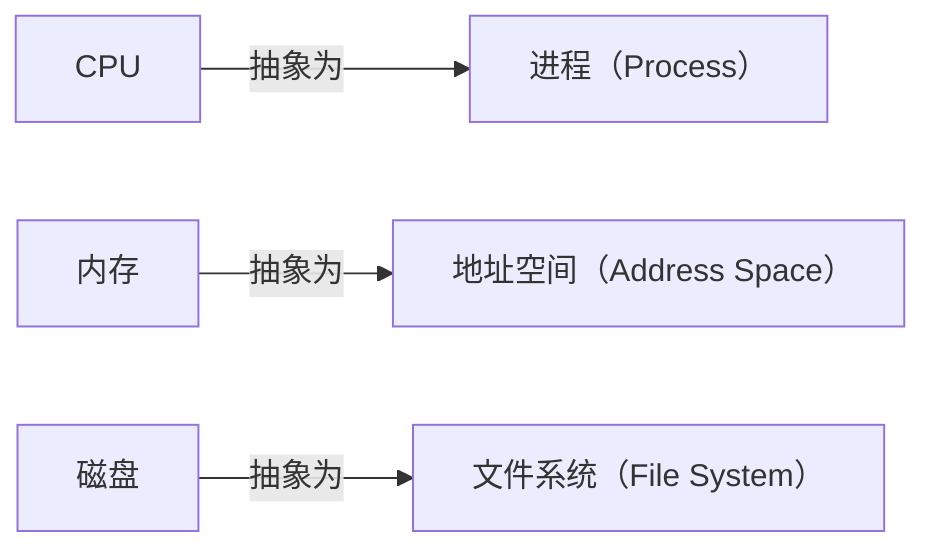

# 01 进程与三个抽象

[本讲目录](../index.md) · [课程目录](../../index.md) · [下一节：02 并发与进程概念](02-from-sequential-to-concurrent-process-concept.md)

> [!abstract] 本节要点
> - 操作系统不能直接“控制”CPU，它通过设置寄存器（最关键的是 PC）决定让哪个进程运行，所以说**进程是对 CPU 的抽象**。
> - 课程的三个基本抽象：进程 ↔ CPU，（虚拟）地址空间 ↔ 内存，文件系统 ↔ 磁盘。
> - 进程的“实体”是内核中描述它的数据结构（PCB）和它的上下文；“进程由什么组成”和“如何描述进程”是同一个问题。
> - 进程有生命周期，学习重点是**状态之间的转换**：什么条件、什么操作（如 `fork`、`wait`）或什么事件引起转换。
> - 在有虚存支持的通用计算机上，操作系统给进程的是**虚拟地址空间**，不是物理内存；中断/异常机制是贯穿整个进程模型的主线。

## 进程是对 CPU 的抽象

操作系统是资源管理者，但 CPU 这种资源没法“直接管”：CPU 只会按 PC 取指、执行。操作系统能做的是控制寄存器，其中最重要的是**程序计数器**（Program Counter, PC）。把某个程序的指令地址装进 PC，并让它的代码和数据在内存里，这个程序就开始运行。[^s4b1]

所以操作系统管理 CPU 的方式是管理一个个**进程**（Process）：每个进程是一个运行实体，操作系统维护它的各种信息，到时把它的现场装回寄存器，它就在 CPU 上跑起来。没有进程，操作系统也就没有存在的意义。这就是“进程是对 CPU 的抽象”。

可以拿学校类比：学校管不到“你这个人”，它管理的是你的学籍、选课、宿舍、食堂等信息，通过这些信息让每个学生的学习生活“运行”起来。操作系统对进程也是这样，它管的是描述进程的数据。

> [!note] 补充解释
> 回忆 L01「02 hello world 的加载」与 L01「03 hello world 的运行」：shell 为程序创建进程、把可执行文件的内容放到内存、设置好 PC 后 CPU 开始取指执行。这正是“通过进程使用 CPU”的具体例子。

## 三个基本抽象

操作系统对三类核心硬件资源各提供一层抽象，用户程序只和抽象打交道：[^s4b1]

1. **进程是 CPU 的抽象**：每个进程好像独占一个 CPU。
2. **地址空间是内存的抽象**：操作系统不直接把物理内存交给进程，而是给每个进程一个（虚拟）地址空间，进程在这个空间里做事，具体放在物理内存哪里由操作系统和硬件负责转换，用户不用关心。详见[进程地址空间](06-process-address-space.md)。
3. **文件系统是磁盘的抽象**：进程看到的是文件，不是磁盘块。

学完整门课，应当对这三个抽象有清晰印象。

## 进程的实体与生命周期

**进程有实体吗？** 有。判断一个进程是否存在，要找它在系统里留下的“痕迹”：内核中描述它的数据结构，以及它的上下文（寄存器现场等）。这像学生在校的证据是档案，在读的证据是每学期的注册。[^s4b1]

“一个进程由哪些要素组成”和“怎样描述一个进程”是同一个问题的两个角度：学生在校的所有活动（宿舍、选课、获奖）都要记录，进程的所有属性也都记在它的数据结构里。这个数据结构就是 PCB，见[进程控制块 PCB](05-process-control-block.md)。

> [!note] 补充解释
> 问题清单中的**进程映像**（process image）指进程在某一时刻的完整“快照”：内存中的代码、数据、堆、栈，加上内核中的 PCB 与上下文。挂起进程时被整体换出到磁盘的，就是进程映像（见[扩展状态与实际系统](04-extended-state-models-linux-xv6.md)）。

**进程有生命周期**：操作系统引导完成后只创建最原始的一个进程，其余进程都是用户要执行程序时由操作系统创建的（UNIX 类系统用 `fork`）。进程有创建、有变化、有消亡，存在期间会处于不同状态，但状态种类不多。[^s4b1]

> [!tip] 课堂强调
> 学进程状态时，关注的是**状态之间的转换**：具备什么条件就转换，或者由哪个动作、哪个操作引起。例如 `fork` 让一个进程从无到有；`wait` 让进程停下来等待某个事件发生。[^s4b1]

## 虚拟地址还是物理地址

“操作系统给进程提供的内存空间，地址是虚拟地址还是物理地址？”这个问题有坑。[^s2p3]

- 回答“物理地址”一定错。
- 回答“虚拟地址”是对的，但要给出场景：通用计算机、智能手机都有虚存支持，进程拿到的是虚拟地址空间；一些嵌入式等小型系统不一定有虚存。[^s4b1]

因此，在有虚存的系统里，地址空间本身就是一层抽象：进程只在虚拟地址空间里操作，虚拟地址到物理内存的映射由系统完成。[^s4b2]

接下来的问题是：**用什么数据结构描述一个进程的地址空间？** ICS 课程给过答案，但没有专门讨论，很多同学没有真正弄懂。这是本讲重点之一，见[进程地址空间](06-process-address-space.md)。[^s4b2]

## 本讲的问题地图

进程与线程部分围绕三组问题展开：[^s2p2] [^s2p3] [^s2p4]

| 问题组 | 关注点 | 本讲去向 |
| --- | --- | --- |
| 问题 1 | 进程是 CPU 的抽象；进程映像与实体；描述进程的要素；创建进程做什么；生命周期中的变化；状态及转换的条件与操作；一个转换是否必然引起另一个转换 | 本章、[并发与进程概念](02-from-sequential-to-concurrent-process-concept.md)、[三状态模型](03-three-state-model-and-transitions.md)、[扩展状态与实际系统](04-extended-state-models-linux-xv6.md)、[进程控制块 PCB](05-process-control-block.md) |
| 问题 2 | 地址空间是虚拟还是物理地址；如何描述地址空间；为什么引入线程、如何实现、Pthreads | 地址空间见[进程地址空间](06-process-address-space.md)；线程本讲不展开，见 L05「04 为什么引入线程」 |
| 问题 3 | 中断/异常机制与进程线程模型的关联；机制与策略分离的体现；协程 | 中断/异常的关联见[三状态模型](03-three-state-model-and-transitions.md)；协程见 L05「07 协程、纤程与可再入」 |

进程部分的内容分为：进程模型（多道程序设计与进程概念；进程状态及转换、进程控制块、进程队列）、进程控制（创建、撤销、阻塞、唤醒等）、线程模型和协程。[^s2p5] 本讲覆盖进程概念、状态模型、PCB 与地址空间；进程队列、进程控制、线程和协程见 L05「01 进程表与队列模型」至 L05「07 协程、纤程与可再入」。

> [!tip] 课堂强调
> 中断/异常机制和进程线程模型的关系“特别重要”，关系非常密切；把这层关系搞清楚，整个进程模型就“拎起来了”。[^s4b2]

中断、异常和系统调用见 L02「08 中断与异常概念」和 L03「06 系统调用机制设计」：用户态程序因中断、异常或系统调用进入内核，硬件保存现场，内核查表找到处理程序。本讲在[三状态模型](03-three-state-model-and-transitions.md)里用 `read` 的完整过程说明它们怎样驱动进程状态转换。

> [!note] 补充解释
> 机制与策略分离原则在进程模型中也有体现。一个直接的例子：把进程从 CPU 上换下、再换上另一个进程（保存与恢复现场）是**机制**；从就绪进程中选哪一个上 CPU 是**策略**（调度算法）。两者分开，换调度算法时不必改切换机制。

> [!question]- 自测：同学说“操作系统通过直接控制 CPU 硬件来管理 CPU”，这个说法差在哪里？
> 操作系统没有“直接管 CPU”的手段，CPU 只按 PC 取指执行。操作系统通过设置寄存器（尤其是 PC）和管理进程的数据结构，决定让哪个进程运行，所以说进程是对 CPU 的抽象。

> [!question]- 自测：在一台运行 Linux 的笔记本上，进程打印出某个变量的地址 `0x404028`，这是物理地址吗？如果换成一块没有 MMU 的单片机呢？
> 笔记本有虚存支持，打印出的是该进程虚拟地址空间中的地址，不是物理地址。没有虚存硬件的小型嵌入式系统里，程序使用的地址可能就是物理地址，所以回答这类问题要先说明场景。

> [!info]- 来源
> - slides03.pdf：PDF p.1–5
> - L04.docx：DOCX body 1–54

[^s4b1]: L04.docx-DOCX body 1-29
[^s2p3]: slides03.pdf-PDF p.3
[^s4b2]: L04.docx-DOCX body 30-54
[^s2p2]: slides03.pdf-PDF p.2
[^s2p4]: slides03.pdf-PDF p.4
[^s2p5]: slides03.pdf-PDF p.5

[本讲目录](../index.md) · [课程目录](../../index.md) · [下一节：02 并发与进程概念](02-from-sequential-to-concurrent-process-concept.md)
