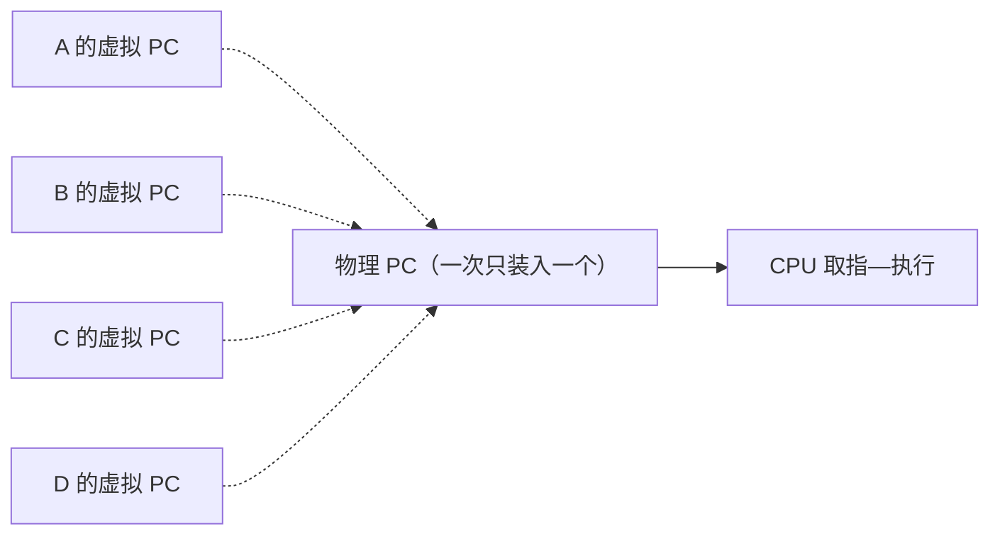
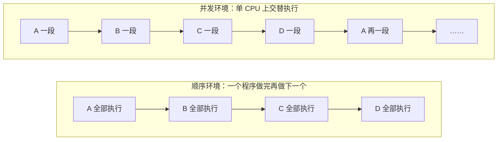

# 02 并发与进程概念

[本讲目录](../index.md) · [课程目录](../../index.md) · [上一节：01 进程与三个抽象](01-guiding-questions-and-abstractions.md) · [下一节：03 三状态模型](03-three-state-model-and-transitions.md)

> [!abstract] 本节要点
> - 顺序环境只有一个 PC，程序独占资源、不受外界影响，具有顺序性、封闭性和结果可再现性（结果与执行速度无关）。
> - 多道程序设计允许多个程序同时进入内存并运行，目的是提高系统效率；单 CPU 上相当于多个虚拟 PC 轮流映射到一个物理 PC，这就是虚拟化。
> - 并发环境的特征：结果不可再现、执行间断（执行—停—执行）、资源共享、独立性与制约性、程序和计算不再一一对应。
> - 进程是程序的**一次**执行；是系统进行资源分配和调度的独立单位，但引入线程后调度单位可能变成线程，回答时要说明场景。
> - 进程按作用分系统/用户、前台/后台、CPU 密集/I/O 密集；UNIX 进程构成以 `init` 为根的家族树，Windows 进程地位相同。

## 顺序程序与顺序环境

“进程”这个词的出现有里程碑意义，因为它恰好刻画了从顺序执行到并发执行的变化。要理解进程，先看没有进程概念时的情形。[^s4b2]

**程序**（Program）是指令或语句的序列，体现某种算法。[^s2p7]

**顺序环境**（Sequential Environment）满足三点：[^s2p7]

1. 计算机系统中**只有一个程序在运行**；
2. 该程序**独占**系统中的所有资源；
3. 该程序的执行**不受外界影响**。

在顺序环境里，只需要一个程序计数器。要运行 A，就把 A 第一条指令的地址送入 PC，然后一条接一条执行（中间可以有跳转）；A 结束后，再把 B 第一条指令的地址装入 PC，依此类推：做完 A 做 B，做完 B 做 C。[^s4b2]

顺序环境有三个特征：[^s2p7]

- **顺序性**：程序按自己的指令顺序执行。
- **封闭性**：独占资源，执行过程不受外界影响，要什么资源就有什么资源。
- **可再现性**：只要初始条件相同，程序运行结果与执行速度无关。

可以想象一个只有你一个人、门关着的健身房：设备随便用，跑完步歇一会儿再练力量也不影响整体结果。[^s4b2]

## 多道程序设计（Multiprogramming）

顺序环境很快被打破，起点是一种软件技术：**多道程序设计**（Multiprogramming），即允许多个程序**同时**进入内存并运行，目的是**提高系统效率**。[^s2p8]

代价是管理变复杂：以前内存里只有一个程序，想占哪就占哪；现在多个程序要分占内存，资源管理难度上升。之所以“自找麻烦”，是因为健身房里有很多设备，一次只放一个人进去太浪费；允许多人同时进入效率高，但跑步机只有几台，就要排队。[^s4b2]

单 CPU 上，A、B、C、D 四个程序都在内存里“执行”，相当于有四个**虚拟 PC**，但物理 PC 只有一个，一次只把其中一个虚拟 PC 映射到物理 PC，其余的暂时不能运行。这正是 OSTEP（*Operating Systems: Three Easy Pieces*）三部分中的第一部分：**虚拟化**（Virtualization）。[^s4b2]

## 并发环境与并发程序

多道程序设计把“顺序环境下的顺序程序”变成了“并发环境下的并发程序”。

**并发环境**（Concurrent Environment）：一段时间间隔内，单处理器上有两个或两个以上的程序**同时处于开始运行但尚未结束的状态**，并且**次序不是事先确定的**。**并发程序**是在并发环境中执行的程序。[^s2p9]

注意“同时”指的是一段时间间隔内都处于“已开始、未结束”，不是同一时刻都在 CPU 上。单 CPU 上实际是快速切换：某段时间运行 A，切到 B，再切到 C、D，又切回 A。切换很快，A 自己觉得没下过 CPU，其实已经轮转了很多次。人也是这样“并发”的：耳朵听课、眼睛看手机，大脑在不断切换；厨师炒菜也是几件事交替做。[^s4b2]

在并发环境的时间轴上，A、B、C、D 各自断续出现，任意时刻只有一个在 CPU 上运行。

### 并发环境的特征

从顺序到并发，出现了必须由操作系统解决的新问题：[^s2p9] [^s4b3]

1. **程序执行结果的不可再现性**：哪怕只运行十个程序，它们的指令之间可以有极多种交错组合，无法保证下次执行还是同一种组合。所以并发系统出了错往往难以复现，设计时就要保证它不出错。
2. **程序执行的间断性**：进程不是一上 CPU 就执行到结束，而是“执行—停—执行”，一会儿在 CPU 上，一会儿下来。
3. **资源共享**：多个进程可能共享一块内存、一个文件，上 CPU 本身也是共享。
4. **独立性和制约性**：每个进程各自完成自己的任务，有独立性；但又受环境中其他进程的影响，有制约性。例如地铁高峰时只剩一个空座，两个人都想坐；ICS 讲过的飞机订票系统卖最后一张票、高铁某车厢的最后一个座位，都是多个执行者争抢同一资源。
5. **程序和计算不再一一对应**：一个程序可以同时有多次执行，每次执行是一个独立的计算。

> [!note] 补充解释
> 顺序环境里一个程序在一段时间内只对应一次计算；并发环境里同一份程序代码可以同时被多次执行（例如两个用户同时运行编译器），每次执行处理不同的数据、进度不同。这正是需要“进程”这个新概念的原因：程序描述不了“某一次执行”。

## 进程的定义

有了并发环境，就需要一个概念来描述“正在执行的某一次程序”。

**进程**（Process，又称任务 Task 或 Job）可以从几个角度定义：[^s2p10]

1. **程序的一次执行过程**。
2. **正在运行程序的抽象**，也就是对 CPU 的抽象。
3. **把一个 CPU 变换成多个虚拟的 CPU**：通过进程管理，每个进程好像都有自己的 CPU。
4. **系统资源以进程为单位分配**，如内存、文件等；每个进程具有**独立的地址空间**。
5. **操作系统将 CPU 调度给进程**：进程上 CPU 由操作系统负责调度和分配（在引入线程之前）。

如果被问“什么是进程”，至少要答出“程序的一次执行过程”，并且要强调**一次**。同一个程序执行两遍，就是两个进程。[^s4b3] 这像电影院放数字拷贝：同一部片子，每放映一场就消耗一次授权，每一场都是一次独立的放映。

更严格的定义来自百科全书：[^s2p10]

> **进程是具有独立功能的程序关于某个数据集合上的一次运行活动，是系统进行资源分配和调度的独立单位。**

这个定义有几个要点：

- **关于某个数据集合**：编译器为你编译程序、同时为另一位同学编译程序，是两个编译进程，因为数据集合（被编译的源程序）不同；你自己编译两次也是两个进程。[^s4b3]
- **资源分配的独立单位**：进程要打开文件、要内存，是整个进程作为单位申请资源，其中最重要的是独立的地址空间。
- **调度的独立单位**：这一点要看场景。引入线程之后，例如在 Windows 中，进程是资源容器，地址空间、文件都以进程为单位分配，但上 CPU 运行的是进程里的线程，调度单位是线程。[^s4b3]

> [!tip] 课堂强调
> 定义中“调度的独立单位”要看场景，回答时要给出约束条件（有没有引入线程、是什么系统），而不是笼统地说一句“哪句都没错”的话。[^s4b3]

这一定义源自 1978 年庐山教学研讨会上老一辈计算机科学家的讨论；引入线程后，定义又有了变化。[^s4b3]

> [!warning] 易错点
> “进程是调度的基本单位”不是无条件成立的。在只有进程、没有线程的模型里成立；在支持内核线程的系统（如 Windows、Linux）里，资源分配单位仍是进程，但调度单位是线程。

## 进程的分类与家族关系

按作用和行为，进程可以分成几类：[^s2p11]

- **系统进程与用户进程**：内核之上运行的都是进程。其中一部分是用户进程（你运行的游戏、编辑器等），另一部分是以进程形式在内核外运行、完成操作系统工作的**系统进程**。系统进程优先级一般比用户进程高。[^s4b3] [^s4b4]
- **前台进程与后台进程**。
- **CPU 密集型进程与 I/O 密集型进程**：区分它们是为了调度。从一堆进程中挑一个上 CPU 要考虑多种指标，进程的行为类型是参考依据之一。[^s4b4]

系统进程常以**守护进程**（daemon，也译作“精灵进程”）的形式工作：平时处于睡眠状态，需要时被唤醒来完成任务。[^s4b3]

> [!example] 例：SPOOLing 打印守护进程
> 办公室里每人一台电脑，共用一台打印机。用户提交的打印任务并不直接送到打印机，而是进入一个打印队列。一个系统守护进程监视这个队列：队列里有待打印的文件就被唤醒去打印，没有就继续睡眠。
>
> 这是 SPOOLing 技术后半段一直沿用到今天的做法。守护进程常驻，不必每次临时创建进程，是很早的**资源池化**思想。[^s4b4]

**进程之间的关系**：[^s2p11]

- **UNIX**：进程构成**家族树**，以 `init` 为根（老祖宗进程），每个进程再创建子进程。
- **Windows**：进程地位相同，没有家族、兄弟关系；虽然也有“谁创建了谁”，但关系不密切。[^s4b4]

> [!note] 补充解释
> 按家族树的直观说法，杀死一个进程，它的子孙也就没了。[^s4b4] 实际 UNIX/Linux 的默认行为并非如此：父进程终止后，子进程并不会自动终止，而是成为**孤儿进程**，被 `init`（PID 1，或 Linux 中设置的 subreaper）收养，由它负责回收。子孙一起结束的情形出现在信号被发给整个进程组或会话时，例如关闭终端时会话内进程收到 `SIGHUP`。

## 进程与程序的区别

进程与程序的区别可以从五个维度比较：[^s2p11]

| 比较维度 | 程序 | 进程 |
| --- | --- | --- |
| 对并发的刻画 | 不能准确刻画并发 | 能准确刻画并发（每次执行是一个进程） |
| 静态/动态 | 静态的指令序列 | 动态的执行过程 |
| 生命周期 | 相对长久地保存 | 有诞生、有消亡，是短暂的 |
| 对应关系 | 一个程序可对应多个进程 | 每个进程是某个程序的一次执行 |
| 创建能力 | 无 | 可以创建其他进程 |

> [!question]- 自测：两位同学同时在同一台服务器上用同一个 `gcc` 编译各自的作业，系统中有几个编译进程？为什么程序概念描述不了这个场景？
> 两个。进程是程序关于某个数据集合的一次执行，两次编译的数据集合（源文件）不同，执行进度也不同。程序只有一份 `gcc` 可执行文件，是静态的，区分不了这两次执行，这就是“程序和计算不再一一对应”。

> [!question]- 自测：某程序在单 CPU 系统里单独运行时总输出 100，和其他程序一起运行时偶尔输出 99，而且很难复现。这体现了并发环境的哪些特征？
> 主要是结果不可再现性：多个程序的指令交错方式每次不同。产生它的根源是资源共享和制约性（与其他程序共享了某个数据），间断性使执行可能在任意点被打断。顺序环境下结果与速度无关，不会出现这种情况。

> [!question]- 自测：在 Windows 中说“进程是系统进行资源分配和调度的独立单位”，哪一半需要修正？
> “调度”一半。Windows 中进程是资源容器，资源分配单位仍是进程；真正上 CPU 的是线程，调度单位是线程。

> [!info]- 来源
> - slides03.pdf：PDF p.6–11
> - L04.docx：DOCX body 30–117

[^s4b2]: L04.docx-DOCX body 30-54
[^s2p7]: slides03.pdf-PDF p.7
[^s2p8]: slides03.pdf-PDF p.8
[^s2p9]: slides03.pdf-PDF p.9
[^s4b3]: L04.docx-DOCX body 55-84
[^s2p10]: slides03.pdf-PDF p.10
[^s2p11]: slides03.pdf-PDF p.11
[^s4b4]: L04.docx-DOCX body 85-117

[本讲目录](../index.md) · [课程目录](../../index.md) · [上一节：01 进程与三个抽象](01-guiding-questions-and-abstractions.md) · [下一节：03 三状态模型](03-three-state-model-and-transitions.md)
