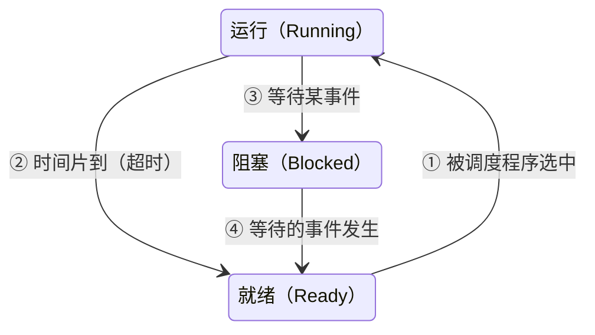
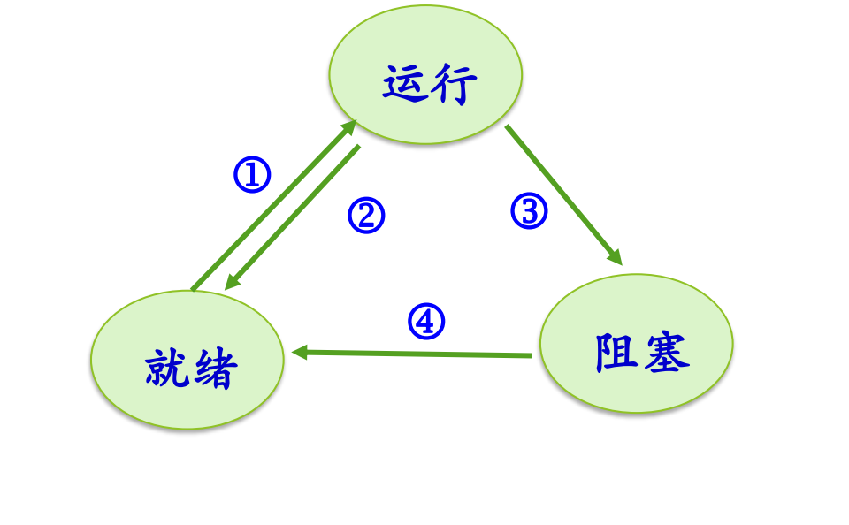
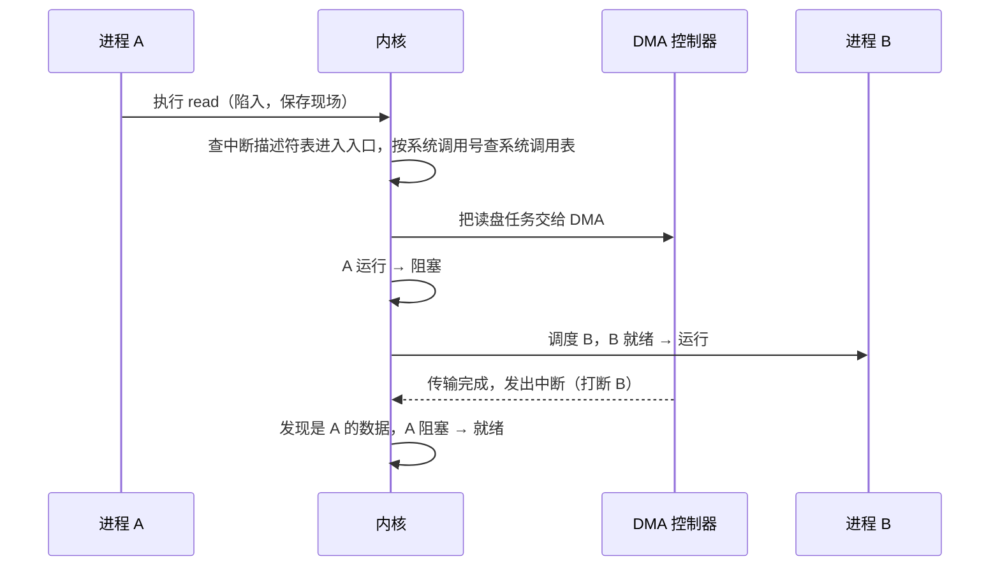

# 03 三状态模型

[本讲目录](../index.md) · [课程目录](../../index.md) · [上一节：02 并发与进程概念](02-from-sequential-to-concurrent-process-concept.md) · [下一节：04 扩展状态与实际系统](04-extended-state-models-linux-xv6.md)

> [!abstract] 本节要点
> - **运行态**：占有 CPU 并在运行；**就绪态**：具备运行条件、只缺 CPU，在就绪队列中等待调度；**等待态**（阻塞态/睡眠态）：等某个事件，CPU 空闲也不能运行。
> - 进程模型 = 状态 + 状态间的转换（条件、动作或事件），像有限状态自动机；进程在消亡前处于且仅处于某一状态。
> - 三个状态理论上有 6 种转换，实际只有 4 种：就绪→运行（调度选中）、运行→就绪（时间片到）、运行→阻塞（等事件，如 `wait`、慢速 I/O）、阻塞→就绪（事件发生）。
> - 没有阻塞→运行：上 CPU 的唯一途径是排就绪队列，保证系统行为确定；也没有就绪→阻塞。
> - 每一次状态转换背后都是一次中断或异常的处理，处理完后内核再决定是否换进程。`read` 的过程：陷入 → 交给 DMA → A 阻塞、B 运行 → DMA 中断 → A 变就绪。

## 三种基本状态

不同操作系统（Windows、Linux、xv6、原理课）的进程状态不完全统一，但不管哪个系统，**三状态基本模型**一定存在。[^s4b4] 它回答的是：一个进程在生命周期中会处于哪些状态。三种状态的定义如下：[^s2p12]

| 状态 | 英文 | 含义 | 能否上 CPU |
| --- | --- | --- | --- |
| 运行态 | Running | 占有 CPU，并在 CPU 上运行 | 正在 CPU 上 |
| 就绪态 | Ready | 已经具备运行条件，但没有空闲 CPU，暂时不能运行 | 一旦被调度即可 |
| 等待态 | Waiting / Blocked | 因等待某一事件（如完成 I/O、等待读盘结果）而暂时不能运行 | CPU 空闲也不行 |

- **就绪态**的进程排在**就绪队列**里。排进这个队列就表达了一个意图：“我要上 CPU”。调度就是在这个队列中选择谁上 CPU。[^s4b4]
- **等待态**又称**阻塞态**、**封锁态**、**睡眠态**，现在多用 blocked；Linux 和 xv6 都叫睡眠（sleep）。它意味着即使 CPU 空着，进程也不能上去，因为它等的事件还没发生。例如父进程创建子进程后调用 `waitpid` 等子进程结束，父进程就停在阻塞态，调度程序不会选它。[^s4b4]

> [!warning] 易错点
> “等待态”等的是**某个事件**（I/O 完成、子进程结束等），不是等 CPU。等 CPU 的是就绪态。名字里有“等待”，很多同学因此误以为是“等着上 CPU”。

## 状态转换与进程模型

只列出状态还不够。**进程模型**由状态和状态之间的转换共同定义，就像有限状态自动机：要说清在什么条件下、执行了什么操作或发生了什么事件，进程从一个状态变到另一个状态。[^s4b4]

关于状态，有两条基本约束：[^s2p13]

- 进程在消亡前**处于且仅处于某一状态**；
- 不同系统设置的进程状态数目不同。

三个状态两两之间理论上有 $3 \times 2 = 6$ 种有向转换，但进程模型只允许其中 **4 种**：[^s4b4]

图：运行、就绪、阻塞三状态之间只有四种合法转换：①就绪→运行（被调度），②运行→就绪（时间片到或被抢占），③运行→阻塞（等待事件），④阻塞→就绪（事件发生）。
图中 ①–④ 四条箭头分别对应上面四种转换；阻塞与运行之间、就绪到阻塞都没有箭头。

### 四种合法转换

> [!info] 可视化资源
> - [OSTEP 第 4 章 The Abstraction: The Process（PDF）](https://pages.cs.wisc.edu/~remzi/OSTEP/cpu-intro.pdf)：Figure 4.2 给出 Running/Ready/Blocked 的状态转换，Figure 4.3–4.4 用 CPU 与 I/O 轨迹演示状态变化。

1. **① 就绪 → 运行**：进程在就绪队列中被调度程序选中，上 CPU。这是操作系统起作用的地方：不是谁都能上 CPU，要先排队，再由调度程序决定。[^s4b4]
2. **② 运行 → 就绪**：典型原因是**时间片**（time slice）用完，即**超时**。进程上 CPU 只允许运行一个时间片段，时间到了就下来重新排队，不能一直占着 CPU 直到运行完；内存里有很多进程，系统的初衷是让更多进程都能运行。类比旋转木马：到点就停，想再玩得重新付钱排队。运行→就绪还可能有其他原因（如被抢占），见 L06「03 调度时机」。[^s4b4]
3. **③ 运行 → 阻塞**：进程执行了某个操作，需要等待某个事件。例如父进程调用 `wait`/`waitpid` 等子进程结束；或者执行了 `read`、`write` 这类**慢速系统调用**。[^s4b4]
4. **④ 阻塞 → 就绪**：进程等待的事件发生（如 I/O 完成），被**唤醒**，进入就绪队列重新排队。

### 为什么只有四种

- **没有阻塞 → 运行**：系统设计要有**确定性**。上 CPU 的唯一途径是排就绪队列；如果阻塞的进程事件一到就能直接上 CPU，同时就绪进程也在上 CPU，系统就乱了。事件发生后，进程先进入就绪，和大家排同一个队。[^s4b4]
- **没有就绪 → 阻塞**：就绪进程只是在等 CPU，它没有在执行，不会去执行一个让自己阻塞的操作，“好好等着上 CPU，自己把自己阻塞”没有道理。[^s4b4]

> [!tip] 课堂强调
> 运行到阻塞“特别重要”：要清楚进程是因为什么操作变成阻塞的。[^s4b4]

### 慢速系统调用

`fork`、`open`、`read`、`write` 都是系统调用，但并不是所有系统调用都会让进程阻塞。`fork`、`open` 等不一定导致阻塞；`read`、`write` 等要和 I/O 设备打交道，叫**慢速系统调用**（slow system call），ICS 教材中有这一术语。[^s4b4]

慢的原因在于计算机系统分成两大块：一块是 CPU 加内存，一块是 I/O。I/O 比 CPU 慢得多，`read`/`write` 往往要等磁盘等设备完成操作，进程只能先阻塞。

## 一次 read 的完整过程

下面用进程 A 执行 `read` 读磁盘的例子，把中断/异常机制（用户程序通过系统调用陷入内核，设备通过中断通知内核，见 L03「03 中断处理完整流程」与 L03「07 Linux 系统调用执行」）和三状态模型串起来。设开始时 A 处于运行态，B 处于就绪态。[^s4b4] [^s4b5]

1. **A 发起系统调用**：A 正在运行，执行 `read`。A 立即暂停，硬件保存现场。
2. **进入系统调用入口**：查中断向量表（中断描述符表），所有系统调用都走同一条路进入内核的系统调用处理程序。
3. **找到具体服务例程**：A 传入了参数，其中有系统调用号；内核按系统调用号查**系统调用表**，找到 `read` 对应的内核例程（如 `sys_read`）。
4. **把 I/O 交给 DMA**：内核并不亲自去读盘。它准备好相关数据，把传输任务交给 DMA 控制器完成。
5. **A 由运行变为阻塞**（转换 ③）：A 要等读盘结果，结果回来之前不能继续，于是内核把 A 置为阻塞态。
6. **调度 B 运行**（转换 ①）：CPU 不能闲着，内核从就绪队列选中 B，B 上 CPU 运行，这时已经“换人”了。
7. **DMA 发出中断**：数据传输完成后，DMA 控制器发中断。B 在运行中被打断，内核进入中断处理程序。
8. **A 由阻塞变为就绪**（转换 ④）：内核处理中断时发现是 A 要的数据到了，把数据准备好，把 A 从阻塞态变为就绪态，A 回到就绪队列等待再次调度。

这个过程里，有一次系统调用（进入内核）和一次外设中断，它们分别引发了“运行→阻塞”加“就绪→运行”，以及“阻塞→就绪”。

> [!tip] 课堂强调
> 进程模型与中断/异常机制关系密切：**每一次状态转换的动作，背后都是一次中断或异常的处理**；处理完之后，内核再决定换不换进程。这一点一定要搞清楚。[^s4b5]

> [!note] 补充解释
> 把四种转换和触发它的内核入口对应起来，可以整理成下表：
>
> | 转换 | 典型触发 | 进入内核的方式 |
> | --- | --- | --- |
> | ③ 运行→阻塞 | `read`、`waitpid` 等需要等待的系统调用 | 系统调用（陷入，属于异常的一种） |
> | ② 运行→就绪 | 时间片用完 | 时钟中断 |
> | ④ 阻塞→就绪 | I/O 完成、子进程结束等事件 | 设备中断（如 DMA 完成中断）或其他进程的系统调用 |
> | ① 就绪→运行 | 当前进程阻塞、超时或结束后，内核调度 | 发生在上述任一处理的末尾 |
>
> 从这张表也能看出：一个转换常常引出另一个转换。③ 或 ② 发生后 CPU 空出来，内核通常紧接着做一次 ①；而 ④ 只是把进程放回就绪队列，不一定立刻引起别的转换。

扩展状态（创建、终止、挂起）以及 Linux、xv6 的实际状态见[扩展状态与实际系统](04-extended-state-models-linux-xv6.md)。

> [!question]- 自测：进程 P 正在等待键盘输入，此时 CPU 空闲、就绪队列为空。用户按下按键后，P 能否直接从阻塞态进入运行态？
> 按模型不能。键盘中断到来后，内核把 P 从阻塞变为就绪（④），再由调度程序把它从就绪变为运行（①）。即使就绪队列里只有 P、CPU 空闲，也要经过就绪这一步，保证“上 CPU 只有排就绪队列一条路”。

> [!question]- 自测：单 CPU 系统中，进程 A 运行时调用 `read` 读磁盘，此时 B、C 在就绪队列。从 A 调用 `read` 到 A 再次上 CPU，至少发生了哪些状态转换、经历了几次进入内核？
> A：运行→阻塞（③）；B 或 C：就绪→运行（①）；DMA 完成后 A：阻塞→就绪（④）；之后 A 还要被调度才能再上 CPU（①，这之前当前运行的进程会因超时或阻塞让出 CPU）。进入内核至少有两次：`read` 系统调用一次，DMA 完成中断一次；A 再次被调度还需要另一次中断或系统调用（如时钟中断）。

> [!question]- 自测：同学认为“调用 `open` 打开文件一定会让进程阻塞，因为它是系统调用”。这个判断对吗？
> 不对。系统调用不等于阻塞。`fork`、`open` 等不一定导致阻塞，只有需要等待慢速事件的调用（如等待 I/O 完成的 `read`/`write`，或等子进程的 `waitpid`）才会使进程从运行变为阻塞。

> [!info]- 来源
> - slides03.pdf：PDF p.12–13
> - L04.docx：DOCX body 85–149

[^s4b4]: L04.docx-DOCX body 85-117
[^s2p12]: slides03.pdf-PDF p.12
[^s2p13]: slides03.pdf-PDF p.13
[^s4b5]: L04.docx-DOCX body 118-149

[本讲目录](../index.md) · [课程目录](../../index.md) · [上一节：02 并发与进程概念](02-from-sequential-to-concurrent-process-concept.md) · [下一节：04 扩展状态与实际系统](04-extended-state-models-linux-xv6.md)
