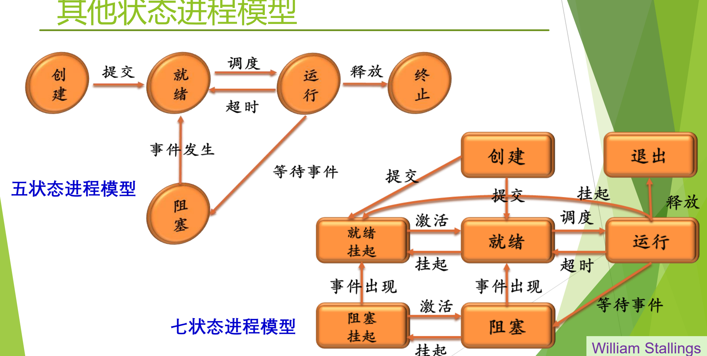
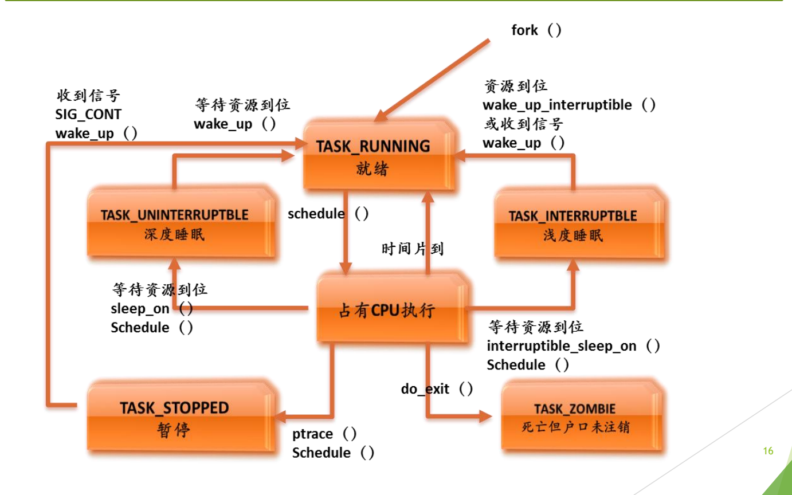
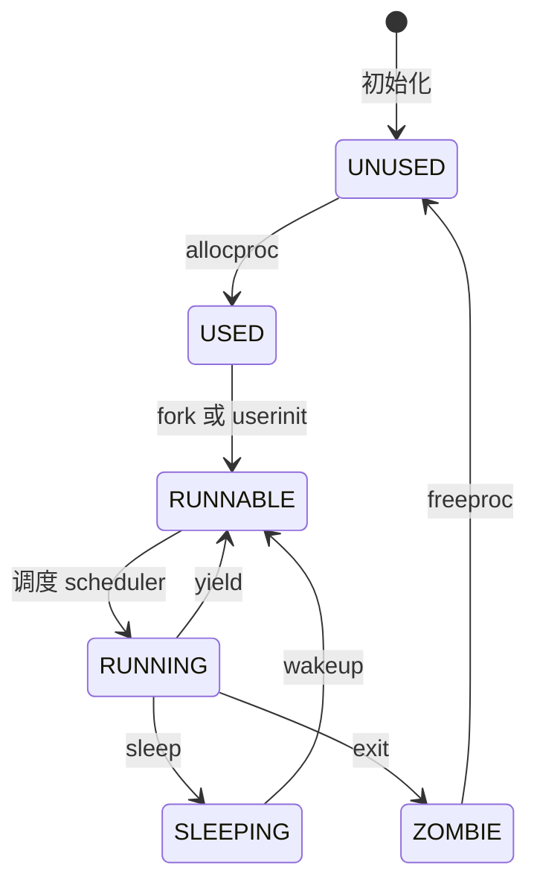

# 04 扩展状态与实际系统

[本讲目录](../index.md) · [课程目录](../../index.md) · [上一节：03 三状态模型](03-three-state-model-and-transitions.md) · [下一节：05 进程控制块 PCB](05-process-control-block.md)

> [!abstract] 本节要点
> - 在三状态模型上加状态，并说清它与其他状态之间的转换，就得到一个新的进程模型。
> - **创建态**做完了 PID、PCB 等创建工作但尚未被同意执行，经“提交”才进入就绪，起缓冲/负载控制作用，不是必需的；**终止态**用于统计和资源回收，现代系统一般都有。
> - **挂起态**把整个进程映像从内存换到磁盘，用于调节负载；七状态模型把它细分为就绪挂起和阻塞挂起，现在已很少见。
> - Linux 用同一个 `TASK_RUNNING` 表示“就绪”和“占有 CPU 执行”，睡眠分不可中断（深度）与可中断（浅度），`TASK_ZOMBIE` 对应终止态，`TASK_STOPPED` 用于跟踪调试。
> - xv6 中 `SLEEPING` = 阻塞、`RUNNABLE` = 就绪；`UNUSED`/`USED` 描述的是 PCB 槽位是否被分配，而不是原理模型中的状态。

## 创建、终止与挂起

三状态模型（运行、就绪、阻塞，见[三状态模型](03-three-state-model-and-transitions.md)）只描述进程“活着”时的样子，没有回答进程刚出生、刚结束以及内存不够时处于什么状态。实际系统因此会再加几个状态。给模型加一个状态，并把它与其他状态之间的转换（条件、动作、事件）说清楚，就构成一个新的进程模型。[^s4b5]

**创建态**（new）：已经完成创建一个进程所必需的工作，例如分配 PID、建立 PCB，但操作系统**尚未同意执行**该进程，原因是资源有限。[^s2p14]

- 从创建态到就绪态需要一个“提交”动作。这样，“创建”与“允许参与调度”被拆成两道关口。
- 动机是负载控制：就绪意味着可以被调度上 CPU，如果就绪队列已经太拥挤，就先把新进程挡在外面，起到缓冲作用。类比故宫：网上预约成功了，到了门口如果当时人数超限，也要在门口等一等。
- 创建态**不是必需的**，有的系统有，有的系统直接从创建进入就绪。[^s4b5]

**终止态**（terminated）：进程执行结束后进入该状态，用来完成数据统计、资源回收等善后工作。[^s2p14] 进程结束并不等于它立刻从系统里消失，善后期间它就处于终止态。类比本科毕业：论文答辩结束后，还要收拾宿舍、归还图书馆的书，领到毕业证才算正式离校。Windows、Linux、xv6 都有终止态。[^s4b5]

**挂起态**（suspend）：把一个进程从内存转到磁盘，进程不再占用内存空间，其**进程映像**交换到磁盘上，用于调节负载。[^s2p14]

- 动因是过去内存紧张：进程多、每个都要分内存，内存放不下时，只好把部分进程整体换出到磁盘。
- 被挂起的进程既没有结束，也没有停止，只是暂时搁置；不在内存中的进程当然不能运行，需要时再换回内存。类比公司把前景不明的项目暂停、“束之高阁”，评估后再决定是否重新启动。
- 有了虚存后，这种整进程换出的情况已经很少见。[^s4b5]

> [!warning] 易错点
> 挂起不是阻塞。阻塞是“在等某个事件”，进程映像仍在内存中；挂起是“被换出到磁盘”，与是否在等事件无关，所以才会有“就绪挂起”和“阻塞挂起”两种组合。

## 五状态与七状态模型

**五状态模型**在三状态之上加入创建和终止：[^s2p15]

1. 创建 —提交→ 就绪；
2. 就绪 —调度→ 运行，运行 —超时→ 就绪；
3. 运行 —等待事件→ 阻塞，阻塞 —事件发生→ 就绪；
4. 运行 —释放→ 终止。

除了两端多出的创建和终止，中间与三状态模型完全相同。它也是最接近现代实际系统的原理模型。

**七状态模型**再把挂起细分成两种状态，共 $3+2+2=7$ 个状态：运行、就绪、阻塞、创建、终止（图中称“退出”）、**就绪挂起**、**阻塞挂起**。[^s2p15] 它的转换如下：

| 转换 | 触发 | 含义 |
|---|---|---|
| 创建 → 就绪 / 创建 → 就绪挂起 | 提交 | 新进程可以直接进入内存排队，也可以先放在磁盘上 |
| 就绪 ⇄ 就绪挂起 | 挂起 / 激活 | 就绪进程太多时拿出一部分，暂不参与调度，减轻就绪队列负载 |
| 阻塞 ⇄ 阻塞挂起 | 挂起 / 激活 | 阻塞进程反正在等事件，可以先换出 |
| 阻塞挂起 → 就绪挂起 | 事件出现 | 等的事件到了，但进程仍在磁盘上，所以变成就绪挂起而不是就绪 |
| 运行 → 就绪挂起 | 挂起 | 例如超时本应回就绪，但就绪队列已太满，直接挂起 |
| 就绪 → 运行、运行 → 就绪、运行 → 阻塞、阻塞 → 就绪、运行 → 退出 | 调度、超时、等待事件、事件出现、释放 | 与五状态模型相同 |

“阻塞挂起 → 就绪挂起”和“运行 → 就绪挂起”是七状态模型最值得注意的两条：前者说明事件发生并不要求进程立刻回到内存；后者是一种直接减轻就绪队列负载的手段。[^s4b5] 至于每个“挂起”“激活”动作由谁、在什么时候完成，要由具体系统赋予含义；七状态模型在实际系统中已不多见。



图：五状态模型在三状态基础上增加创建和终止；七状态模型再引入就绪挂起和阻塞挂起，进程可被挂起到外存，经激活回到内存。
上图上半部分是五状态模型，下半部分是七状态模型（William Stallings 教材的画法）。

## Linux 的进程状态

原理模型中的术语与实际系统中的名称不一定一致，读 Linux 的状态时要先做一次“翻译”。[^s4b5]

- **`TASK_RUNNING`**：同时覆盖原理中的**就绪**和**运行**。处于就绪队列中的进程和正在 CPU 上执行的进程，状态值都是 `TASK_RUNNING`，区别只在于是否“占有 CPU 执行”。注意这里的 running 不能按字面理解为“正在运行”。
- **`TASK_INTERRUPTIBLE`（浅度睡眠）**：可中断睡眠。资源到位时被唤醒，也可以被**信号**唤醒。
- **`TASK_UNINTERRUPTIBLE`（深度睡眠）**：不可中断睡眠，不接受信号等打断，只能等资源到位后被唤醒。两种睡眠合起来对应原理中的**阻塞态**。[^s4b6]
- **`TASK_ZOMBIE`（僵尸态）**：“死亡但户口未注销”。进程已经结束，但还有善后工作，对应**终止态**，取“百足之虫，死而不僵”之意。
- **`TASK_STOPPED`（暂停）**：专为跟踪调试设置。`ptrace`、`strace` 等工具可以在程序中插入断点进行跟踪，打印当时的状态。[^s4b6]

Linux 的状态转换及其调用的内核函数如下：[^s2p16]

| 转换 | 触发事件 / 函数 |
|---|---|
| 新进程 → `TASK_RUNNING`（就绪） | `fork()` |
| 就绪 → 占有 CPU 执行 | `schedule()` |
| 占有 CPU 执行 → 就绪 | 时间片到 |
| 占有 CPU 执行 → `TASK_INTERRUPTIBLE` | 等待资源到位：`interruptible_sleep_on()`，再 `schedule()` |
| `TASK_INTERRUPTIBLE` → 就绪 | 资源到位 `wake_up_interruptible()`，或收到信号 `wake_up()` |
| 占有 CPU 执行 → `TASK_UNINTERRUPTIBLE` | 等待资源到位：`sleep_on()`，再 `schedule()` |
| `TASK_UNINTERRUPTIBLE` → 就绪 | 资源到位 `wake_up()` |
| 占有 CPU 执行 → `TASK_STOPPED` | `ptrace()`，再 `schedule()` |
| `TASK_STOPPED` → 就绪 | 收到信号 `SIGCONT`，`wake_up()` |
| 占有 CPU 执行 → `TASK_ZOMBIE` | `do_exit()` |

从表中可以看到：每一次进入睡眠之后都紧跟一次 `schedule()`，因为当前进程让出了 CPU，必须选另一个进程上去；所有唤醒都回到 `TASK_RUNNING`（就绪），没有直接从睡眠回到“占有 CPU 执行”的路径，这和三状态模型中“没有阻塞 → 运行”的规则一致。



图：Linux 用 TASK_RUNNING 同时表示就绪与运行；等待资源时进入可中断的浅度睡眠 TASK_INTERRUPTIBLE 或不可中断的深度睡眠 TASK_UNINTERRUPTIBLE，另有暂停 TASK_STOPPED 和僵尸 TASK_ZOMBIE。
上图是 Linux 进程状态图（使用较早版本内核的命名，新内核的变化见下方补充解释）。中间“占有 CPU 执行”与上方 `TASK_RUNNING` 是同一个状态值的两种情形。

> [!note] 补充解释
> 新内核中 `TASK_ZOMBIE`、`TASK_STOPPED` 等名称有调整（例如僵尸状态移到 `exit_state` 字段中表示为 `EXIT_ZOMBIE`），但睡眠分两种、就绪与运行共用 `TASK_RUNNING` 这一结构没有变。在 `ps` 命令输出的 STAT 列中，R、S、D、T、Z 分别对应运行/就绪、浅度睡眠、深度睡眠、暂停/跟踪、僵尸。

## xv6 的进程状态

xv6 在 `<kernel/proc.h>` 中用一个枚举定义进程状态：[^s2p17]

```c
enum procstate { UNUSED, USED, SLEEPING, RUNNABLE, RUNNING, ZOMBIE };
```

它和原理模型的对应关系是：[^s4b6]

- `RUNNABLE` = 就绪（沿用 UNIX 的叫法“可运行”）；
- `RUNNING` = 运行；
- `SLEEPING` = 阻塞（睡眠）；
- `ZOMBIE` = 终止。

右边这四个状态完全没有脱离原理模型。`UNUSED` 和 `USED` 则与进程的状态转换无关，描述的是**进程创建之前 PCB 槽位的状态**：系统初始化时预先建好一批 PCB，它们都是 `UNUSED`；创建进程时必须先用 `allocproc` 拿到一个空闲 PCB，状态变为 `USED`；之后经 `fork`（或创建第一个用户进程的 `userinit`）把它设为 `RUNNABLE`，进程才真正进入调度。[^s4b6] 这种“预先分配一批 PCB”的做法见[进程表](05-process-control-block.md)。



转换函数位于 `<kernel/proc.c>`：`yield` 让出 CPU 回到就绪，`sleep` 在某个等待通道上睡眠，`wakeup` 唤醒在该通道上睡眠的进程，`exit` 使进程变为 `ZOMBIE`，`freeproc` 释放 PCB 槽位使其回到 `UNUSED`。[^s2p17]

> [!note] 补充解释
> 在 xv6 源码中，时钟中断到来、时间片用完时内核调用 `yield`。`freeproc` 是在父进程调用 `wait` 发现某个子进程处于 `ZOMBIE` 时被调用的：父进程取走子进程的退出状态，再释放它的 PCB 槽位。这正是终止态“善后工作”的一个具体例子。

### 几种模型的对照

| 原理模型 | Linux | xv6 |
|---|---|---|
| 创建 | （无单独状态，`fork()` 后直接就绪） | `USED`（槽位已分配，尚未可运行） |
| 就绪 | `TASK_RUNNING` | `RUNNABLE` |
| 运行 | `TASK_RUNNING`（占有 CPU） | `RUNNING` |
| 阻塞 | `TASK_INTERRUPTIBLE` / `TASK_UNINTERRUPTIBLE` | `SLEEPING` |
| 终止 | `TASK_ZOMBIE` | `ZOMBIE` |
| 其他 | `TASK_STOPPED`（调试） | `UNUSED`（空闲槽位） |

> [!question]- 自测：在 Linux 上看到某进程的状态值是 `TASK_RUNNING`，能否断定它此刻正在 CPU 上执行？
> 不能。`TASK_RUNNING` 同时表示“在就绪队列中等待”和“占有 CPU 执行”，要判断是否正在执行，还需要看它是不是当前 CPU 上的那个进程。

> [!question]- 自测：七状态模型中，一个阻塞挂起的进程等待的磁盘 I/O 完成了，它会立刻变成就绪吗？
> 不会，它变成就绪挂起。事件出现只解除了“等待”这一条件，进程映像仍在磁盘上；只有经过“激活”换回内存后，它才进入就绪队列。

> [!question]- 自测：xv6 中一个 PCB 的状态从 `UNUSED` 变为 `USED`，是否意味着系统中多了一个可被调度的进程？
> 不是。`USED` 只表示 `allocproc` 分配了这个 PCB 槽位，进程还在创建过程中；要等 `fork`/`userinit` 把它设为 `RUNNABLE`，调度器才会选它。

> [!info]- 来源
> - slides03.pdf：PDF p.14–17
> - L04.docx：DOCX body 118–175

[^s4b5]: L04.docx-DOCX body 118-149
[^s2p14]: slides03.pdf-PDF p.14
[^s2p15]: slides03.pdf-PDF p.15
[^s4b6]: L04.docx-DOCX body 150-175
[^s2p16]: slides03.pdf-PDF p.16
[^s2p17]: slides03.pdf-PDF p.17

[本讲目录](../index.md) · [课程目录](../../index.md) · [上一节：03 三状态模型](03-three-state-model-and-transitions.md) · [下一节：05 进程控制块 PCB](05-process-control-block.md)
