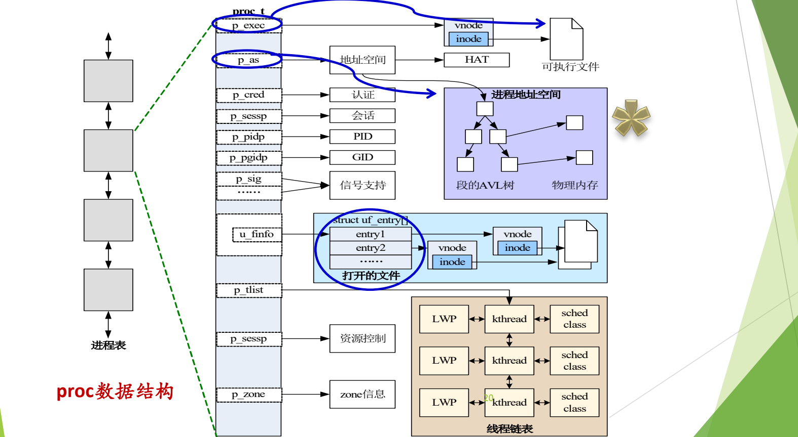

# 05 进程控制块 PCB

[本讲目录](../index.md) · [课程目录](../../index.md) · [上一节：04 扩展状态与实际系统](04-extended-state-models-linux-xv6.md) · [下一节：06 进程地址空间](06-process-address-space.md)

> [!abstract] 本节要点
> - **PCB** 是操作系统中表示进程的数据结构，记录进程的各种属性及其动态变化；进程与 PCB 一一对应，PCB 是系统感知进程存在的唯一标志。
> - **进程表**是所有 PCB 的集合，通常预先分配在一段连续内存中，大小由系统事先估定。
> - PCB 内容分四类：描述信息（PID、进程名、UID、进程组）、控制信息（状态、优先级、入口地址、可执行文件位置等）、资源（虚拟地址空间、打开文件列表）、CPU 现场（上下文）。
> - 上下文包括通用寄存器、PC、PSW、栈指针和页表指针；下 CPU 时保存，上 CPU 时恢复，换掉 PC 和现场就切换了进程。
> - 必须掌握的三个字段：指向可执行文件的指针、地址空间、打开文件表（子进程继承父进程的打开文件，至少有 0/1/2 三项）。

## 进程控制块与进程表

操作系统的每一项功能都依赖特定的数据结构。到这一讲为止，已经出现了三个关键数据结构：[^s4b6]

- **中断向量表**、**系统调用表**：在中断与异常机制中使用（见 L03「02 中断响应与中断向量」和 L03「06 系统调用机制设计」），都在操作系统引导、初始化时建好，此后硬件和内核随时可以使用；
- **PCB**：进程的数据结构，也是本节的主角。

> [!tip] 课堂强调
> 遇到一道看不懂在问什么的题目时，冷静下来想一想：这个功能依赖的是哪个数据结构？数据结构确定了，问题也就清楚了。[^s4b6]

操作系统要管理许多进程，它“看”到一个进程的唯一途径，就是那个进程留在内核中的记录。这份记录就是 PCB。

**进程控制块**（Process Control Block，PCB），又称**进程描述符**、**进程属性**，是操作系统中表示进程的数据结构：[^s2p18]

- 它记录进程的各种属性，描述进程的动态变化过程（当前状态、优先级、PID、名字等）；
- 操作系统通过 PCB 来控制和管理进程；
- 因此**进程与 PCB 一一对应**，**PCB 是系统感知进程存在的唯一标志**。

名字中的 block 在早期计算机系统中指内存中的“一块区域”，即为控制进程而在内存中划出的一块存放相关数据的区域。PCB 像学生在校四年一直跟着的学籍档案：信息随时补充，学校靠它管理学生；查不到档案，就只能找同学作证。没有 PCB 的进程，就像断了线的风筝，操作系统无法管理它。[^s4b6]

**进程表**（process table）：所有进程的 PCB 的集合。[^s2p18] 常见做法是把所有 PCB 放在一段**连续的内存空间**中，表的大小由系统事先估定并预留，而不是每创建一个进程才临时多出一个 PCB。创建进程时先从表中取一个空闲 PCB，这正是 xv6 中 `UNUSED`/`USED` 两个状态的含义（见[xv6 的进程状态](04-extended-state-models-linux-xv6.md)）。[^s4b6]

不同系统对 PCB 的组织方式不同，没有唯一方案：[^s2p18]

- Linux：一个 `task_struct` 结构；
- Windows：内容分散在 `EPROCESS`、`KPROCESS`、`PEB` 三个数据结构中，合起来构成 PCB；
- xv6：`struct proc`；Solaris：`proc_t`。

## PCB 的主要内容

PCB 的字段很多，但可以按类别记忆，至少要能说出每一类中的几个字段。[^s2p19]

**进程描述信息**：

- 进程标识符（process ID，PID），唯一，通常是一个整数；
- 进程名，通常基于可执行文件名，不唯一；
- 用户标识符（user ID，即进程的 owner）；进程组关系。父子进程之间的关系也与这些 ID 有关。[^s4b7]

**进程控制信息**：

- 当前状态、优先级（priority）；
- 代码执行入口地址；
- 可执行文件名（磁盘地址）；
- 运行统计信息（执行时间、页面调度）；
- 进程间同步和通信信息，阻塞原因；
- 进程的队列指针、进程的消息队列指针。

**所拥有的资源和使用情况**：

- 虚拟地址空间的现状；
- 打开文件列表。

这是进程最重要的两类资源，它们本身都是 PCB 中的**子数据结构**（结构里再套结构）。

**CPU 现场信息**（context）：

- 寄存器值：通用寄存器、程序计数器 PC、程序状态字 PSW、地址类寄存器（如栈指针）；
- 指向赋予该进程的段表/页表的指针。

进程暂时不运行时，操作系统要把该进程的硬件环境保存在这里。[^s2p19]

## 上下文与进程切换

CPU 像心脏一样从不停歇，它只做一件事：按 PC 取指令、执行指令、更新 PC，再取下一条。[^s4b7] 它并不知道“进程”的存在。因此，要让 CPU 改去执行另一个进程，只需要把 PC 和其他寄存器换成那个进程的值。

**上下文**（context，旧称“现场”）就是进程在 CPU 上运行时的寄存器状态，其中最重要的是 PC、PSW、栈指针，以及页表指针。[^s4b7]

1. **下 CPU**：把当前进程的上下文保存到它的 PCB 中；
2. **选择**下一个进程；
3. **上 CPU**：把下一个进程 PCB 中的上下文装回寄存器；
4. CPU 照常按新的 PC 取指执行，对那个进程来说就像什么都没发生过。


类比拍电视剧时的场记：同一场景的不同集可能分几次拍，每次开拍前都要把服装、道具位置、演员站位恢复成上次的样子，否则就会穿帮。[^s4b7]

> [!warning] 易错点
> 上下文只包括操作系统能够读写的寄存器状态，不包括 cache。cache 的内容和替换完全由硬件自动管理，操作系统切换进程时并不保存、恢复 cache 内容。[^s4b7]

## 三个必须掌握的字段

以 Solaris 的 `proc_t`（定义在 `<usr/src/uts/common/sys/proc.h>`）为例，可以看到 PCB 中最重要的三个字段。[^s2p20]

**1. 指向可执行文件的指针**（`p_exec`）。程序是由进程来执行的，所以 PCB 中必须有一个字段能找到磁盘上对应的可执行文件；在 Solaris 中，它经过 vnode / inode 找到可执行文件。字段名不重要，但这个字段**必须有**。回想执行 hello world 的过程：操作系统首先要找到 hello 这个文件，并确认它是可执行文件。[^s4b7]

**2. 地址空间**（`p_as`）。**创建进程必须立刻给它分配一个地址空间**，这个字段就指向描述该地址空间的数据结构。[^s4b7] Solaris 用**段的 AVL 树**描述进程地址空间，并通过 HAT 与物理内存建立映射；Linux（ICS 教材的描述）用链表。地址空间的含义、分配方式以及链表与 AVL 树的取舍见[进程地址空间](06-process-address-space.md)。

**3. 打开文件表**（`u_finfo` → `struct uf_entry[]`）。表中每一项经 vnode / inode 指向一个打开的文件。进程一创建就有打开文件表：在 UNIX 中，子进程**继承父进程的所有打开文件**，父进程打开了文件 A、B，子进程也就打开了 A、B。即使父进程一个文件都没打开，表中也至少有三个缺省项：文件描述符 0、1、2，分别是标准输入、标准输出、标准错误输出，`read`/`write` 中直接使用它们。[^s4b7]



图：Solaris 的进程表由 proc 结构串成；每个 proc 通过指针关联可执行文件（vnode/inode）、地址空间、认证、会话、PID、信号、打开文件表以及由 LWP、kthread 组成的线程链表。
上图左侧的进程表由多个 PCB 串成，其中一个展开为 `proc_t`。三个蓝圈标出 `p_exec`、`p_as` 和打开文件表；其他字段包括 `p_cred`（认证）、`p_sessp`（会话）、`p_pidp`（PID）、`p_pgidp`（进程组 ID）、`p_sig`（信号支持）、`p_tlist`（线程链表，每项由 LWP、kthread、调度类组成）、资源控制和 `p_zone`（zone 信息）。

> [!tip] 课堂强调
> 可执行文件指针“一定要记住，这是必须有的”；创建进程就必须马上分配地址空间，这个概念要“始终特别牢记”；打开文件表及其 0/1/2 三个缺省项“今天就得记住”。[^s4b7]

> [!note] 补充解释
> HAT 是 Solaris 中的 Hardware Address Translation 层，负责把进程地址空间中的段映射到物理页，作用相当于页表管理。`proc_t` 的完整定义在 `<usr/src/uts/common/sys/proc.h>` 中，字段远多于上图所列。[^s2p21]

## 实际系统中的 PCB

### Linux task_struct

Linux 的 PCB 是 `task_struct`。它的字段很多，并且随内核版本变化，具体细节不重要；重要的是能在其中找到前面讲过的那些字段。[^s4b8] 下面是 Linux 2.6.x 中的节选（完整定义有上百个字段，这里只保留与 PCB 四类内容相关的部分）：[^s2p22]

```c
struct task_struct {
    volatile long state;    /* -1 unrunnable, 0 runnable, >0 stopped */
    struct thread_info *thread_info;
    unsigned long flags;    /* per process flags */
    int prio, static_prio;
    struct list_head run_list;
    unsigned long policy;
    unsigned int time_slice, first_time_slice;
    struct list_head tasks;
    struct mm_struct *mm, *active_mm;
    int exit_code, exit_signal;
    pid_t pid;
    pid_t tgid;
    struct task_struct *real_parent; /* real parent process (when being debugged) */
    struct task_struct *parent;      /* parent process */
    struct list_head children;       /* list of my children */
    struct list_head sibling;        /* linkage in my parent's children list */
    struct task_struct *group_leader;/* threadgroup leader */
    unsigned long utime, stime, cutime, cstime;
    unsigned long nvcsw, nivcsw, cnvcsw, cnivcsw; /* context switch counts */
    u64 start_time;
    /* ... */
    uid_t uid, euid, suid, fsuid;    /* process credentials */
    gid_t gid, egid, sgid, fsgid;
    char comm[16];
    struct thread_struct thread;     /* CPU-specific state of this task */
    struct fs_struct *fs;            /* filesystem information */
    struct files_struct *files;      /* open file information */
    struct signal_struct *signal;    /* signal handlers */
    struct sighand_struct *sighand;
    sigset_t blocked, real_blocked;
    struct sigpending pending;
    /* ... */
};
```

把它与 PCB 的四类内容对照：`state`、`prio`、`policy`、`time_slice` 是控制信息；`pid`、`uid`、`comm`（进程名）是描述信息；`mm` 指向地址空间，`files` 指向打开文件表，这是两大资源；`thread`（`thread_struct`）保存 CPU 相关的现场；`parent`、`children`、`sibling` 构成进程家族树。[^s2p23]

按功能分类后，较新版本的 `task_struct` 主要字段如下：[^s2p24]

```c
struct task_struct {
    struct list_head tasks;              /* 进程列表 */

    /* 任务 ID */
    pid_t pid;
    pid_t tgid;
    struct task_struct *group_leader;

    /* 亲缘关系 */
    struct task_struct __rcu *real_parent;
    struct task_struct __rcu *parent;
    struct list_head children;
    struct list_head sibling;

    /* 任务状态 */
    volatile long state;
    int exit_state;
    unsigned int flags;

    /* 权限 */
    const struct cred __rcu *real_cred;
    const struct cred __rcu *cred;

    /* 运行统计 */
    u64 utime;
    u64 stime;
    unsigned long nvcsw;
    unsigned long nivcsw;
    u64 start_time;
    u64 real_start_time;

    /* 调度相关 */
    int on_rq;
    int prio;
    int static_prio;
    int normal_prio;
    const struct sched_class *sched_class;
    struct sched_entity se;
    unsigned int policy;

    /* 信号处理 */
    struct signal_struct *signal;
    struct sighand_struct *sighand;
    struct sigpending pending;

    /* 内存管理 */
    struct mm_struct *mm;
    struct mm_struct *active_mm;

    /* 文件与文件系统 */
    struct fs_struct *fs;
    struct files_struct *files;

    /* 内核栈 */
    struct thread_info thread_info;
    void *stack;
};
```

各类字段的作用：

- **任务 ID**：`pid` 是进程（任务）号，`tgid` 是线程组号，`group_leader` 指向线程组的领头任务；
- **亲缘关系**：`parent`/`real_parent` 指向父进程，`children` 是子进程链表头，`sibling` 把自己挂进父进程的子进程链表；
- **任务状态**：`state` 即上一节的 `TASK_RUNNING` 等状态，`exit_state` 记录退出状态（如僵尸），`flags` 是进程标志；
- **权限**：`cred` 中保存 UID、GID 等身份与权限信息；
- **运行统计**：用户态时间 `utime`、内核态时间 `stime`，自愿/非自愿上下文切换次数 `nvcsw`/`nivcsw`，启动时间；
- **调度相关**：`prio` 等优先级、调度类 `sched_class`、调度实体 `se`、调度策略 `policy`、是否在运行队列上 `on_rq`；
- **信号处理**、**内存管理**（`mm`，下一节展开）、**文件与文件系统**（`fs` 为当前目录等，`files` 为打开文件表）、**内核栈**（`stack`）。[^s4b8]

### xv6 struct proc

xv6 的 PCB 是 `<kernel/proc.h>` 中的 `struct proc`，字段少而精，是阅读真实内核前最好的范本，务必读懂。[^s4b8]

```c
// Per-process state
struct proc {
  struct spinlock lock;

  // p->lock must be held when using these:
  enum procstate state;        // Process state
  void *chan;                  // If non-zero, sleeping on chan
  int killed;                  // If non-zero, have been killed
  int xstate;                  // Exit status to be returned to parent's wait
  int pid;                     // Process ID

  // wait_lock must be held when using this:
  struct proc *parent;         // Parent process

  // these are private to the process, so p->lock need not be held.
  uint64 kstack;               // Virtual address of kernel stack
  uint64 sz;                   // Size of process memory (bytes)
  pagetable_t pagetable;       // User page table
  struct trapframe *trapframe; // data page for trampoline.S
  struct context context;      // swtch() here to run process
  struct file *ofile[NOFILE];  // Open files
  struct inode *cwd;           // Current directory
  char name[16];               // Process name (debugging)
};
```

逐个对应到 PCB 的类别：

| 字段 | 类别 | 含义 |
|---|---|---|
| `lock` | 同步 | 保护本结构的自旋锁；前面一组字段必须持锁访问 |
| `state` | 控制信息 | 上一节的 `enum procstate` |
| `chan` | 控制信息（阻塞原因） | 非零表示在 `chan` 这个等待通道上睡眠，`wakeup(chan)` 据此唤醒 |
| `killed` | 控制信息 | 非零表示已被杀死 |
| `xstate` | 控制信息 | 退出状态，交给父进程的 `wait` |
| `pid` | 描述信息 | 进程号 |
| `parent` | 描述信息（家族关系） | 父进程；需持 `wait_lock` 访问 |
| `kstack` | 资源 | 内核栈的虚拟地址 |
| `sz` | 资源（地址空间） | 进程内存大小（字节） |
| `pagetable` | 资源 / 现场 | 用户页表，即上下文中的“页表指针” |
| `trapframe` | 现场 | 陷入内核时保存用户态寄存器的页，供 `trampoline.S` 使用 |
| `context` | 现场 | 内核切换进程时 `swtch()` 保存、恢复的寄存器 |
| `ofile[NOFILE]` | 资源（打开文件表） | 打开文件数组，下标即文件描述符 |
| `cwd` | 资源 | 当前目录 |
| `name` | 描述信息 | 进程名，用于调试 |

以上字段及注释取自 xv6 源码。[^s2p25]

可以看到，前面要求掌握的字段在 xv6 中大多都有：地址空间对应 `sz` 和 `pagetable`，打开文件表对应 `ofile`，上下文对应 `trapframe` 和 `context`。

> [!note] 补充解释
> `struct proc` 中没有单独指向可执行文件的字段：xv6 的 `exec` 在建立地址空间时直接把程序各段读入内存，此后不再需要回到文件。真实系统按需从文件调入页面，所以必须保留指向可执行文件的指针：Solaris 是 `p_exec`，Linux 则放在 `mm_struct` 的 `exe_file` 以及各区域的 `vm_file` 中。

与 `task_struct` 相比，xv6 没有调度优先级、权限位和信号处理等字段：真实场景远比 xv6 复杂。[^s2p25]

> [!info] 依据讲义整理
> 读懂 `struct proc` 之后，可以结合以下材料自学进程相关源码：[^s2p73]
>
> 1. xv6-book 第 2.5 节，以及 xv6-riscv 的 `kernel/proc.h`、`kernel/proc.c` 和 `user/sh.c`；
> 2. OSTEP 第 5 章 Process API，以及 xv6 中对应的函数实现。
>
> 阅读目标是弄清 shell 与 `fork()`、`exec()`、`wait()` 之间的关系：shell 先 `fork` 出子进程，子进程 `exec` 要运行的程序，父进程 `wait` 等它结束。还要体会把“创建进程”和“装入程序”拆成两个调用的好处，并用几句话概括这组 API。`fork`/`exec` 的内核实现见 L05「03 fork、exec 与写时复制」。

> [!question]- 自测：父进程没有打开任何文件就 `fork` 了一个子进程，子进程执行 `write(1, "hi", 2)` 会成功吗？为什么？
> 会。子进程继承父进程的打开文件表，而任何进程的打开文件表中至少有 0、1、2 三个缺省项，描述符 1 就是标准输出。

> [!question]- 自测：操作系统要把 CPU 从进程 A 切换给进程 B，至少要改变哪些硬件状态？这些信息存放在哪里？
> 要把 A 的上下文（通用寄存器、PC、PSW、栈指针、页表指针）保存到 A 的 PCB，再把 B 的 PCB 中保存的这些值装入寄存器。PC 一换，CPU 就从 B 上次停下的地方继续取指；cache 不在保存范围内。

> [!question]- 自测：xv6 中一个进程调用 `sleep` 等待磁盘 I/O，`struct proc` 中哪两个字段会变化？
> `state` 变为 `SLEEPING`，`chan` 被设为它等待的通道（非零）。I/O 完成后 `wakeup` 按 `chan` 找到它，把 `state` 改回 `RUNNABLE`。

> [!info]- 来源
> - slides03.pdf：PDF p.18–25, 73
> - L04.docx：DOCX body 150–226

[^s4b6]: L04.docx-DOCX body 150-175
[^s2p18]: slides03.pdf-PDF p.18
[^s2p19]: slides03.pdf-PDF p.19
[^s4b7]: L04.docx-DOCX body 176-203
[^s2p20]: slides03.pdf-PDF p.20
[^s2p21]: slides03.pdf-PDF p.21
[^s4b8]: L04.docx-DOCX body 204-226
[^s2p22]: slides03.pdf-PDF p.22
[^s2p23]: slides03.pdf-PDF p.23
[^s2p24]: slides03.pdf-PDF p.24
[^s2p25]: slides03.pdf-PDF p.25
[^s2p73]: slides03.pdf-PDF p.73

[本讲目录](../index.md) · [课程目录](../../index.md) · [上一节：04 扩展状态与实际系统](04-extended-state-models-linux-xv6.md) · [下一节：06 进程地址空间](06-process-address-space.md)
