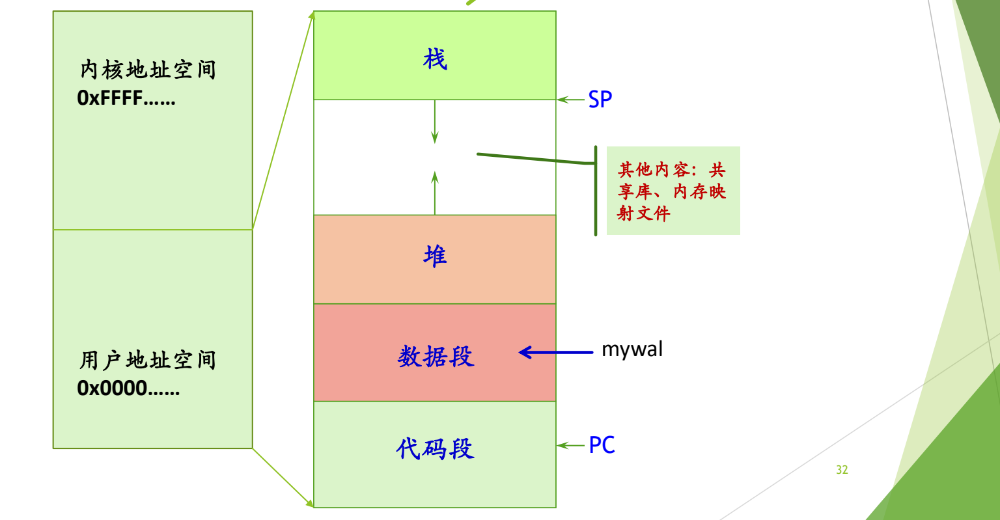
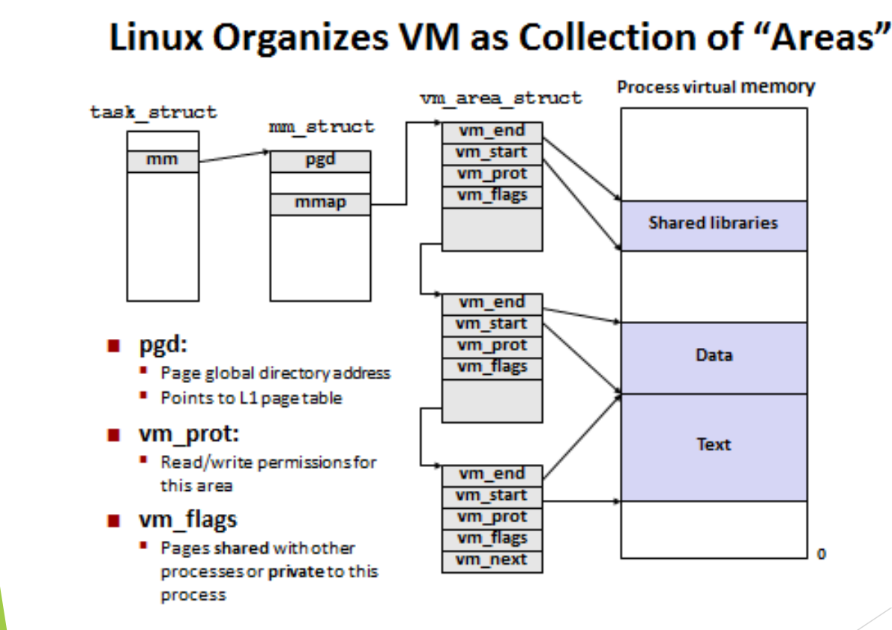

# 06 进程地址空间

[本讲目录](../index.md) · [课程目录](../../index.md) · [上一节：05 进程控制块 PCB](05-process-control-block.md)

> [!abstract] 本节要点
> - **地址空间是对内存的抽象**：创建进程时操作系统立即给它一个虚拟地址空间，再把虚拟地址映射到物理内存。
> - myval 实验：两个并发进程打印的变量地址相同（老机器上均为 `0x804968c`）而值不同，说明打印的是各自虚拟地址空间中的同一位置，映射到不同的物理内存；现代机器地址不同是 **ASLR** 造成的，关闭后又相同。
> - 地址空间有四个特征：巨大（大小取决于体系结构和 OS，Linux x86-64 为 $2^{48}$）、统一一致的布局、安全、稀疏。
> - 建立地址空间时只根据可执行文件为代码、数据建立 area 映射，并不真正装入；堆、栈动态产生。
> - Linux 用 `task_struct→mm→mm_struct` 描述地址空间：`mmap` 指向 `vm_area_struct` 链表（每个区域一个，含起止地址、权限、标志），`pgd` 指向顶级页表。

## 地址空间是对内存的抽象

[进程是对 CPU 的抽象](01-guiding-questions-and-abstractions.md)，地址空间则是对内存的抽象。操作系统不再直接给进程分配一块物理内存，而是给每个进程分配一个**地址空间**（address space），并在地址空间与具体的物理内存之间加一层映射。两层结构比直接使用物理内存灵活得多。[^s2p26]

只要创建进程，操作系统就**先**给它分配一个地址空间（PCB 中对应的字段见[三个必须掌握的字段](05-process-control-block.md)）。很多年前是真的分给它一块物理内存，按需要的大小读进去；有了虚存后，只是**承诺**给它一个地址空间。就像网上预订酒店房间：交了定金，房间一定有，只是到了才知道是 305 还是 408。[^s4b7] [^s4b8] 在有虚存支持的通用计算机上，这个地址空间是**虚拟地址空间**。

### myval 实验与 ASLR

下面的程序用实验说明“每个进程有自己独立的虚拟地址空间”：[^s2p27]

```c
int myval;

int main(int argc, char *argv[]) {
    myval = atoi(argv[1]);
    while (1)
        printf("myval is %d, loc 0x%lx\n", myval, (long) &myval);
}
```

程序把命令行参数存入全局变量 `myval`，然后在死循环中不停打印它的值和地址。死循环保证进程不会结束。**同时**运行两个实例，例如在后台先启动 `myval 5`，再启动 `myval 6`，系统中就有两个并发进程。

**老机器上的结果**：两个进程打印的值分别是 5 和 6，但打印出的 `myval` 地址**完全相同**，都是 `0x804968c`。[^s2p28]

```text
myval is 5, loc 0x804968c
myval is 6, loc 0x804968c
```

原因如下：[^s4b10]

1. 每创建一个进程，就给它一个新的地址空间，因此两个进程各有一个地址空间；
2. `myval` 是全局变量，编译器在编译、链接时就确定了它在数据区中的位置，两个进程运行的是同一个可执行文件，所以在各自地址空间中 `myval` 的**虚拟地址**相同；
3. 运行时，两个进程的这个虚拟地址经地址映射分别对应到**不同的物理内存**，所以各存各的值，互不影响。

类比：小区里每栋楼都有 208 号房间，“208”相同，但它们是不同楼里的不同房间。程序打印的 `&myval` 是虚拟地址，而不是物理地址。

**现代机器上的结果**：两个进程打印的地址**不一样**，例如 `myval 5` 打印 `loc 0x104a40000`，`myval 6` 打印 `loc 0x102098000`；重复运行同一程序，地址也会变化。[^s2p29]

```text
myval is 5,loc 0x104a40000
myval is 6,loc 0x102098000
```

这仍然是虚拟地址，地址不同是因为**地址空间布局随机化**（Address Space Layout Randomization，ASLR）：为了安全，系统每次创建进程时都随机改变代码、数据、堆、栈、共享库等区域的起始位置，让攻击者难以预测关键数据和代码的地址，从而提高攻击成本。[^s4b8]

ASLR 是一个开关。在 Linux 上关闭它：[^s2p30]

```bash
sudo sysctl -w kernel.randomize_va_space=0
```

关闭后再同时运行两个 myval，两个进程打印的地址又相同了，都是 `loc 0x555555558014`：它们仍然是不同地址空间中的同一个位置，对应的物理内存当然不同。[^s2p30]

| 场景 | `myval 5` 打印的地址 | `myval 6` 打印的地址 | 结论 |
| --- | --- | --- | --- |
| 老机器（无 ASLR） | `0x804968c` | `0x804968c` | 同一虚拟地址，不同物理内存 |
| 现代机器（ASLR 开启） | `0x104a40000` | `0x102098000` | 布局被随机化，地址不同 |
| 现代 Linux，`randomize_va_space=0` | `0x555555558014` | `0x555555558014` | 关闭随机化后又相同 |

> [!note] 补充解释
> `kernel.randomize_va_space` 的取值：0 表示关闭随机化；1 表示随机化栈、`mmap` 区域（共享库）和 vdso 等的位置；2（多数发行版默认）在 1 的基础上再随机化堆的起始位置。做完实验后应执行 `sudo sysctl -w kernel.randomize_va_space=2` 恢复。另外，`myval` 没有初值，严格说位于数据区中的 `.bss` 部分。三组地址的长度也不同：`0x804968c` 只有 32 位，是老式 32 位 x86 可执行文件的典型地址（代码默认从 `0x08048000` 起）；`0x555555558014` 落在 64 位 Linux 关闭随机化后位置无关可执行文件（PIE）的默认装载区附近（`0x555555554000` 起）。

> [!warning] 易错点
> 看到两个进程打印的地址不同，不能得出“打印的是物理地址”的结论；看到地址相同，也不能得出“两个进程共享了这个变量”的结论。两种情况下打印的都是虚拟地址，相同还是不同只取决于 ASLR 是否开启，而两个进程的 `myval` 始终位于不同的物理内存中。

## 进程地址空间的生成与布局

进程地址空间的内容一部分来自可执行文件，一部分在运行时产生：[^s2p31]


1. 源代码经编译、链接成为可执行文件（见 ICS 第七章），文件中有文件头、代码和初始化数据；
2. 创建进程时，操作系统找到可执行文件，从中找到代码 section 和数据 section，知道它们各占多大空间，然后在虚拟地址空间中分别为它们建立一个 **area**，与文件内容建立映射关系；
3. 此时并**没有**真正把文件内容装入内存，只是建立了映射；
4. 堆、栈和共享库不来自可执行文件，在运行过程中动态产生。[^s4b9]

所谓“执行程序”，执行的就是这个可执行文件：地址空间中的代码和数据部分正是从它映射而来。

**统一一致的布局**：整个地址空间一分为二，高地址部分（如 `0xFFFF……`）是内核地址空间，低地址部分（`0x0000……`）是用户地址空间。用户部分从低地址到高地址依次是：[^s2p32]

1. **代码段**：PC 指向这里；
2. **数据段**：全局变量（如 `myval`）在这里；
3. **堆**：从低向高增长；
4. 中间的大片空白：可以放共享库、内存映射文件等其他内容；
5. **栈**：位于高地址，SP 指向栈顶，从高向低增长。

ASLR 只随机化这些区域的位置，不改变这一布局。[^s4b9]



图：用户地址空间自低向高依次是代码段（PC 指向）、数据段（全局变量 myval 所在）、向上增长的堆，以及自高地址向下增长的栈（SP 指向）；高端是内核地址空间，中间还映射共享库、内存映射文件等。
上图左侧是内核与用户两部分地址空间，右侧是用户地址空间的展开，标出了 PC、SP 和 `myval` 所在的位置。可以用 `cat /proc/PID/maps` 查看一个进程实际的地址空间布局。

## 地址空间的四个特征

现代操作系统中，每个进程的地址空间都有以下四个特征：[^s4b8]

1. **巨大**：地址空间的大小取决于具体的**体系结构和操作系统**，脱离这两者谈“地址空间多大”没有意义。Linux x86-64 上为 $2^{48}$ 字节；xv6 在 RISC-V 上的大小也要记住（见下方补充解释）。ICS 第九章开篇就说，虚拟地址空间是虚存思想与磁盘的完美结合。
2. **统一一致**：每个进程的布局都一样，即上一小节的布局。
3. **安全**：地址空间受到保护，进程之间互相隔离，各区域也有自己的访问权限。
4. **稀疏**：真正有内容的部分很少。

> [!note] 补充解释
> x86-64 目前使用 48 位虚拟地址，整个空间为 $2^{48}$ 字节，其中低半部分 $2^{47}$ 字节（128 TB）给用户，高半部分给内核，对应上一小节的“一分为二”。xv6 运行在 RISC-V 的 Sv39 分页模式下，虚拟地址为 39 位；xv6 只使用其中低 $2^{38}$ 字节（`kernel/riscv.h` 中的 `MAXVA`），以避免处理高位符号扩展。

稀疏性需要放到真实尺寸中才能体会：在 $2^{48}$ 字节的空间里，代码只占几页，数据也不多，栈一般约 8 MB，堆与栈之间是巨大的空白，除了可以放共享库和内存映射文件外，仍有大量空间。就像在内蒙古大草原上走半天才能遇到一个蒙古包。[^s4b9]

## 用 /proc/PID/maps 观察地址空间

`/proc/PID/maps` 显示进程映射的内存区域及其访问权限。[^s2p34] 下面的程序用于练习，它满足三个条件：用到了常量（字符串 `"hello, world!"`）、用到了堆（`malloc`）、不会自动退出（`getchar()` 等待输入）。[^s2p33]

```c
#include <stdio.h>
#include <stdlib.h>
int main() {
    printf("hello, world!");
    int *a = malloc(sizeof(int));
    getchar();
    return 0;
}
```

运行后在另一个终端执行 `cat /proc/<PID>/maps`，得到如下输出：

```text
00400000-00401000 r-xp 00000000 fc:01 925064 /root/tmp/hello
00600000-00601000 r--p 00000000 fc:01 925064 /root/tmp/hello
00601000-00602000 rw-p 00001000 fc:01 925064 /root/tmp/hello
00c0b000-00c2c000 rw-p 00000000 00:00 0 [heap]
7f1aa1c26000-7f1aa1c28000 r-xp 00000000 fc:01 25150 /usr/lib64/libdl-2.17.so
7f1aa1c28000-7f1aa1e28000 ---p 00002000 fc:01 25150 /usr/lib64/libdl-2.17.so
7f1aa1e28000-7f1aa1e29000 r--p 00002000 fc:01 25150 /usr/lib64/libdl-2.17.so
7f1aa1e29000-7f1aa1e2a000 rw-p 00003000 fc:01 25150 /usr/lib64/libdl-2.17.so
7f1aa1e2a000-7f1aa1fe4000 r-xp 00000000 fc:01 25054 /usr/lib64/libc-2.17.so
7f1aa1fe4000-7f1aa21e3000 ---p 001ba000 fc:01 25054 /usr/lib64/libc-2.17.so
7f1aa21e3000-7f1aa21e7000 r--p 001b9000 fc:01 25054 /usr/lib64/libc-2.17.so
7f1aa21e7000-7f1aa21e9000 rw-p 001bd000 fc:01 25054 /usr/lib64/libc-2.17.so
7f1aa21e9000-7f1aa21ee000 rw-p 00000000 00:00 0
7f1aa21ee000-7f1aa220f000 r-xp 00000000 fc:01 24864 /usr/lib64/ld-2.17.so
7f1aa22f2000-7f1aa22f5000 rw-p 00000000 00:00 0
7f1aa2305000-7f1aa2307000 rw-p 00000000 00:00 0
7f1aa2307000-7f1aa230a000 r-xp 00000000 fc:01 25620 /usr/lib64/libonion_security.so.1.0.19
7f1aa230a000-7f1aa240a000 ---p 00003000 fc:01 25620 /usr/lib64/libonion_security.so.1.0.19
7f1aa240a000-7f1aa240b000 rw-p 00003000 fc:01 25620 /usr/lib64/libonion_security.so.1.0.19
7f1aa240b000-7f1aa240f000 rw-p 00000000 00:00 0
7f1aa240f000-7f1aa2410000 r--p 00021000 fc:01 24864 /usr/lib64/ld-2.17.so
7f1aa2410000-7f1aa2411000 rw-p 00022000 fc:01 24864 /usr/lib64/ld-2.17.so
7f1aa2411000-7f1aa2412000 rw-p 00000000 00:00 0
7ffc47264000-7ffc47285000 rw-p 00000000 00:00 0 [stack]
7ffc47337000-7ffc47339000 r-xp 00000000 00:00 0 [vdso]
ffffffffff600000-ffffffffff601000 r-xp 00000000 00:00 0 [vsyscall]
```

每一行描述一个 area，各列依次为：起始–结束地址、权限、在映射文件中的偏移、设备号、inode 号、映射的文件名（或 `[heap]`、`[stack]` 等特殊名称）。

> [!example] 例：读懂 hello 的 maps
> 1. `00400000-00401000 r-xp …/hello`：代码段，从 `0x400000` 开始，可读、可执行、不可写，映射自可执行文件 hello。
> 2. `00600000-00601000 r--p` 与 `00601000-00602000 rw-p`：数据部分，分成只读数据和可读写数据（含 `.bss`），同样映射自 hello。
> 3. `[heap]`：`malloc` 用到的堆，紧接在数据之后，可读写，不对应任何文件（inode 为 0）。
> 4. `7f1a…` 开头的一大片：共享库 `libdl`、`libc`、`ld`、`libonion_security` 等（其中没有文件名的 `rw-p` 行是匿名映射），每个库又分为代码、只读数据、可写数据几个区域；它们位于堆与栈之间的空白中，地址范围很大。
> 5. `[stack]`：`7ffc…` 开头，位于用户空间的最高处，从高地址向低地址增长。
> 6. 从 `0x400000` 到 `0x7ffc…` 之间只有少数几行有内容，这就是稀疏性。[^s4b9]

> [!note] 补充解释
> 权限列第 4 位的 `p` 表示**私有映射**（private，写时复制：进程写入时得到自己的副本，不影响文件和其他进程），`s` 表示共享映射（shared）。权限为 `---p` 的区域不可读、写、执行，是动态链接器在共享库各段之间留出的保护间隔，访问它会触发段错误。

在内核中，进程的一段地址空间用 `vm_area_struct` 表示，所有区域存储在 `task->mm->mmap` 链表中；一个文件可以映射到进程的一段内存区域中，映射的文件保存在 `vm_area_struct->vm_file` 域中，这种区域叫**有名内存区域**，不对应文件的（如堆、栈）叫**匿名映射内存区域**。[^s2p34]

### mmap 的用途

堆与栈之间的大片空白可以用 **`mmap`**（memory map）函数利用起来：把一个文件直接映射到地址空间的空白处，之后像访问内存数组一样访问文件内容。[^s4b9]

例：一个文件中存有几千万个整数，要求排序。

- 不用 `mmap`：只能 `open` 文件，用 `read` 每次读入一部分到缓冲区，分批排序，再合并结果；
- 用 `mmap`：把整个文件映射进地址空间，得到一个指针，直接在这片区域上排序。哪些页需要访问，由虚存机制按需调入，程序不必自己分批读写。

> [!tip] 课堂强调
> `mmap` 是“特别重要的函数”，后续课程会反复提到它。[^s4b9]

## 用 vm_area_struct 描述稀疏的地址空间

地址空间是稀疏的，那么该用什么数据结构描述它？最直接的想法是开一个与地址空间一样大的字节数组，但一个 $2^{48}$ 字节的数组根本不可能存在。思路与数据结构课中的**稀疏矩阵**相同：稀疏矩阵用三元组等方式只存非零元素，地址空间也**只描述有内容的区域**：代码段、数据段、堆、栈，以及中间每一个被映射的区域。[^s4b9]

每个区域用一个结构描述，然后把这些结构连成链表，或组织成 AVL 树。Linux 中这个结构是 **`vm_area_struct`**，主要字段有：[^s2p35]

- `vm_start`、`vm_end`：区域在地址空间中的起始地址和结束地址，即 maps 中每行开头的地址范围；
- `vm_prot`：本区域的读写权限（protection）。代码区域可执行，数据区域不可执行，只读区域不可写；
- `vm_flags`：本区域的页是与其他进程**共享**的，还是本进程**私有**的；
- `vm_next`：指向下一个区域，把所有区域连成链表。

整个结构的入口在 PCB 中：`task_struct` 的 `mm` 字段指向 **`mm_struct`**，`mm_struct` 中的 `mmap` 指针指向 `vm_area_struct` 链表的表头，`pgd` 字段则指向页表。[^s4b9]



图：task_struct 的 mm 指向 mm_struct，其 mmap 链接多个 vm_area_struct，每个区域用 vm_start、vm_end、vm_prot、vm_flags 描述进程虚拟内存中的一段，如代码、数据和共享库；pgd 指向页表。
上图从左到右依次是 `task_struct`、`mm_struct`、`vm_area_struct` 链表和进程虚拟内存。三个 `vm_area_struct` 分别描述 Text、Data 和 Shared libraries 区域，其余空白部分没有任何结构描述，这正是“只描述有内容的区域”。

**`pgd`**（page global directory）是顶级页表的地址，在四级页表中指向最顶层那一级。进程上 CPU 时，这个值被装入页表基址寄存器；进程下 CPU 时，它保存在 PCB 中。[^s4b10] 这正是[上下文](05-process-control-block.md)中“页表指针”的具体落脚点，页表本身的结构属于 ICS 第九章的内容。

**链表与 AVL 树**：两者都能完整描述所有区域，区别在于查找效率。用 `mmap` 在指定位置映射一块新区域时，内核必须先判断这个位置是否已被其他区域占用，也就是查找“某地址是否落在已有区域中”。链表只能逐个比较；AVL 这类平衡树可以按地址二分查找，快得多。本质上这是一个检索问题。Solaris 用段的 AVL 树（见[Solaris 的 PCB](05-process-control-block.md)），上图的 Linux 结构则用链表。[^s4b9]

> [!tip] 课堂强调
> `pgd` 的作用要和 ICS 学过的页表联系起来，“这个挺重要”；描述区域的数据结构可以用链表，也可以用树。[^s4b10]

> [!note] 补充解释
> 实际的 Linux 内核并不只用链表：Linux 2.2 曾在链表之外使用 AVL 树；2.4 系列起到 6.0 版本，`vm_next` 链表之外维护的是一棵红黑树（`mm_rb`），用于按地址快速查找区域；从 6.1 版本起，链表和红黑树都被一种名为 maple tree 的 B 树变体取代。思路仍是本节所说的“按地址检索区域”。

> [!question]- 自测：关闭 ASLR 后同时运行 `myval 5` 和 `myval 6`，两者打印出相同的地址。如果此时用调试器把 `myval 5` 进程中的 `myval` 改成 100，`myval 6` 打印的值会变吗？
> 不会。相同的只是虚拟地址，两个进程有各自的地址空间，同一虚拟地址映射到不同的物理内存，修改一个不影响另一个。

> [!question]- 自测：一个进程的 maps 输出（不含内核的 `[vsyscall]` 行）共有 25 行。在 Linux 内核中，描述它的用户地址空间大约需要多少个 `vm_area_struct`？为什么不需要描述 $2^{48}$ 字节中的其余部分？
> 大约 25 个，每行一个 area。地址空间是稀疏的，内核只为有内容的区域建立结构；没有结构覆盖的地址就是未映射的空白，访问它会出错。

> [!question]- 自测：程序调用 `mmap` 时指定在地址 $A$ 处映射一个文件，内核首先要做什么？此时链表和 AVL 树哪个更合适？
> 先检查从 $A$ 开始的这段范围是否与已有区域重叠。这是按地址检索已有区域的问题，链表要逐个比较，平衡树可以按地址快速定位，所以树更快。

> [!info]- 来源
> - slides03.pdf：PDF p.26–35
> - L04.docx：DOCX body 176–262

[^s2p26]: slides03.pdf-PDF p.26
[^s4b7]: L04.docx-DOCX body 176-203
[^s4b8]: L04.docx-DOCX body 204-226
[^s2p27]: slides03.pdf-PDF p.27
[^s2p28]: slides03.pdf-PDF p.28
[^s4b10]: L04.docx-DOCX body 253-262
[^s2p29]: slides03.pdf-PDF p.29
[^s2p30]: slides03.pdf-PDF p.30
[^s2p31]: slides03.pdf-PDF p.31
[^s4b9]: L04.docx-DOCX body 227-252
[^s2p32]: slides03.pdf-PDF p.32
[^s2p34]: slides03.pdf-PDF p.34
[^s2p33]: slides03.pdf-PDF p.33
[^s2p35]: slides03.pdf-PDF p.35

[本讲目录](../index.md) · [课程目录](../../index.md) · [上一节：05 进程控制块 PCB](05-process-control-block.md)
