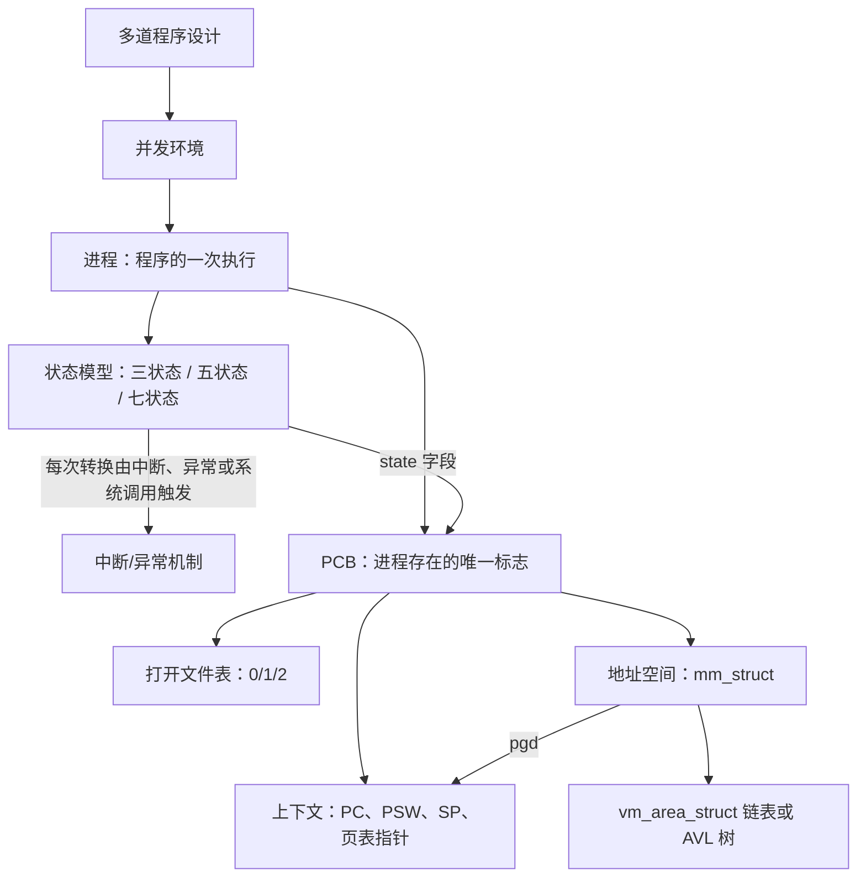

# L04 进程模型

[课程目录](../index.md)

操作系统管不到 CPU 本身，只能通过寄存器和一份份记录来“运行”程序。本讲回答：进程这个抽象是怎样从多道程序设计中产生的，操作系统又用什么模型和数据结构来描述它。路线依次是：进程与三个抽象、并发与进程概念、三状态模型、扩展状态与 Linux/xv6 的实际状态、进程控制块 PCB，最后是 PCB 中最重要的子结构：进程地址空间。阅读前应熟悉 L02–L03 的中断、异常与系统调用机制，以及 ICS 中链接、虚拟内存和 `fork`/`wait` 的基本用法。

## 章节导航

- [01 进程与三个抽象](chapters/01-guiding-questions-and-abstractions.md)：进程是 CPU 的抽象，与地址空间、文件系统并列
- [02 并发与进程概念](chapters/02-from-sequential-to-concurrent-process-concept.md)：从顺序到并发，引出进程定义、分类与家族
- [03 三状态模型](chapters/03-three-state-model-and-transitions.md)：运行、就绪、阻塞三态，四种转换由中断/异常驱动
- [04 扩展状态与实际系统](chapters/04-extended-state-models-linux-xv6.md)：创建/终止/挂起态，五/七状态与 Linux、xv6 状态
- [05 进程控制块 PCB](chapters/05-process-control-block.md)：PCB 是进程存在的唯一标志：字段、上下文与实例
- [06 进程地址空间](chapters/06-process-address-space.md)：虚拟地址空间、ASLR 与 vm_area 描述

## 本讲小结

本讲的主线是“用什么描述进程”：先用**状态**描述进程在生命周期中的变化，再用 **PCB** 记录描述一个进程所需的全部信息，其中地址空间又是 PCB 里一个需要专门数据结构描述的子结构。

| 遇到的问题 | 先想到的数据结构 | 对应章节 |
| --- | --- | --- |
| 进程现在能不能上 CPU、为什么不能 | PCB 中的状态字段与就绪/阻塞队列 | [三状态模型](chapters/03-three-state-model-and-transitions.md)、[扩展状态与实际系统](chapters/04-extended-state-models-linux-xv6.md) |
| 切换进程要保存和恢复什么 | PCB 中的上下文（含页表指针 `pgd`） | [进程控制块 PCB](chapters/05-process-control-block.md) |
| 子进程为什么能直接读写 0/1/2 | PCB 中的打开文件表 | [进程控制块 PCB](chapters/05-process-control-block.md) |
| 两个进程为什么能打印出同一个地址 | 每个进程独立的虚拟地址空间 | [进程地址空间](chapters/06-process-address-space.md) |
| 某地址是否已被映射、`mmap` 能否放在这里 | `mm_struct` 下的 `vm_area_struct` 集合 | [进程地址空间](chapters/06-process-address-space.md) |

进程的创建与撤销、进程队列，以及为什么要在进程之上再引入线程，在 L05「02 进程控制与原语」和 L05「04 为什么引入线程」中继续展开。

## 不确定事项

- p29 中现代机器的截图只显示地址 0x104a40000 和 0x102098000，没有说明是哪种操作系统，所以笔记不写平台；p30 关闭 ASLR 用的是 Linux 的 sysctl 命令。
- xv6 地址空间大小（Sv39，2^38）、Linux 区域查找结构的版本演变、randomize_va_space 的各个取值、32 位与 PIE 默认基址都是标注过的补充解释，课程材料中没有这些内容。
- 讲义 p21（Solaris proc_t 源码截图）没有可提取的文字，内容只按 p20 的结构图和头文件路径描述。

> [!info]- 来源
> - slides03.pdf：PDF p.1–35, 73
> - L04.docx：DOCX body 1–262
