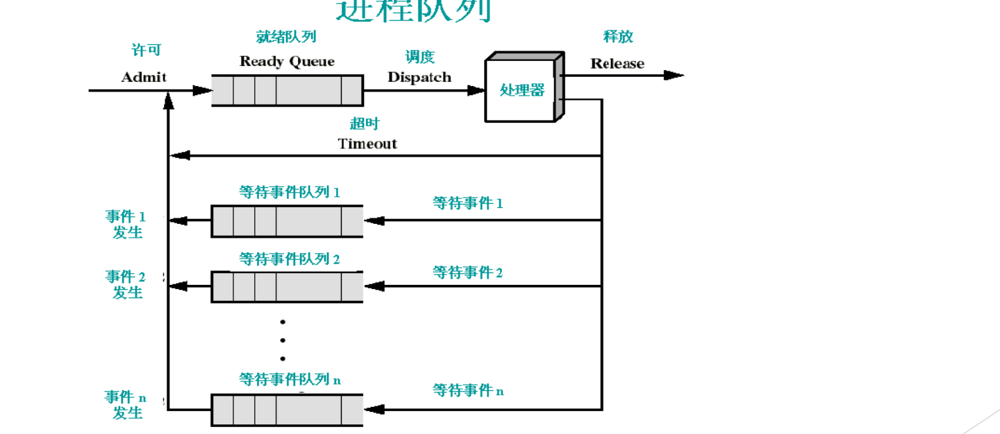
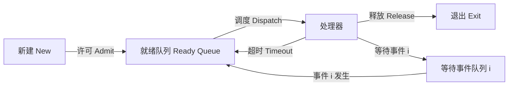

# 01 进程表与队列模型

[本讲目录](../index.md) · [课程目录](../../index.md) · [下一节：02 进程控制与原语](02-process-control-and-primitives.md)

> [!abstract] 本节要点
> - 操作系统为每一类进程建立一个或多个队列，队列元素是 PCB；进程状态改变时，它的 PCB 从一个队列移到另一个队列。
> - 常见实现是内存中一张 PCB 大表（数组）：PCB 位置固定不动，靠 PCB 内的多种指针挂入就绪队列、等待队列，并表示父、子、兄弟关系。
> - 等待队列可以有多个，按所等事件区分；就绪队列也可以有多个；单 CPU 时处于运行态的只有一个进程。
> - 五状态队列模型中，只有就绪队列里的进程能被调度上 CPU；离开 CPU 只有三条路：结束释放、时间片到回就绪、等待事件进入对应等待队列（事件发生后回就绪）。
> - 进程模型 = 有哪些状态 + 能从哪转到哪 + 在什么条件下转 + 调用什么函数转；没有触发条件就没有转换，而触发条件与中断/异常密切相关。

## 从地址空间到进程组织

上一讲已经解决了“单个进程的地址空间如何描述”：虚存给每个进程一个巨大、布局一致、天然受保护且稀疏的空间，Linux 用 `task_struct`→`mm`→`mmap` 串起的 `vm_area_struct` 链表（或 AVL 树）只描述有内容的区域（见 L04「06 进程地址空间」）。[^s4b1]

接下来的问题是：系统里同时有成百上千个进程，每个都有一份 PCB，操作系统怎样把它们组织起来，才能快速找到“下一个该上 CPU 的进程”或“等这块磁盘数据的那些进程”？答案是**排队**。

## 进程表与进程队列

**进程队列**（process queue）是操作系统组织 PCB 的基本方式：

- 操作系统为每一类进程建立一个或多个队列；
- 队列元素就是 PCB；
- 伴随进程状态的改变，其 PCB 从一个队列进入另一个队列。[^s2p36]

典型的队列结构如下：

| 队列 | 队列中的 PCB | 说明 |
| --- | --- | --- |
| 就绪队列 | PCB1、PCB2、PCB3 | 就绪队列也可以有多个 |
| 等待队列 1 | PCB5、PCB6 | 不同等待队列等待的事件不同 |
| 等待队列 2 | PCB7、PCB8、PCB9 | 同上 |
| 运行 | PCB4 | 单 CPU 情况下只有一个进程处于运行态 |

### 进程表：大数组加多种指针

队列在逻辑上是链表，但 PCB 本身放在哪里？操作系统一般的做法是在内存里安排一张大表，即**进程表**（process table）：它是一个大数组，每个元素就是一个 PCB，数组的大小决定了系统最多能容纳多少个进程。[^s4b1]

PCB 在表中的位置固定不变，“排队”靠 PCB 内的指针完成：

1. **状态队列指针**：处于就绪态的进程，用这组指针链进就绪队列；处于等待态的进程，链进它所等事件的那个等待队列。状态改变时只需改指针，PCB 不搬家。
2. **家族关系指针**：UNIX 类系统中进程有父子关系，PCB 里还有指向父进程、子进程、兄弟进程的指针。

所以一个 PCB 往往带着好几种指针，同时出现在几条不同的链上。Linux 的 `task_struct` 就是这样，用不同的指针挂到不同的队列和关系链上，位置不动而组织灵活。[^s4b2]

> [!warning] 易错点
> “PCB 从就绪队列进入等待队列”说的是逻辑上的移动：实际修改的是 PCB 里的链表指针，PCB 在进程表中的存储位置并不改变。

## 五状态模型的队列模型

五状态模型（新建、就绪、运行、阻塞/等待、终止）是最接近实际系统的进程模型：三状态模型太简单，七状态模型（含挂起）在实际系统中很少见。[^s4b2] 把五状态模型画成队列图（W. Stallings），每个状态对应一个或一组队列，状态转换就变成 PCB 沿箭头在队列之间流动。

图：新进程经许可（Admit）进入就绪队列，调度（Dispatch）后上处理器运行；超时回到就绪队列，等待事件 $i$ 则进入等待事件队列 $i$，事件 $i$ 发生后整个对应队列移回就绪队列，运行结束则释放（Release）。

读图时可以直接推出以下规则：

1. **许可（Admit）**：新创建的进程被允许进入系统后，进入就绪队列。
2. **调度（Dispatch）**：处理器只从就绪队列取进程。也就是说只有就绪的进程才能变成运行态，就绪→运行只有“被调度”这一条路。图中的就绪队列没有优先级，例如按 FIFO 排队。[^s2p38]
3. **离开处理器的三条路**：
   - **释放（Release）**：进程结束，离开系统；
   - **超时（Timeout）**：规定的时间片用完，回到就绪队列重新排队；
   - **等待事件 $i$**：进程需要等待某个事件，进入对应的等待事件队列 $i$。
4. **事件发生**：当事件 $n$ 发生时，对应等待队列中的进程被移进就绪队列，再等待调度。[^s2p38]

等待队列按所等事件拆成 $n$ 条，不同事件发生只唤醒对应队列中的进程。队列图的流向可概括如下：

> [!warning] 易错点
> 等待队列中的进程在事件发生后**不会**直接回到处理器，而是先回到就绪队列，再由调度程序选中。阻塞→运行这条边在五状态模型中不存在。

## 状态转换的触发条件

所谓**进程模型**，就是规定系统中的进程处于哪些状态、如何从一个状态切换到另一个状态；模型一旦确定，整个系统的运行方式也就确定了。[^s4b1] 画队列图的目的，是看清每次转换的**条件**和完成转换的**函数**。一个进程模型要回答四个问题：[^s4b2]

1. 有哪些状态？
2. 能从哪个状态转到哪个状态？
3. 在什么情况下转（触发条件）？
4. 调用什么函数完成转换？

关键结论：**没有触发条件就没有转换**。连“新建→就绪”这种看似平常的转换也有触发条件，例如一次 `fork` 完成后子进程才进入就绪态。而触发条件大多来自中断和异常，所以中断/异常机制和进程模型是绑在一起的（中断与异常的概念见 L02「08 中断与异常概念」）。[^s4b2]

> [!note] 补充解释
> 下面把常见的触发条件与中断/异常对应起来，便于理解（据课程内容整理）：
>
> | 转换 | 典型触发条件 |
> | --- | --- |
> | 运行→就绪 | 时钟中断，发现时间片用完 |
> | 运行→阻塞 | 进程执行会阻塞的系统调用（陷入），如 `read` 等待磁盘数据 |
> | 阻塞→就绪 | 所等事件完成，如 I/O 完成中断 |
> | 运行→终止 | 进程调用 `exit`，或发生无法处理的严重异常 |
> | 新建→就绪 | 创建原语（如 `fork`）完成 |

触发条件出现后，具体的转换动作由进程控制原语完成，见[进程控制与原语](02-process-control-and-primitives.md)。

> [!question]- 自测：单 CPU 系统中有 1 个运行进程、3 个就绪进程、5 个等待进程。运行进程发起磁盘读请求，随后又有一个等待中的进程等到了键盘输入。之后各队列中各有几个进程？
> 运行进程进入等待磁盘的队列（等待变为 6 个），等到键盘输入的进程回到就绪队列（等待变回 5 个，就绪变为 4 个），调度程序再从就绪队列选一个上 CPU。最终运行 1 个、就绪 3 个、等待 5 个。注意等到键盘输入的进程不会直接上 CPU，而是先回就绪队列。

> [!question]- 自测：如果某系统的状态图中没有“挂起”状态，操作系统还需要“挂起原语”吗？从队列模型的角度说明。
> 不需要。原语是为状态转换服务的：队列模型里没有挂起队列，就不存在“移入挂起队列”的转换，也就没有对应的控制函数。

> [!info]- 来源
> - slides03.pdf：PDF p.36, 38
> - L05.docx：DOCX body 1–67

[^s4b1]: L05.docx-DOCX body 1-39
[^s2p36]: slides03.pdf-PDF p.36
[^s4b2]: L05.docx-DOCX body 40-67
[^s2p38]: slides03.pdf-PDF p.38

[本讲目录](../index.md) · [课程目录](../../index.md) · [下一节：02 进程控制与原语](02-process-control-and-primitives.md)
