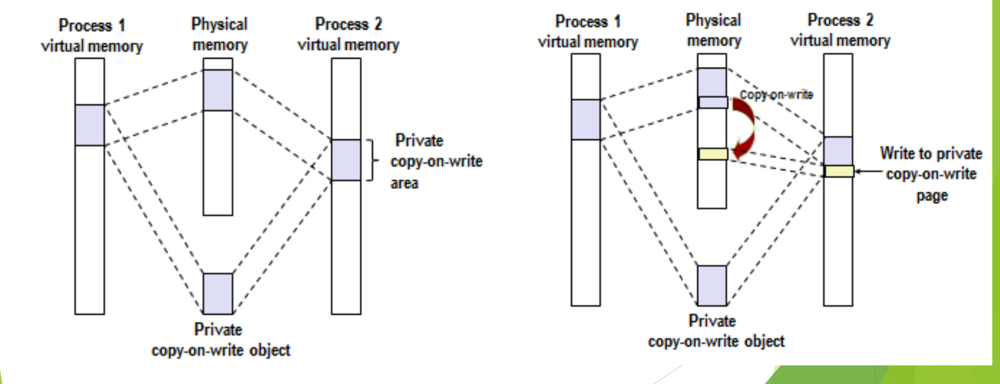
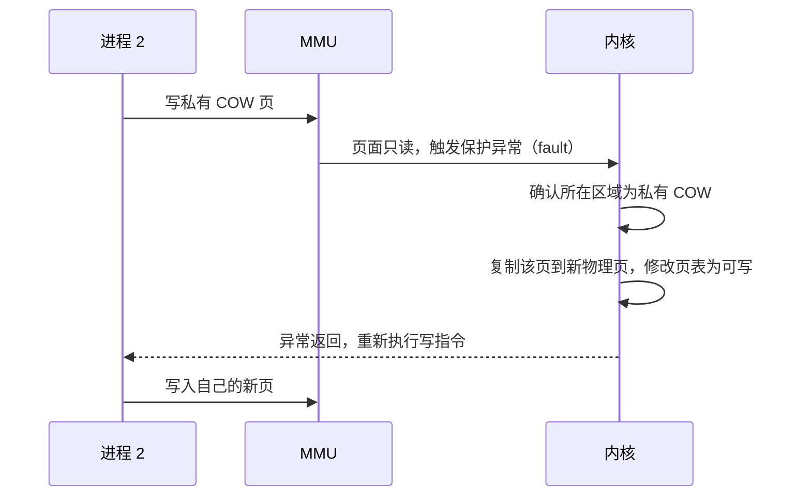
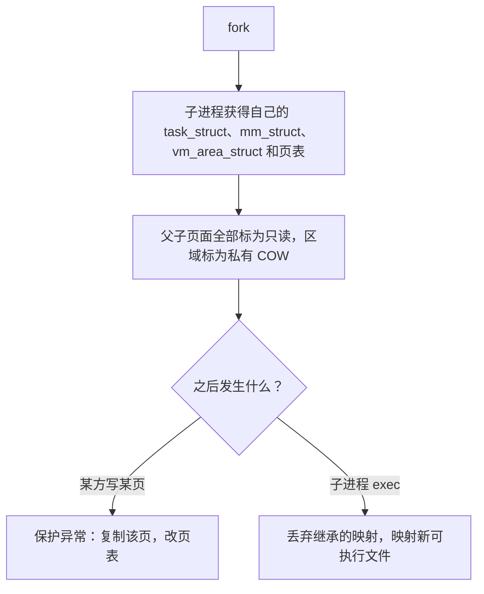

# 03 fork、exec 与写时复制

[本讲目录](../index.md) · [课程目录](../../index.md) · [上一节：02 进程控制与原语](02-process-control-and-primitives.md) · [下一节：04 为什么引入线程](04-why-introduce-threads.md)

> [!abstract] 本节要点
> - UNIX 进程控制的四个系统调用：`fork`（复制调用进程建立新进程）、`exec`（用新代码覆盖原内存空间）、`wait`（初级同步，等另一进程结束）、`exit`（终止）。
> - UNIX 创建进程靠两个动作：`fork` 克隆出除 PID 外一模一样的子进程，紧接着 `exec` 把继承来的代码和数据全部换掉；这体现了 small is beautiful 的设计哲学。
> - 传统 UNIX `fork` 以一次一页的方式复制父进程地址空间，既费时又费空间，而绝大多数 `fork` 之后紧跟 `exec`，复制的内容随即作废。
> - Linux 利用存储管理模块**已有的**写时复制（COW）技术优化 `fork`：子进程拥有自己的 `task_struct`、`mm_struct`、`vm_area_struct` 和页表，但指向同一批物理页，页面标为只读、区域标为私有 COW。
> - 写 COW 页时触发保护异常，内核复制该页并改页表后再写；`exec` 时子进程直接丢弃这些映射、改为映射新的可执行文件，因此 `fork`+`exec` 几乎不复制任何页面。

## UNIX 的进程控制系统调用

UNIX 系统设计的进程控制操作由四个系统调用组成：[^s2p44]

- **`fork()`**：通过复制调用进程来建立新的进程，是最基本的进程建立过程；
- **`exec()`**：包括一系列系统调用，它们都用一段新的代码覆盖原来的内存空间，实现进程执行代码的转换；
- **`wait()`**：提供初级的进程同步措施，使一个进程等待，直到另外一个进程结束为止；
- **`exit()`**：终止一个进程的运行。

### 创建 = fork + exec

在 UNIX 体系中，进程创建由两个动作共同完成：[^s4b2]

1. **`fork`：克隆**。调用 `fork` 的进程成为父进程，新进程是子进程。子进程是父进程的复制品，除了 PID 不同，其他一模一样。
2. **`exec`：替换**。一个和父进程完全相同的子进程本身没什么用，所以子进程紧接着调用 `exec`，把从父进程继承来的代码和数据全部换成自己要运行的程序。

为什么不像 Windows 的 `CreateProcess` 那样一步到位？这是 UNIX 的设计哲学 **small is beautiful**：每个系统调用名字只有几个字母，好记好用；把一个大动作分解成两个小动作，组合起来更灵活。[^s4b3] 例如 shell 就是 `fork` 出子进程，在子进程里 `exec` 用户输入的命令，父进程 `wait` 它结束。推荐阅读 OSTEP 第 5 章 Process API，了解 shell、`fork()`、`exec()`、`wait()` 之间的关联，体会这样设计的好处。[^s2p44]

> [!example] 例：shell 式的 fork / exec / wait（补充示例）
> 下面的 C 程序演示四个调用的配合，以及 `fork` 对父子进程返回不同值：
>
> ```c
> #include <stdio.h>
> #include <unistd.h>
> #include <sys/wait.h>
>
> int main(void) {
>     pid_t pid = fork();              /* 一次调用，两次返回 */
>     if (pid == 0) {                  /* 子进程：fork 返回 0 */
>         execlp("ls", "ls", "-l", NULL);  /* 用 ls 的代码覆盖自己 */
>         _exit(1);                    /* 只有 exec 失败才会执行到这里 */
>     } else if (pid > 0) {            /* 父进程：fork 返回子进程 pid */
>         int status;
>         wait(&status);               /* 阻塞，直到子进程结束 */
>         printf("child %d finished\n", (int)pid);
>     }
>     return 0;                        /* 正常结束，相当于 exit(0) */
> }
> ```
>
> 1. `fork` 返回后父子进程都从同一位置继续执行，靠返回值区分身份。
> 2. 子进程调用 `execlp` 成功后，原来的代码不复存在，后面的 `_exit(1)` 不会执行。
> 3. 父进程在 `wait` 处阻塞，子进程 `exit` 后被唤醒。

### 延伸阅读：xv6 中的 shell 与 fork

> [!info] 依据讲义整理
> 这是课后的 xv6 源码阅读任务，课上未讲解。

阅读任务要求：参考 xv6-book 第 2.5 节，阅读 xv6-riscv 中 `kernel/proc.h`、`kernel/proc.c` 和 `user/sh.c`，并结合 OSTEP 第 5 章 Process API，弄清 shell、`fork()`、`exec()`、`wait()` 之间的关联，体会这样设计的好处，再简要概括这些 API。[^s2p73]

阅读时可以按下面的线索把本讲内容对上号：

1. **`proc.h`**：`struct proc` 就是 xv6 的 PCB，其中的状态字段对应本讲的进程状态（见[进程表与队列模型](01-process-table-and-queue-model.md)）；xv6 用一个固定大小的 `proc` 数组作为进程表。
2. **`proc.c` 中的 `fork()`**：依次完成分配 `proc` 结构和 pid、复制父进程内存、复制打开的文件和当前目录、把子进程置为可运行，并让子进程的返回值为 0、父进程得到子进程 pid，正好对应下文“UNIX fork 的实现”的七个步骤。
3. **`sh.c`**：shell 主循环读入一行命令，`fork` 出子进程，子进程解析命令并 `exec` 对应程序，父进程 `wait` 子进程结束后再读下一条命令。

> [!note] 补充解释
> xv6 的 `fork()` 通过 `uvmcopy()` 把父进程的用户内存**整体复制**一份，没有实现写时复制，因此它展示的是下文的传统做法；`exec()` 的实现在 `kernel/exec.c` 中。源码见 [xv6-riscv（GitHub）](https://github.com/mit-pdos/xv6-riscv)。

## UNIX fork 的实现与代价

`fork` 要完成[进程创建的基本工作](02-process-control-and-primitives.md)，只是换成了 UNIX 的数据结构：UNIX 的 PCB 叫 **`proc` 结构**（进程描述符）。传统 UNIX `fork()` 的实现步骤如下：[^s2p45]

1. 为子进程分配一个空闲的进程描述符 `proc` 结构；
2. 分配给子进程唯一标识 `pid`；
3. **以一次一页的方式复制父进程地址空间**；
4. 从父进程处继承共享资源，如打开的文件和当前工作目录等；
5. 将子进程的状态设为就绪，插入就绪队列；
6. 对子进程返回标识符 0；
7. 向父进程返回子进程的 `pid`。

问题出在第 3 步。假设父进程地址空间有 100 页，`fork` 就要另外分配 100 个物理页框并逐页拷贝，又耗空间又耗时。[^s4b3] 更糟的是，绝大部分情况下 `fork` 之后紧跟着 `exec`，从父进程拷来的东西随即被全部换掉，这次复制完全白做。于是 Linux 对这一步做了优化。

## 写时复制（Copy-on-Write）

**写时复制**（Copy-on-Write，COW）是一种内存管理和数据复制策略：多个使用者先共享同一份物理数据，只有当某一方要写时，才为它复制一份私有副本，再在副本上写。[^s2p46]

> [!tip] 课堂强调
> COW **不是 Linux 发明的**。它是操作系统存储管理模块中原本就有的技术，Linux 只是利用它优化了 `fork`。以往考这个点时，约四五成同学答成“Linux 提出了 COW 技术”，一定要记住这一点。[^s4b3]

准确的表述是：Linux 利用存储管理模块中的写时复制技术（COW）对 `fork()` 进行了优化。[^s2p45]

### 基本场景：私有 COW 映射

COW 的基本场景是内存映射（ICS 中已学过 `mmap`）：[^s4b3]

1. 磁盘上有一个对象（例如一个文件），进程 1 和进程 2（也可以更多）都要用它，各自调用 `mmap` 把它映射进自己的虚拟地址空间。两个进程中映射的虚拟地址位置可以不同。
2. 如果物理内存里为每个进程各存一份副本，就很浪费空间。因此两个进程的页表都指向**同一块物理内存**，物理内存中只保留一个副本。
3. 使用场景要求：共享只为省空间，各自的修改互不可见——我改的你看不到，你改的我也不要。为此 `mmap` 时把 `flags` 参数设为私有（`MAP_PRIVATE`），对应的虚存区域（area）被标记为**私有写时复制**（private copy-on-write），区域中的页面在页表里标为只读。



图：左侧两个进程把同一个私有写时复制对象映射进各自的虚拟地址空间，共享同一份物理页；右侧进程 2 写该页时触发写时复制，内核复制出一个新的物理页供进程 2 私有，进程 1 仍映射原页。

上图左半部分是映射完成后的状态：两个进程虚拟空间中的私有 COW 区域都映射到同一个物理副本（private copy-on-write object）。右半部分是进程 2 写其中一页之后的状态。写入的过程如下：[^s4b3]

1. 进程 2 写私有 COW 区域中的某一页。内存按页管理，所以一次写涉及的是一整页。
2. 这一页在页表中是只读的，写只读页引发**保护异常**（fault）。这是一种异常（异常的分类见 L03「01 中断异常事件分类」），CPU 由此陷入内核。
3. 内核检查发现，出错地址所在区域是私有 COW 区域，说明这不是非法写，而是“要写请先复制”。
4. 内核分配一个新的物理页，把原页内容拷贝过去，并重建映射：修改进程 2 的页表，使该虚拟页指向新物理页，且可写。
5. 从异常返回，重新执行写指令，这次写到进程 2 的私有副本上。



对进程 2 而言，它看到的地址空间依然完整：一部分页是共享的原始内容，一部分是自己写过的私有副本。只有真正被写的页才会被复制，没写的页始终共享。

> [!warning] 易错点
> COW 复制的单位是**页**，不是整个区域，更不是整个地址空间。进程只写了一个字节，内核也只复制这一个页。

## 用 COW 重新审视 fork

虚存和内存映射解释了 `fork` 怎样为每个进程提供私有地址空间，而且是 `fork()` 后跟 `exec()` 这一常见情况的完美方法。[^s2p47]

Linux 为新进程创建虚拟地址空间的步骤如下：[^s2p47]

1. **建立子进程自己的数据结构**：为子进程创建自己的 `task_struct`，其中 `mm` 指向子进程自己的 `mm_struct`，`mm_struct` 的 `mmap` 再指向 `vm_area_struct` 链表；同时复制页表。这些结构的内容可以从父进程复制，但是挂在子进程的 `task_struct` 上，不和父进程共用，它们是父进程这些结构的**精确副本**。[^s4b4]
2. **把两个进程中的每个页面都标记为只读**。
3. **把两个进程中的每个 `vm_area_struct` 都标记为私有 COW**。
4. **返回**：此时每个进程都有一份虚拟内存的精确副本，但数据结构是两套、指向的却是同一批物理页，没有复制任何数据页。
5. **后续写入**：父子任何一方写某页，都按上一小节的 COW 机制为自己创建新页。



### exec 让复制无从发生

`fork` 之后子进程马上 `exec`：子进程要执行另一个程序的代码，而这些代码在给定的可执行文件里。于是内核把子进程从父进程继承来的映射全部扔掉，把子进程的地址空间重新映射到这个可执行文件。[^s4b4] 这样一来，`fork` 时没有复制页面，`exec` 时也不需要复制，原来那 100 页的逐页拷贝被完全省掉，只复制了几张描述地址空间的表。这就是 Linux `fork` 与传统 UNIX `fork` 的重大不同。

> [!note] 补充解释
> 把 `exec` 理解为“碰到只读页、进内核发现是私有 COW，再给子进程单独分配空间”并不准确。更准确的说法是：`exec` 并不去写父进程的那些页，而是直接拆除子进程原有的全部映射（只是让这些共享物理页的引用计数减一），再按新程序建立全新的映射，新程序的页在被访问时才按需调入。因此 `exec` 不会触发对旧页的 COW 复制；真正触发 COW 的是 `exec` 之前（或不调用 `exec` 时）父子进程对共享页的写操作，例如 `fork` 返回后写栈上的变量。

### 把知识串起来

这一节把三块知识连在了一起：ICS 中的虚存与 `mmap`（私有映射、`flags` 参数）、中断与异常（写只读页引发的保护异常）、以及本课的进程创建（`fork`/`exec`）。COW 不是孤立的知识点，它是存储管理模块的已有机制，被进程管理模块借来解决 `fork` 的性能问题。[^s4b3]

> [!question]- 自测：父进程有 100 页地址空间，在 Linux 上 fork 后，子进程只修改了一个全局变量（位于 data 段的某一页）就调用了 exec。不计栈等其他写入，整个过程中一共复制了多少个数据页？
> 1 页。`fork` 只复制 `task_struct`、`mm_struct`、`vm_area_struct` 和页表，不复制数据页；子进程写全局变量触发一次保护异常，内核复制那一页；`exec` 直接丢弃全部旧映射，不再复制。传统 UNIX `fork` 则要复制全部 100 页。

> [!question]- 自测：同学甲说“Linux 发明了写时复制，用来加速 fork”。这句话错在哪里，应如何改？
> 错在“发明”。COW 是存储管理模块原本就有的技术（例如私有 `mmap` 映射就用它），Linux 只是利用它优化了 `fork`。应说“Linux 利用存储管理模块中已有的写时复制技术优化了 fork”。

> [!question]- 自测：fork 之后，父子进程同一个虚拟地址上的变量值相同。若父进程随后把它改成 5，子进程读到的是多少？为什么父进程写的时候也会触发异常？
> 子进程读到的仍是原值。`fork` 把**两个**进程的页面都标成只读，所以父进程写该页同样触发保护异常，内核为父进程复制出新页再写，子进程仍映射原来的物理页，双方修改互不可见。

> [!info]- 来源
> - slides03.pdf：PDF p.44–47, 73
> - L05.docx：DOCX body 40–116

[^s2p44]: slides03.pdf-PDF p.44
[^s4b2]: L05.docx-DOCX body 40-67
[^s4b3]: L05.docx-DOCX body 68-89
[^s2p73]: slides03.pdf-PDF p.73
[^s2p45]: slides03.pdf-PDF p.45
[^s2p46]: slides03.pdf-PDF p.46
[^s2p47]: slides03.pdf-PDF p.47
[^s4b4]: L05.docx-DOCX body 90-116

[本讲目录](../index.md) · [课程目录](../../index.md) · [上一节：02 进程控制与原语](02-process-control-and-primitives.md) · [下一节：04 为什么引入线程](04-why-introduce-threads.md)
