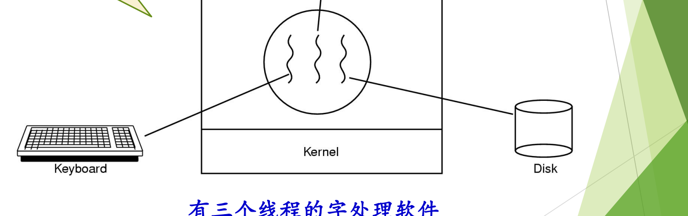
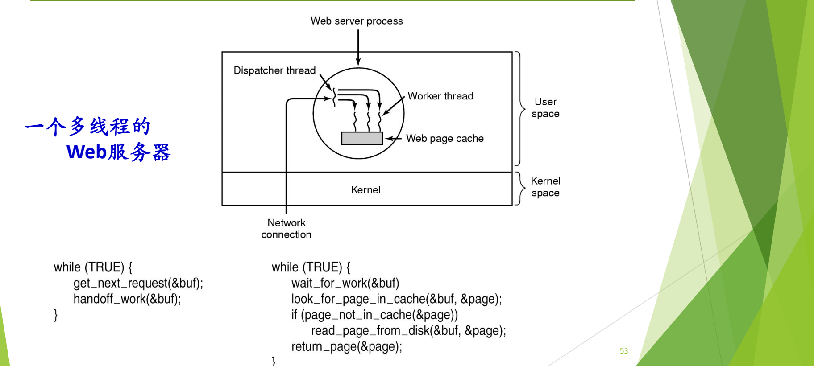
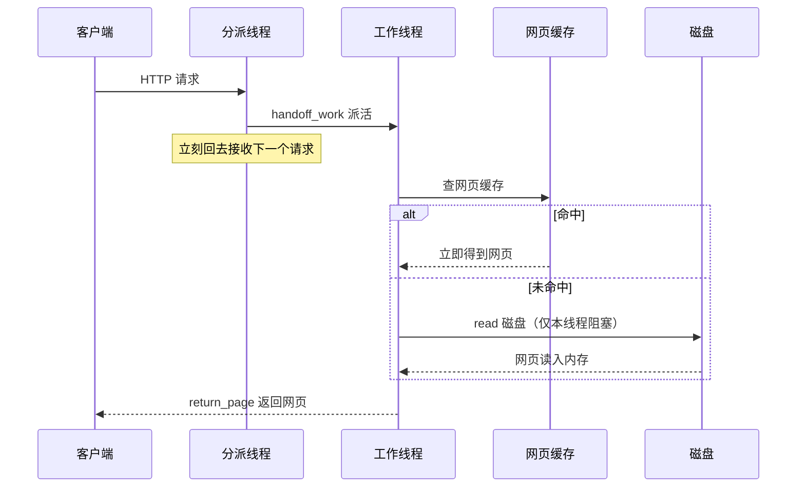

# 04 为什么引入线程

[本讲目录](../index.md) · [课程目录](../../index.md) · [上一节：03 fork、exec 与写时复制](03-unix-fork-exec-and-copy-on-write.md) · [下一节：05 线程的基本概念与属性](05-thread-concepts-and-attributes.md)

> [!abstract] 本节要点
> - 引入一种新机制前先问三件事：有没有**应用需要**、**开销**值不值、能否提高**性能**（多核、多处理器）；线程的引入正是这三点的答案。
> - 多线程字处理软件把“接收键盘输入”“即时排版”“定时存盘”分给三个线程，任何一个在等待时其他两个照常工作，保证响应速度。
> - 单进程 Web 服务器的瓶颈是**阻塞的系统调用**：一次 `read` 磁盘把整个进程挂起，既不能接新请求，也不能做别的事。
> - 多线程 Web 服务器：分派线程只接请求、派活；工作线程先查网页缓存，未命中才 `read` 磁盘，只阻塞自己；工作线程取自预先建好、数量有上限的线程池。
> - 构造服务器的三种方法：多线程（并行、阻塞调用）、单线程进程（无并行、阻塞调用）、有限状态机（并行、非阻塞调用、中断）；线程的创建、撤销、切换、通信开销都远小于进程。

## 线程的由来与三个理由

进程概念出现之后运行了很长时间都没有问题，大约二十多年后，人们才提出：进程“体量”较大，可以在一个进程里再分出若干个**运行实体**，这就是线程。[^s4b4] 引入线程后，“谁上 CPU”这个问题的答案就变了：在 Windows 这类系统中，被调度上 CPU 的不再是进程，而是进程中的某个线程；一个进程的多个线程还可以同时在多个核上运行。于是形成了这样的分工，即**进程是资源分配单位，线程是调度单位**（详细定义见 [线程的基本概念与属性](05-thread-concepts-and-attributes.md)）。

为什么有了进程还要在进程中再派生线程？引入任何一项新技术都绕不开三个问题，它们也是计算机设计中反复出现的问题（再加上安全）：[^s2p49]

1. **应用的需要**：有没有真实的应用场景需要它。
2. **开销的考虑**：时间、空间（乃至金钱）上的成本是否值得。
3. **性能的考虑**：能否借助多核、多处理器提高性能。

各操作系统之所以出现多种线程实现方式（见 [线程的实现模型](06-thread-implementation-user-kernel-hybrid.md)），是历史遗留的结果：面对线程这项新技术，有的厂商积极拥抱，有的为了省事尽量少改内核，观点并不相同。[^s4b4]

## 应用需要之一：多线程字处理软件

字处理软件（如 Word、WPS）本身是一个进程，但其内部有许多线程。Tanenbaum《现代操作系统》用三个线程说明其分工：[^s2p50]

1. **交互线程**：接收键盘输入，用户敲的字马上被接收。
2. **排版线程**：对文档即时重新排版，实现“所见即所得”，敲下的内容立刻按排版结果显示。
3. **后台存盘线程**：定时（例如每小时）把文档保存到磁盘，防止意外丢失。

三个线程各干各的：存盘线程在等磁盘时，交互线程照样接收输入，排版线程照样刷新屏幕，所以整个软件的**响应速度**好、用起来顺畅。真实的软件分为很多层，每层都有许多线程，三个只是示意。[^s4b4]



图：一个字处理进程内有三个线程，分别负责与键盘交互、在后台重排文档格式、定期把文档写回磁盘，它们共享同一份文档数据。

图中进程（圆圈）内有三条波浪线代表三个线程，左边连键盘、右边连磁盘、上边连正在排版的文档页面。

如果没有线程，这三件事只能在一个执行流里轮流做：存盘时一旦等磁盘，键盘输入和排版就全部停顿；要想避免停顿，就得像下文的“有限状态机”那样自己用非阻塞 I/O 把三件事交错安排，编程复杂得多。

## 应用需要之二：Web 服务器

### 工作原理与提速手段

Web 服务器的工作过程分三步：[^s2p51]

1. 从客户端接收网页请求（通过 HTTP 协议，请求里带有网页的 URL）；
2. 根据请求从磁盘上检索相关网页，读入内存；
3. 把网页返回给对应的客户端。

提高服务器效率有两个手段：**网页缓存**（Web page cache）和**多线程**。网页缓存把当天查询最多的热点网页留在内存里，查热点网页立刻返回，查多年前的旧网页就慢一些。它和 cache、TLB、文件系统缓存是同一种“快慢搭配”的思路：用一小块快速存储存放最常用的数据。[^s4b5]

### 阻塞系统调用是关键

`read`、`write` 这类系统调用是**慢速的、会阻塞的**。如果整个服务器只有一个进程：它接收请求后去磁盘检索网页，`read` 一发出，进程就被阻塞；在网页读回之前，它既不能接收新的请求，也做不了别的事。结果是同一时刻只能服务一个客户端，其他客户端只能排队等待。[^s4b5]

> [!tip] 课堂强调
> `read`/`write` 等系统调用是慢速、会阻塞的，这一点上节课特意强调过，必须记住；后面理解线程、理解服务器的各种构造方法，关键都在“系统调用是否阻塞”。[^s4b5]

### 多线程 Web 服务器

既然一个执行流会被卡住，就让多个执行流一起干活。多线程 Web 服务器在一个进程里设两类线程：[^s2p53]

- **分派线程**（dispatcher thread）：只负责从网络接收请求，接到后把工作交给一个工作线程，然后立刻回去接下一个请求，客户端不会被挡在门外。
- **工作线程**（worker thread）：没活时睡眠；被唤醒后先查网页缓存，命中就立即返回；未命中才从磁盘 `read` 网页。此时被阻塞的只是这一个工作线程，其他线程仍然活跃。

```c
/* (a) 分派线程 */
while (TRUE) {
    get_next_request(&buf);        /* 从网络接收下一个请求 */
    handoff_work(&buf);            /* 交给一个空闲的工作线程 */
}

/* (b) 工作线程 */
while (TRUE) {
    wait_for_work(&buf);                     /* 没活就睡眠 */
    look_for_page_in_cache(&buf, &page);     /* 先查网页缓存 */
    if (page_not_in_cache(&page))
        read_page_from_disk(&buf, &page);    /* 未命中：读磁盘，只阻塞本线程 */
    return_page(&page);                      /* 把网页返回客户端 */
}
```



图：分派线程（dispatcher）循环接收网络请求并交给工作线程；工作线程先查网页缓存，不命中才从磁盘读取，读盘阻塞的只是这个工作线程。

图中 Web 服务器进程位于用户空间，网络连接经内核进入分派线程，分派线程把请求交给多个工作线程，工作线程共享同一块网页缓存。

工作线程通常来自**线程池**（thread pool）：事先建好一批线程，数量有上限，不会无限创建，也不在每个请求到来时临时新建，用时从池中取出，用完放回。这是**资源池**的思想。[^s4b5]



多线程方案的最大好处是**编程模型简单**：每个工作线程按顺序写“查缓存 → 读磁盘 → 返回”，阻塞就让它阻塞，并发由多个线程自然提供。

## 没有线程时的方案与三种构造方法

没有线程，Web 服务器也能做，只是要么慢，要么难写。两种方案：[^s2p52]

1. **一个服务进程**：顺序编程，先完整服务一个客户端（直到连接关闭），再接受下一个客户端的请求。写起来简单，但性能下降。
2. **有限状态机**（finite-state machine）：在 ICS 中称为 **I/O 多路复用**（I/O multiplexing），即事件驱动方式。进程使用一套编程模型，把原本会阻塞的 `read` 换成**非阻塞 I/O**：请求发出后不等待，先去处理别的请求，之后再回来检查数据是否已到。为此进程内部要为每个请求记录它“进行到哪一步”，即若干个状态。这样 CPU 的控制权始终留在进程自己手里；一旦真的阻塞，进程就会被调度下 CPU。UNIX 的 `select` 就是这类接口，Windows 也有类似接口。缺点是**编程模型复杂**，对程序员要求高。[^s4b5]

有限状态机可以类比一位店员：顾客要看某件商品，店员去取时不在原地干等，而是先接待其他顾客；但他必须记住每位顾客进行到哪一步，记得把东西取回来，也别让贵重珠宝被人顺手拿走。[^s4b5]

三种方法比较如下（Tanenbaum）：[^s2p54]

| 模型 | 并行性 | 系统调用 | 编程难度 |
| --- | --- | --- | --- |
| 多线程 | 有 | 阻塞 | 简单（每个线程顺序编写） |
| 单线程进程 | 无 | 阻塞 | 简单，但性能差 |
| 有限状态机 | 有 | 非阻塞，并借助中断（事件通知） | 复杂（自己维护状态） |

表中的“并行性”指多个请求的处理在时间上重叠（并发），不一定要求多个 CPU。三种方法的分界正是“系统调用是否阻塞”：想在等待时继续做事，要么让别的线程去等（多线程），要么把调用改成非阻塞的（有限状态机）。[^s4b5]

> [!tip] 课堂强调
> 构造一个 Web 服务器的三种办法都应该知道，区别只在于针对什么问题选哪一种。[^s4b5]

> [!note] 补充解释
> 这三种方法常与 ICS（CS:APP 第 12 章）的 process-based、event-based、thread-based 三种并发服务器对应。后两者确实分别对应有限状态机（I/O 多路复用）和多线程；但 ICS 的 process-based 服务器为每个连接 `fork` 一个子进程，多个子进程本身是并发的，并不等于表中“无并行性”的单线程顺序服务进程。它的问题在于进程开销大、进程间共享信息困难，这正是下文“开销”要讨论的内容。

## 开销的考虑

与进程相关的操作有创建进程、撤销进程、进程通信、进程切换。它们的时间和空间开销都大，限制了并发度的提高。线程则开销小：[^s2p56]

- 创建一个新线程花费的时间少，撤销也一样；
- 两个线程之间切换花费的时间少；
- 线程之间相互通信**无须调用内核**，因为同一进程内的线程共享内存和文件。

可以用宿舍来理解：一个宿舍四位同学相当于一个进程里的四个线程。上下铺两人换个床位，很快就完成了（线程切换）；换宿舍则要搬动全部家当，麻烦得多（进程切换）。同宿舍的人商量明天去哪儿，喊一嗓子就行（线程通信不经内核）；要通知别的宿舍，就得打电话或发微信（进程通信要借助内核提供的机制）。[^s4b6]

> [!warning] 易错点
> “线程开销小”比的是**同一进程内**的线程与进程。原因在于线程不独立拥有地址空间等资源：创建时不必分配一套新的地址空间，同进程线程切换时不必更换地址空间，通信可以直接读写共享内存。

> [!question]- 自测：一个单进程 Web 服务器每个请求要 `read` 磁盘 10 ms，CPU 处理只要 1 ms。改为“分派线程 + 4 个工作线程”后，为什么吞吐量能明显提高？如果所有请求都命中网页缓存，提升还大吗？
> 原来每个请求有 10 ms 进程整体被阻塞，CPU 在这段时间闲着；多线程后，一个工作线程阻塞在 `read` 上时，分派线程和其他工作线程仍可接收请求、处理请求，多次磁盘等待在时间上重叠，吞吐量随之提高。若全部命中缓存，就没有阻塞等待可供重叠，在单 CPU 上提升很小，多线程的价值主要体现在“有阻塞调用时”。

> [!question]- 自测：某服务器用 `select` 监视所有连接，任何时刻只有一个执行流。它属于三种构造方法中的哪一种？与多线程相比代价在哪里？
> 属于有限状态机（I/O 多路复用、事件驱动）：用非阻塞 I/O 加事件通知，在一个执行流里交错处理多个请求，因此具有并行性（并发）。代价是程序员必须自己为每个请求保存“进行到哪一步”的状态并手工切换，编程模型复杂；多线程则由各线程的栈和上下文自动保存这些状态。

> [!question]- 自测：为什么同一进程的两个线程交换数据不需要系统调用，而两个进程交换数据通常需要？
> 同一进程的线程共享地址空间和打开的文件，一个线程写入全局变量或堆中的数据，另一个线程直接就能读到；两个进程的地址空间相互独立、受保护，必须通过内核提供的通信机制（管道、共享内存映射等）才能交换数据。

> [!info]- 来源
> - slides03.pdf：PDF p.49–54, 56
> - L05.docx：DOCX body 90–167

[^s4b4]: L05.docx-DOCX body 90-116
[^s2p49]: slides03.pdf-PDF p.49
[^s2p50]: slides03.pdf-PDF p.50
[^s2p51]: slides03.pdf-PDF p.51
[^s4b5]: L05.docx-DOCX body 117-144
[^s2p53]: slides03.pdf-PDF p.53
[^s2p52]: slides03.pdf-PDF p.52
[^s2p54]: slides03.pdf-PDF p.54
[^s2p56]: slides03.pdf-PDF p.56
[^s4b6]: L05.docx-DOCX body 145-167

[本讲目录](../index.md) · [课程目录](../../index.md) · [上一节：03 fork、exec 与写时复制](03-unix-fork-exec-and-copy-on-write.md) · [下一节：05 线程的基本概念与属性](05-thread-concepts-and-attributes.md)
