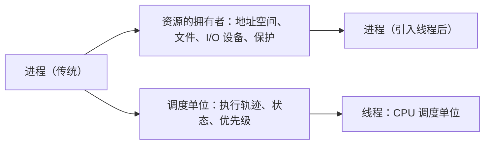
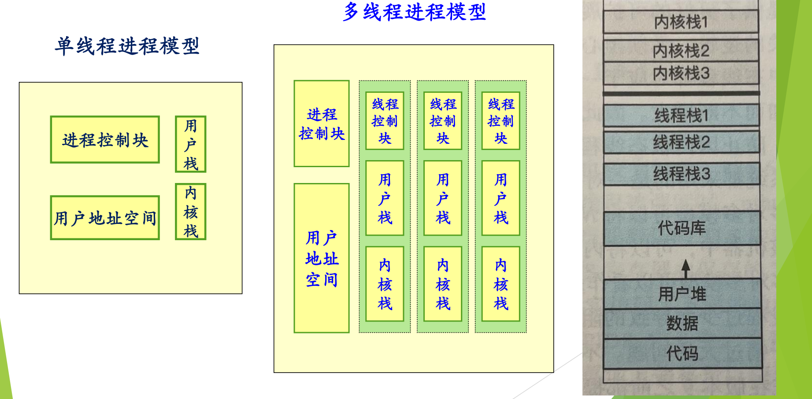

# 05 线程的基本概念与属性

[本讲目录](../index.md) · [课程目录](../../index.md) · [上一节：04 为什么引入线程](04-why-introduce-threads.md) · [下一节：06 线程的实现模型](06-thread-implementation-user-kernel-hybrid.md)

> [!abstract] 本节要点
> - 进程有两个基本属性：**资源的拥有者**（虚拟地址空间、文件、I/O 设备、保护）和**调度单位**（执行轨迹、状态、优先级）。
> - 线程把“调度单位”这一属性从进程中分离出来：线程是进程中的运行实体、CPU 的调度单位，有时称轻量级进程；进程只是资源的拥有者，资源由其中的多个线程共享。
> - 线程私有的是状态、不运行时保存的上下文（PC 等寄存器）、自己的栈和栈指针；共享的是所在进程的地址空间和其他资源。
> - 多线程进程中，每个线程有自己的线程控制块、用户栈和内核栈，共享进程控制块和用户地址空间。
> - 各线程的栈只是同一地址空间中划分出来的区域，并不设防：线程 1 拿到指针就能访问线程 2 的栈。这不算错，但有安全隐患。

## 进程的两个基本属性

讲进程概念时，进程同时承担着两种角色：[^s2p57]

1. **资源的拥有者**：拥有一个虚拟地址空间和一些占有的资源（文件、I/O 设备等），并受到保护。
2. **调度单位**：有一条执行（路径）轨迹，有状态和优先级，是被调度上 CPU 的对象。

这两个属性原本绑在一起，所以创建、切换进程时两方面的工作都要做，开销很大（见 [为什么引入线程](04-why-introduce-threads.md)）。线程的思路就是**把这两个属性分开处理**。



## 线程（Thread）的定义

**线程**（thread）是进程中的一个运行实体，是 CPU 的调度单位；有时也把线程称为**轻量级进程**。[^s2p57] 引入线程后，线程把进程的“调度单位”属性拿走了：上 CPU 执行的是线程，而进程只负责拥有资源。虚拟地址空间、各种设备等资源都以进程为单位分配，由进程内的多个线程共享使用。[^s4b6]

> [!tip] 课堂强调
> “进程是资源的拥有者、线程是 CPU 调度单位”这一区分在 ICS 中学过，本课特别强调一遍。[^s4b6]

这一区分有个前提：系统里**既有进程又有线程**，即在进程里再派生线程。如果某个系统只有线程的概念而没有进程的概念，那么这种线程就等价于原来的进程，二者没有区别。本课讨论的都是前一种情形。[^s4b6]

## 线程的属性

线程有以下属性：[^s2p58]

1. **有状态及状态转换**：线程要上 CPU，所以和进程一样有运行、就绪、等待等状态，以及状态之间的转换，因此系统需要提供相应的操作。
2. **不运行时需要保存上下文**：包括程序计数器（PC）等寄存器，以便恢复执行。
3. **有自己的栈和栈指针**。
4. **共享所在进程的地址空间和其他资源**。
5. **可以创建、撤销另一个线程**：程序开始时以一个单线程进程的方式运行，之后由这个线程创建其他线程。

宿舍类比：整个宿舍空间、洗手间、电视等是大家共享的，对应进程的地址空间和资源；每位同学自己的床、书柜、书桌只属于他本人，对应线程私有的栈和上下文。[^s4b6]

| 归属 | 内容 |
| --- | --- |
| 线程私有 | 线程状态、寄存器上下文（PC、栈指针等）、自己的栈 |
| 进程内各线程共享 | 地址空间（代码、全局数据、堆）、打开的文件、I/O 设备等资源 |

## 单线程与多线程进程模型

> [!info] 可视化资源
> - [OSTEP 第 26 章 Concurrency: An Introduction（PDF）](https://pages.cs.wisc.edu/~remzi/OSTEP/threads-intro.pdf)：Figure 26.1 对比单线程与多线程进程的地址空间：多个线程共享代码和堆，各有独立的栈。

在**单线程进程模型**中，进程由进程控制块、用户地址空间、一个用户栈和一个内核栈组成。在**多线程进程模型**中，进程控制块和用户地址空间仍只有一份，由所有线程共享；每个线程另有自己的**线程控制块**（保存寄存器上下文、状态等）、**用户栈**和**内核栈**。[^s2p59]



图：单线程进程只有一个进程控制块、用户地址空间和一对用户栈/内核栈；多线程进程共享进程控制块和用户地址空间，每个线程另有自己的线程控制块、用户栈和内核栈。

左图是单线程进程模型，中图是有三个线程的多线程进程模型。右图是这种进程的地址空间布局：从低地址到高地址依次是代码、数据、用户堆、代码库（共享库），之上是线程栈 1、2、3；最上面是内核部分的内核栈 1、2、3 以及内核代码和数据。三个线程栈都位于同一个用户地址空间中。

> [!note] 补充解释
> 每个线程各有一个内核栈，前提是内核知道这些线程的存在（线程进入内核执行系统调用时使用自己的内核栈）。如果线程完全在用户态实现，内核就只看到进程，情况见 [线程的实现模型](06-thread-implementation-user-kernel-hybrid.md)。

## 线程栈并不设防

“每个线程有自己的栈”是**容易出错的地方**。[^s4b6] 所谓“线程 1 的栈”“线程 2 的栈”，只是在同一个进程地址空间里划出的不同区域，硬件和操作系统并没有在它们之间设置保护。因此回答“线程 1 是否可以访问线程栈 2”这个问题，答案是**可以**：只要线程 1 拿到一个指向线程 2 栈中数据的地址（例如线程 2 把局部变量的地址存进了全局变量），就能直接读写。[^s2p59]

> [!example] 例：通过全局指针访问另一个线程的栈
> 下面的程序中，数组 `msgs` 是主线程的局部变量，位于主线程的栈上；主线程把它的地址赋给全局变量 `ptr`，对等线程通过 `ptr` 读取它。
>
> ```c
> #include <pthread.h>
> #include <stdio.h>
>
> char **ptr;                 /* 全局变量：所有线程可见 */
>
> void *peer(void *arg) {
>     long id = (long)arg;
>     printf("[%ld] %s\n", id, ptr[id]);   /* 读的是主线程栈上的数据 */
>     return NULL;
> }
>
> int main(void) {
>     pthread_t tid[2];
>     char *msgs[2] = {"Hello from foo", "Hello from bar"};  /* 在主线程栈上 */
>     ptr = msgs;
>     for (long i = 0; i < 2; i++)
>         pthread_create(&tid[i], NULL, peer, (void *)i);
>     for (int i = 0; i < 2; i++)
>         pthread_join(tid[i], NULL);
>     return 0;
> }
> ```
>
> 1. `msgs` 分配在主线程的栈帧中；
> 2. 两个对等线程运行在同一地址空间，`ptr` 指向的地址对它们同样有效；
> 3. 因此对等线程可以读取主线程栈上的 `msgs`，程序能正确打印两行消息。

这种访问在语法和机制上都不算错，但它带来安全隐患：一个线程的错误写操作可能破坏另一个线程的栈。如果被访问的栈帧已经返回，指针还会变成悬空指针。用宿舍类比，朋友来串门坐在别人的床上是可以的，主人不在也没人拦着，只是要大家自觉。[^s4b6]

> [!warning] 易错点
> “线程有自己的栈”说的是每个线程**使用**一块独立的栈区域、拥有自己的栈指针，并不等于这块栈**受保护**。线程之间唯一的隔离是约定，地址空间是共享的；真正受硬件保护的隔离只存在于进程之间。

> [!question]- 自测：线程 A 修改了全局变量 `x`，并在自己的函数里把局部变量 `y` 加 1。线程 B（同一进程）随后读 `x` 和用同名函数读自己的 `y`，各看到什么？
> B 看到 A 修改后的 `x`，因为全局变量在共享的数据段中；B 的 `y` 不受影响，因为每次函数调用的局部变量位于调用线程自己的栈帧上，A 和 B 各有一份。除非 A 把 `&y` 交给 B，否则 B 不会访问到 A 的 `y`。

> [!question]- 自测：一个程序启动后调用 `pthread_create` 创建了 3 个线程。此时进程里共有几个线程？共有几个线程控制块、几个进程控制块？
> 共 4 个线程：程序开始时以单线程进程方式运行，原来的主线程加上新建的 3 个。按多线程进程模型，有 4 个线程控制块（每线程一个，各带用户栈和内核栈），进程控制块只有 1 个，由所有线程共享。

> [!question]- 自测：某系统只有“线程”而没有“进程”概念，每个线程独立拥有地址空间。这种线程和本节的线程有何不同？
> 它同时承担资源拥有者和调度单位两个属性，实际上就等价于传统的进程。本节的线程以“既有进程又有线程”为前提：资源归进程，线程只是共享这些资源的调度实体。

> [!info]- 来源
> - slides03.pdf：PDF p.57–59
> - L05.docx：DOCX body 145–167

[^s2p57]: slides03.pdf-PDF p.57
[^s4b6]: L05.docx-DOCX body 145-167
[^s2p58]: slides03.pdf-PDF p.58
[^s2p59]: slides03.pdf-PDF p.59

[本讲目录](../index.md) · [课程目录](../../index.md) · [上一节：04 为什么引入线程](04-why-introduce-threads.md) · [下一节：06 线程的实现模型](06-thread-implementation-user-kernel-hybrid.md)
