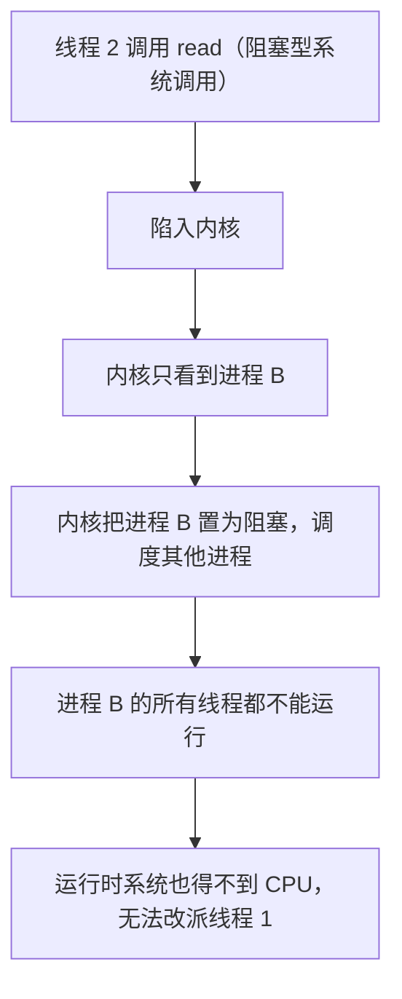
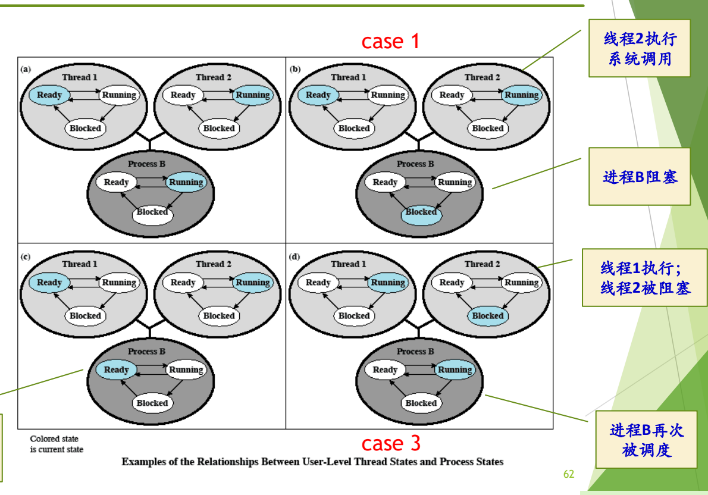
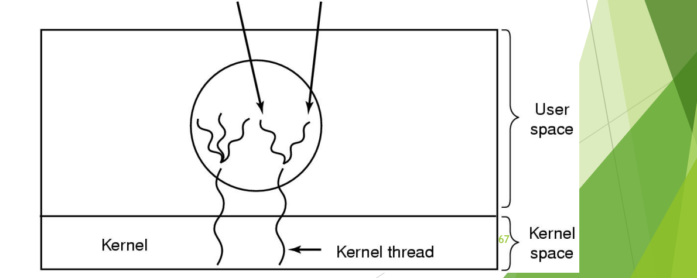
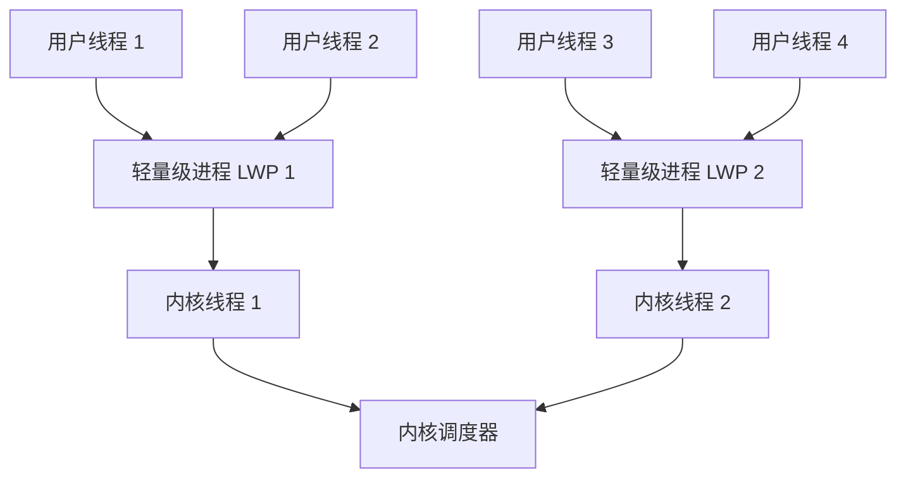

# 06 线程的实现模型

[本讲目录](../index.md) · [课程目录](../../index.md) · [上一节：05 线程的基本概念与属性](05-thread-concepts-and-attributes.md) · [下一节：07 协程、纤程与可再入](07-coroutines-fibers-and-reentrant-programs.md)

> [!abstract] 本节要点
> - 线程有三种实现方式：**用户级线程**（在用户空间实现，内核不知道线程存在）、**核心级线程**（内核实现并管理线程）、**混合模型**（内核支持线程，同时支持用户线程）。三者反映了操作系统面对新概念时的不同态度和折中。
> - 用户级线程由线程库提供函数、由运行时系统维护线程表并切换线程，切换不需内核特权，因而快；但任一线程执行阻塞系统调用，内核会把整个进程阻塞，同一进程的线程也不能同时跑在多个处理器上。
> - 用户级线程下，线程状态和进程状态处在不同层面：进程 B 被阻塞时，线程 2 的状态可能仍是 running，但它并没有真正在运行。
> - 阻塞系统调用的两种对策：用 jacketing/wrapper 把阻塞调用转化为非阻塞调用，或重新实现相应的 I/O 库函数。
> - 核心级线程以线程为基础调度，例子是 Windows；混合模型的例子是 Solaris，用户线程经轻量级进程（LWP）多路复用到内核线程上。

## 三种实现方式概览

线程概念出现时，操作系统早已有了进程。如何在原有系统中支持线程这个新概念，形成了三种方案：[^s2p60]

1. **用户级线程**：在用户空间实现，内核不支持、也不知道线程。
2. **核心级线程**：在内核中实现，内核知道并管理线程。
3. **混合模型**：两者结合，在内核中实现线程，同时支持用户线程；用户级线程通过某种中介与内核级线程挂上钩。

这三种方法体现的是一种“态度”：嫌改内核麻烦，就把线程放到用户态实现；不嫌麻烦，就直接在内核里实现；混合模型则是折中权衡。把几种已有方案组合成新方案，也是计算机领域的典型做法。[^s4b6]

> [!tip] 课堂强调
> 考试一般会考“线程怎么实现”，即这几种不同的实现手段。[^s4b6]

## 用户级线程（User Level Thread）

**用户级线程**是在用户空间建立的线程，其组成和特点是：[^s2p61]

- **线程库**：提供一组管理线程的函数（创建、退出、等待等）。
- **运行时系统**（run-time system）：完成线程的管理工作，包括各种线程操作和维护**线程表**。
- **内核管理的是进程，不知道线程的存在**。
- **线程切换不需要内核态特权**，由运行时系统在用户态完成。
- 例子：POSIX Pthreads。

运行时系统只能在**同一个进程**的线程之间切换，管不到别的进程的线程。[^s4b6]

### 阻塞系统调用会阻塞整个进程

用户级线程的关键问题在系统调用上。无论是哪个线程，执行系统调用都要进入内核；而内核只看得到进程。于是：[^s4b6]

### 进程状态与线程状态

Stallings 用一组典型场景说明用户级线程下两种状态的关系。初始状态 (a)：进程 B 正在运行，它有两个线程，线程 2 处于 Running，代表进程 B 执行，线程 1 处于 Ready。因为内核只调度进程，进程 B 内部一次只能有一个线程在执行，由运行时系统决定是哪一个。[^s4b7] 从 (a) 出发有三种情况：[^s2p62]

1. **case 1：线程 2 执行系统调用**（如阻塞的 `read`）。内核把进程 B 置为 Blocked；运行时系统并没有机会修改线程表，所以线程 2 的状态**仍是 Running**。见图 (b)。
2. **case 2：进程 B 被切换**（例如时间片到）。进程 B 回到 Ready，CPU 上运行的是另一个进程（图中未画出）；从线程库的角度看，两个线程的状态都没有变化，线程 2 仍为 Running。见图 (c)。
3. **case 3：线程 2 被阻塞、线程 1 执行**。线程 2 需要等待线程 1 完成某个动作，于是在用户态把自己置为 Blocked，运行时系统改派线程 1 运行；这一切发生在进程内部，内核不知道，进程 B 仍处于 Running。见图 (d)。

在 (b)、(c) 之后，当进程 B 再次被内核调度时，由于线程表中线程 2 仍记为 Running，进程 B 就从线程 2 停下的地方继续执行。

图：用户级线程的状态由线程库维护，与内核看到的进程状态可能不一致：线程 2 发起阻塞系统调用会让整个进程 B 阻塞，而线程库里线程 2 仍显示为运行；进程 B 时间片用完被切换时也一样。

图中四个面板分别为初始状态 (a) 和 case 1–3，彩色的椭圆表示当前状态；上方两个小圆是线程 1、线程 2 的状态机，下方深色大圆是进程 B 的状态机。

结论：**线程状态和进程状态处在不同层面**。线程状态由用户态的运行时系统记录，进程状态由内核记录；线程显示为 running，并不意味着它正在 CPU 上运行。[^s4b7]

### Pthreads 与 yield

**POSIX**（Portable Operating System Interface）1003.4a 定义了多线程编程接口，以线程库的方式提供给用户，这就是 **Pthreads**。[^s2p63] 它是一个标准，各家按标准实现若干函数，主要有：[^s4b7]

| 函数 | 作用 |
| --- | --- |
| `pthread_create` | 创建一个新线程 |
| `pthread_exit` | 结束调用线程 |
| `pthread_join` | 等待一个特定线程退出，作用类似进程的 `wait` |
| `pthread_yield` | 调用线程主动释放 CPU，让另一个线程运行 |
| `pthread_attr_init` | 创建并初始化线程的属性结构 |
| `pthread_attr_destroy` | 删除线程的属性结构 |

> [!note] 补充解释
> 1003.4a 是 Pthreads 标准制定期间的草案编号，正式发布时为 IEEE Std 1003.1c-1995，现已并入 POSIX.1。`pthread_yield` 并不在最终标准中（标准里对应的是 `sched_yield`），但许多实现提供了它。另外，Pthreads 只规定接口，并不规定实现方式：它可以用纯用户级线程库实现，也可以像今天的 Linux 那样用内核线程实现（见 [man7: pthreads(7)](https://man7.org/linux/man-pages/man7/pthreads.7.html)）。讲义把它当作用户级线程的例子，指的是“以线程库方式提供”这一形态。

在用户级线程库里，`yield` 尤其重要。为什么**线程要自愿让出 CPU**？[^s2p63]

- 进程和进程之间会“打架”，即竞争资源；而同一进程的线程之间是**天然的合作关系**，派生多个线程是为了让这个进程执行得更快，不是为了彼此争抢。[^s4b7]
- 内核不管线程，运行时系统也无法通过时钟中断强行剥夺一个线程的 CPU。因此一个线程做完手头工作后，应调用 `yield` 主动让运行时系统换上另一个线程，这样整个进程不会因为当前线程无事可做而空转。
- 自愿让出并不排除被动换下：进程时间片到了照样会被换下；线程执行阻塞调用时，整个进程照样被阻塞。

> [!tip] 课堂强调
> 进程之间是竞争关系、同一进程的线程之间是合作关系，这是二者非常重要的不同点，也是线程要自愿 `yield` 的原因。[^s4b7]

## 用户级线程的优缺点与阻塞处理

### 优点

1. **线程切换快**：切换由用户态的运行时系统完成，只需保存和恢复寄存器、换栈指针，不必陷入内核。[^s2p64]
2. **调度算法是应用程序特定的**：线程之间如何轮换由应用（线程库）自己决定，内核不参与。
3. **可运行在任何操作系统上**：只需要实现一个线程库。这是最重要的一条：如果已经有了一个操作系统又不想改造它，线程库就是支持线程最快的办法。[^s4b7]

> [!note] 补充解释
> 有一种说法是：Linux 当初为了不重新设计内核，采用了线程库的方式支持线程。这一说法需要修正。Linux 确实没有在内核中另设一种“线程”对象，进程和线程都用 `task_struct` 表示；但从 2.0 版前后（约 1996 年）起，主流线程库 LinuxThreads 就用 `clone()` 系统调用为每个线程创建一个与创建者共享地址空间、打开文件等资源的内核调度实体。这是**一对一的内核级线程**，不是纯用户级线程。2.6 内核起使用的 NPTL 仍然是一对一模型。所以 Linux 走的是“少改内核”的路线，但它的线程是由内核调度的。

### 缺点

1. 大多数系统调用是阻塞的。内核阻塞进程时，进程中的所有线程都**不能运行**。[^s2p64]
2. 内核只将处理器分配给进程，同一进程中的两个线程不能同时运行于两个处理器上，用户级线程无法利用多核提升单个进程的性能。[^s4b7]

两条缺点都可以从“内核只看到进程”推出：阻塞的决定和分配 CPU 的决定都由内核以进程为单位做出，进程里让哪个线程上 CPU 不归内核管。[^s4b7]

> [!warning] 易错点
> 讲义 p64 中“由于内核阻塞进程，故进程中所有线程也被阻塞”的措辞不准确（课末已作更正），应理解为进程中所有线程**都不能运行**。结合 case 1，被阻塞的是进程；线程表中线程 2 的状态可能仍是 running，状态记录本身没有错，但整个进程已被阻塞，CPU 已换给别的进程，线程实际上并没有在运行。[^s4b8]

### 阻塞系统调用的处理

针对“一个线程阻塞拖累整个进程”，有两种解决方案：[^s2p65]

1. **把系统调用改为非阻塞的**：使用 **Jacketing/wrapper** 技术，把一个会产生阻塞的系统调用转化成一个非阻塞的系统调用。
2. **重新实现对应系统调用的 I/O 库函数**。

Jacketing 可以理解为给系统调用“加一件马甲”“包一层包袱皮”（wrapping，封装）。线程调用的不再是原来的阻塞调用，而是外面这层封装；封装发现需要等待时，就尽快 `yield`，让运行时系统换别的线程上，而不是把时间交给内核去决定。[^s4b7]

> [!note] 补充解释
> 按 Stallings 的描述，jacket 例程的典型做法是：线程不直接调用系统 I/O 例程，而是调用一个应用层的 I/O jacket 例程。它先检查这次 I/O 是否会阻塞（例如设备是否忙、数据是否已到，可借助 `select` 之类的接口）。如果会阻塞，就把当前线程在线程表中置为 Blocked，经线程库切换到另一个线程，等以后条件满足时再真正发起调用。这样内核始终看不到进程阻塞。

## 核心级线程（Kernel Level Thread）

**核心级线程**由内核实现和管理，其特点是：[^s2p66]

- 内核管理所有线程，并向应用程序提供 API 接口；
- 内核维护进程和线程的上下文；
- 线程的切换需要内核支持；
- 以线程为基础进行调度；
- 例子：Windows。

这是提出线程概念时的“完美模型”：进程是资源的拥有者，线程是上 CPU 的调度单位，内核既管进程又管线程，API 统一，所有线程都由内核维护。例如图中 932 号进程有三个线程、110 号进程有四个线程，内核对它们全都可见。[^s4b7] 它恰好克服了用户级线程的两个缺点：一个线程阻塞时，内核可以调度同一进程的其他线程；同一进程的多个线程也能同时运行在多个处理器上。代价是线程的创建和切换都要进入内核，比用户态切换慢。

Windows 采用这一模型有其历史背景。Windows NT 于 1988 年开始开发，而线程概念大约在 1984 年前后提出，于是 NT 把当时的新概念全部采用：线程、面向对象、微内核等。当时外界普遍认为微软商业上成功、技术上不行，UNIX 家族则被看作技术上更完美。微软为此专门从 DEC（VAX/VMS 的开发者）挖来人才开发 NT，也是要在技术上证明自己。[^s4b7]

> [!note] 补充解释
> 上面的历史只是概述，可以这样核实与补充：NT 项目的负责人 Dave Cutler 于 1988 年 10 月从 DEC 加入微软，他此前主持过 VMS 等操作系统；NT 第一版 Windows NT 3.1 于 1993 年发布。“约 1984 年提出线程概念”只是大致时间，类似思想出现得更早，1980 年代中期 Mach 等系统把“任务（资源）与线程（执行）分离”的设计推广开。NT 的设计受到微内核思想影响，但它把许多服务放在内核态运行，通常被归为混合内核，而不是纯微内核。

## 混合模型

**混合模型**的特点是：线程创建在用户空间完成，线程调度等在核心态完成；多个用户级线程**多路复用**到多个内核级线程上。例子：Solaris。[^s2p67]

图：混合模型中，线程在用户空间创建，多个用户级线程多路复用到少量内核级线程上，由内核调度内核线程。

图中用户空间的一个进程内有多个用户线程，它们成组地落在少数几个内核线程上，即 “multiple user threads on a kernel thread”；内核按内核线程调度。

Solaris 的具体做法是：[^s4b8]

1. 用户态有线程库，用户可以像在 UNIX/Linux 中那样创建线程；
2. 内核也有内核线程（kernel thread），内核按内核线程进行调度；
3. 用户线程和内核线程之间并不直接对应，而是通过一种专门的连接实体，即**轻量级进程**（LWP，Lightweight Process）连接起来；
4. 用户线程多、LWP 和内核线程少，所以二者**不是一对一的，而是多路复用的**：某个用户线程要运行，必须先“挂上”一个 LWP，由它代表该用户线程被内核调度。

后来 Solaris 嫌多路复用太麻烦：用户线程必须先挂到 LWP 上才能运行，管理复杂，于是随着版本演化改成了用户线程与内核线程**一对一**，课程中给出的时间是大约 Solaris 8 之后（准确版本见下方补充解释）。Sun 公司后来被 Oracle 收购，Solaris 逐渐淡出，而它在操作系统层面的技术曾非常出色。[^s4b8]

> [!note] 补充解释
> 按 Oracle/Sun 的文档：Solaris 2.x 到 Solaris 8 默认采用这种 M:N 的两级模型；Solaris 8 另外提供了一个可选的一对一线程库；Solaris 9（2002 年）起一对一成为默认且唯一的实现。Oracle 对 Sun 的收购于 2010 年 1 月完成。

> [!warning] 易错点
> 同一个词“轻量级进程”在本讲有两种用法。[线程的基本概念与属性](05-thread-concepts-and-attributes.md) 中说“有时把线程称为轻量级进程”，是对线程的泛称；Solaris 的 LWP 则是混合模型里连接用户线程和内核线程的一个具体内核实体。二者不能混为一谈。

### 三种实现方式对比

| 维度 | 用户级线程 | 核心级线程 | 混合模型 |
| --- | --- | --- | --- |
| 线程由谁管理 | 用户空间的线程库与运行时系统 | 内核 | 创建在用户空间，调度在核心态 |
| 内核是否知道线程 | 不知道，只知道进程 | 知道 | 知道内核线程（经 LWP 关联用户线程） |
| 线程切换 | 用户态完成，快 | 需内核支持，较慢 | 用户线程间可在用户态切换 |
| 一个线程执行阻塞调用 | 整个进程被阻塞，所有线程都不能运行 | 只阻塞该线程 | 只占住相应的 LWP/内核线程 |
| 同进程线程能否并行于多处理器 | 不能 | 能 | 能（内核线程有多少，最多就有多少并行） |
| 例子 | POSIX Pthreads 线程库 | Windows | Solaris |

> [!question]- 自测：用户级线程模型下，进程 P 有线程 T1、T2，T1 正在运行时调用了阻塞的 `read`。此刻线程表中 T1、T2 各是什么状态？内核眼中 P 是什么状态？T2 能运行吗？
> 内核把 P 置为阻塞；线程表没有被更新，T1 仍记为 running，T2 为 ready。但 T2 不能运行：P 得不到 CPU，运行时系统本身也无法执行，也就没法改派 T2。这正是课末勘误的意思：线程不是“被阻塞”状态，而是“不能运行”。

> [!question]- 自测：一台 4 核机器上，某计算密集型程序创建了 4 个线程。分别在用户级线程和核心级线程实现下运行，大约能用上几个核？
> 用户级线程：内核只把 CPU 分配给进程，4 个线程只能轮流在 1 个核上运行。核心级线程：内核以线程为调度单位，4 个线程可同时运行在 4 个核上。

> [!question]- 自测：用户级线程库中某线程循环等待一个共享标志由另一个线程置位，但从不调用 `yield`。会发生什么？
> 运行时系统无法通过时钟中断抢占用户级线程，置位标志的那个线程得不到运行机会，等待线程会一直空转到进程时间片用完。进程再次被调度时，线程表里仍是这个等待线程在运行，于是继续空转，程序无法前进。所以同一进程内合作的线程应在无事可做时主动 `yield`。

> [!info]- 来源
> - slides03.pdf：PDF p.60–67
> - L05.docx：DOCX body 145–208

[^s2p60]: slides03.pdf-PDF p.60
[^s4b6]: L05.docx-DOCX body 145-167
[^s2p61]: slides03.pdf-PDF p.61
[^s4b7]: L05.docx-DOCX body 168-186
[^s2p62]: slides03.pdf-PDF p.62
[^s2p63]: slides03.pdf-PDF p.63
[^s2p64]: slides03.pdf-PDF p.64
[^s4b8]: L05.docx-DOCX body 187-208
[^s2p65]: slides03.pdf-PDF p.65
[^s2p66]: slides03.pdf-PDF p.66
[^s2p67]: slides03.pdf-PDF p.67

[本讲目录](../index.md) · [课程目录](../../index.md) · [上一节：05 线程的基本概念与属性](05-thread-concepts-and-attributes.md) · [下一节：07 协程、纤程与可再入](07-coroutines-fibers-and-reentrant-programs.md)
