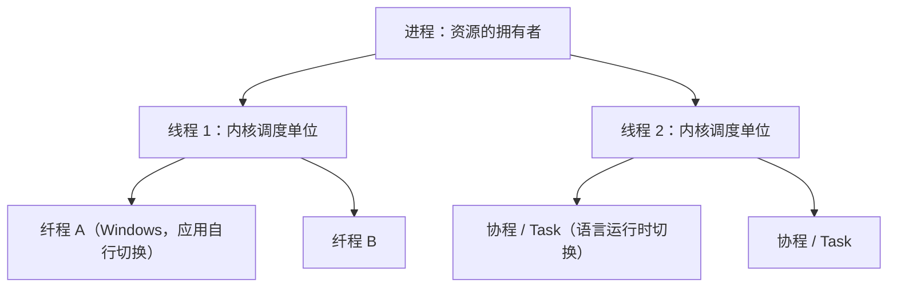

# 07 协程、纤程与可再入

[本讲目录](../index.md) · [课程目录](../../index.md) · [上一节：06 线程的实现模型](06-thread-implementation-user-kernel-hybrid.md)

> [!abstract] 本节要点
> - **协程**是特定编程语言或库支持的并发成分，与操作系统没有直接关系：它在一个线程中实现多个协作的执行流，常见于 Python asyncio、Rust async_std、C++20 coroutine、Go goroutine。
> - 协程与“在进程中派生线程”思路相同、层面不同，就像过程调用在语言层完成，而系统调用要进入内核。
> - **纤程**是 Windows 提供的机制，一个线程中可以有多个纤程；执行实体从进程到线程再到纤程/协程，一个比一个细。
> - C10K 问题（单机如何支撑上万个并发连接）是引出这些机制的出发点；线程并非越多越好，线程本身也有开销。
> - **可再入程序**可被多个进程同时调用：代码是纯代码，执行中自身不变，数据区由调用者提供（栈）；`rand` 因保留跨调用的内部状态而不可再入。

## 协程（Coroutine）

线程比进程轻，但每个线程仍要占用栈空间，创建、切换仍有开销。当一个程序要同时处理成千上万个异步任务、并发连接时，为每个任务开一个线程就太重了。**协程**就是在这种需求下出现的。[^s2p69]

关于协程，可以从四个问题来把握：[^s2p69]

1. **为什么引入协程**：改善并发编程的性能，用于处理异步任务和大量并发连接。
2. **协程是什么**：允许在一个线程/进程中实现多个执行流，并让它们之间相互协作。
3. **协程怎么用**：需要编程语言或库的支持。
4. **协程怎么实现**：更偏向语言机制的模拟和实现，即在一个用户线程上运行多个 Task。例如 Python `asyncio`、Rust `async_std`、C++20 coroutine、Go goroutine 等。

协程的名字和进程、线程、管程是同一系列，它也是一种运行实体。但它**与操作系统没有直接关系**，而是特定语言中支持的并发成分。几个协程协同完成一件事，所以叫“协”程。它的思路与“在进程中再派生线程”相同，即在一个线程中再派生出多个执行实体，但层次不同：如同 C 语言里写的过程调用在语言层面就完成了，而系统调用要进入内核。用协程必须有编程语言或库的支持。[^s4b8]

> [!note] 补充解释
> 经典协程在固定位置（如 `await`、`yield`）主动交出控制权，由语言运行时在同一线程内切换，不需要陷入内核。Go 的 goroutine 稍有不同：Go 运行时把大量 goroutine 调度到多个操作系统线程上（M:N），而且自 Go 1.14 起可以被运行时抢占，因此它更像“由语言运行时管理的用户级线程”。讲义把它与协程并列，是取其“语言层面的轻量执行实体”这一共性。

## 纤程（Fiber）

> [!info] 拓展内容
> 纤程课上只提到名称，留作自学。以下内容依据讲义与微软官方文档整理。

**纤程**（fiber）是 Windows 提供的机制，一个线程中可以有多个纤程。[^s2p70] 从进程到线程，再到线程里的纤程，执行实体一个比一个细：原来的进程比较庞大，线程瘦一些，纤程又更瘦一点。[^s4b8]

纤程的工作方式如下（据 [Microsoft Learn: Fibers](https://learn.microsoft.com/en-us/windows/win32/procthread/fibers)）：

1. **转换**：线程先调用 `ConvertThreadToFiber`，把自己变成一个纤程，之后才能调度其他纤程。
2. **创建**：调用 `CreateFiber` 创建新纤程，为它指定栈大小和入口函数。每个纤程有自己的栈和一份寄存器上下文。
3. **切换**：调用 `SwitchToFiber` 切换到指定纤程。切换完全由应用程序决定，内核不感知，也不会抢占纤程；当前纤程不主动切换，其他纤程就得不到运行。
4. **删除**：调用 `DeleteFiber` 释放纤程。

由此可以看出，纤程本质上是由应用程序在一个内核线程内部手工调度的用户态执行实体，与 [线程的实现模型](06-thread-implementation-user-kernel-hybrid.md) 中的用户级线程同理。它的调度是协作式的，切换开销小；但一个纤程执行阻塞调用时，它所在的整个线程都会被阻塞。



## C10K 与并发关键词

与这一部分相关的并发概念可以归纳为一组关键词：[^s2p71]

- **内核态/用户态**：线程、协程等机制是在哪个态下支持的。用户级线程、纤程、协程都在用户态切换，核心级线程要内核支持。
- **阻塞/非阻塞**：非阻塞是这些机制的关键要素之一（见 [为什么引入线程](04-why-introduce-threads.md) 中的有限状态机）。
- **进程、线程、协程**：逐级变细的执行实体。
- **线程池**：预先创建、有上限的线程集合。
- **异步 I/O**、**I/O 密集型**、**I/O 多路复用**：协程主要针对的就是 I/O 密集型、大量等待 I/O 的任务。
- **切换开销**、**编程语言原生支持**（如 Golang、JavaScript）：编程语言要原生支持，才有协程。

这组关键词的出发点是 **C10K 问题**：一台服务器上，联网登录、并发连接最多能支持多少个，如何支撑上万（10K）个并发连接。[^s4b8]

**线程是不是越多越好？**[^s2p71] 不是。这和软件开发加人类似：一个人干不完，加到两三人、一个小组似乎会更快，但人多了就有沟通成本。线程也一样，每个线程有栈空间、创建和切换开销，线程之间还有同步和协调的成本。线程数量远超 CPU 核数且大多在等 I/O 时，这些开销会吞掉收益。这正是引出协程等更轻量机制的原因。[^s4b8]

> [!note] 补充解释
> “C10K problem”一词由 Dan Kegel 在 1999 年前后的同名文章中提出，讨论单机同时处理一万个客户端连接所需的 I/O 模型，如非阻塞 I/O 加事件通知、每连接一线程等（见 [The C10K problem](http://www.kegel.com/c10k.html)）。

## 可再入程序（Reentrant Program）

多个进程（或线程）常常执行同一段代码，例如同一个编辑器被多个用户同时运行，或同一个库函数被多个线程同时调用。代码只在内存中保留一份，却要让各个调用互不干扰，这要求代码满足一定条件。

**可再入程序**（又称可重入程序）是可被多个进程同时调用的程序，具有下列性质：[^s2p72]

1. 它是**纯代码**的，即在执行过程中自身不改变；
2. 调用它的进程应该**提供数据区**。

数据区通常就是调用者的栈。递归调用就是典型：每次调用都在栈上得到一个新的栈帧，存放这一次的参数和局部变量，执行期间这块空间只属于这次调用。多次递归就有多个栈帧，彼此不会互相破坏。[^s4b8]

> [!tip] 课堂强调
> 可再入是一个很重要的前提，ICS 中已学过，需要复习。[^s4b8]

> [!example] 反例：随机数发生器 `rand`
> C 标准库中的 `rand` 大致这样实现：
>
> ```c
> static unsigned int next = 1;        /* 跨调用保留的内部状态 */
>
> int rand(void) {
>     next = next * 1103515245 + 12345;
>     return (unsigned int)(next / 65536) % 32768;
> }
>
> void srand(unsigned int seed) { next = seed; }
> ```
>
> 1. 每次调用都会改写静态变量 `next`，下一次调用的结果依赖上一次留下的状态；
> 2. `next` 位于全局数据区，不由调用者提供，所有调用者共用一份；
> 3. 两个线程同时调用时，可能交错读写 `next`，各自得到的序列互相干扰。
>
> 因此 `rand` 不是可再入的。可再入的版本 `rand_r(unsigned int *seedp)` 把状态改由调用者传入，满足“数据区由调用者提供”。

> [!note] 补充解释
> 把 `rand` 不可再入解释为“代码本身每次都变了”并不准确：`rand` 的机器代码在执行中并不改变，改变的是它在静态数据区中保存的内部状态（上例中的 `next`）。不可再入的根源是函数依赖并修改了不由调用者提供的共享数据，这正违反了可再入的第二条性质。CS:APP 第 12 章把这类函数归为“保持跨越多个调用的状态”的线程不安全函数。

> [!warning] 易错点
> “纯代码”不只是“不修改指令”。函数中的 `static` 局部变量和被修改的全局变量都属于共享数据区，使用了它们的函数一般就不可再入。判断方法：函数使用的所有可写数据是否都来自参数或自己的栈帧。

## 进程特性与进程映像

> [!info] 依据讲义整理
> 本小节是讲义“重点小结”中除可再入以外的内容，课上未展开讲解。

进程有五个特性：[^s2p72]

| 特性 | 含义 |
| --- | --- |
| 并发性 | 任何进程都可以同其他进程一起向前推进 |
| 动态性 | 进程是正在执行程序的实例；进程是动态产生、动态消亡的；在生命周期内在三种基本状态之间转换；具有动态的地址空间 |
| 独立性 | 进程是资源分配的一个独立单位，不同进程的工作不相互影响，例如各进程的地址空间相互独立 |
| 制约性 | 进程在执行过程中可能与其他进程产生直接或间接的关系，因访问共享数据/资源或进程间同步而产生制约 |
| 异步性 | 每个进程都以其相对独立的、不可预知的速度向前推进 |

**进程映像**（process image）由四部分组成：

$$
\text{进程映像} = \text{程序} + \text{数据} + \text{栈} + \text{PCB}
$$

其中程序（代码）可以是可再入的，被多个进程共享；数据和栈是每个进程私有的；PCB 是操作系统管理该进程的数据结构（组织方式见 [进程表与队列模型](01-process-table-and-queue-model.md)）。线程部分的小结包括多线程应用场景、线程基本概念与属性、线程实现机制，分别对应 [为什么引入线程](04-why-introduce-threads.md)、[线程的基本概念与属性](05-thread-concepts-and-attributes.md) 和 [线程的实现模型](06-thread-implementation-user-kernel-hybrid.md)。

> [!question]- 自测：下面的函数是否可再入？`int counter(void) { static int n = 0; return ++n; }`
> 不可再入。代码本身不变，但它修改了位于静态数据区的 `n`，这个数据区不由调用者提供，所有调用者共享一份；多个线程同时调用时结果相互干扰。改为由调用者传入 `int *n` 即可再入。

> [!question]- 自测：一个 Python asyncio 程序在单线程里运行 1000 个协程。其中一个协程调用了阻塞的 `time.sleep(1)`（而不是 `await asyncio.sleep(1)`），会发生什么？
> `time.sleep` 是阻塞调用，会让整个线程被内核阻塞 1 秒，这 1 秒内其余 999 个协程都不能运行。这和用户级线程中“一个线程阻塞调用导致整个进程不能运行”是同一个道理；`await asyncio.sleep` 则把控制权交还事件循环，让其他协程继续执行。

> [!question]- 自测：纤程和 Windows 的线程都能在一个进程中并发执行。二者在“谁来调度”和“能否利用多核”上有何区别？
> Windows 线程是核心级线程，由内核调度，可抢占，同一进程的多个线程可同时运行在多个核上。纤程由应用程序调用 `SwitchToFiber` 自行切换，内核不知道它的存在；同一线程中的纤程只能轮流在这个线程上运行，无法利用多核。

> [!info]- 来源
> - slides03.pdf：PDF p.68–72
> - L05.docx：DOCX body 187–208

[^s2p69]: slides03.pdf-PDF p.69
[^s4b8]: L05.docx-DOCX body 187-208
[^s2p70]: slides03.pdf-PDF p.70
[^s2p71]: slides03.pdf-PDF p.71
[^s2p72]: slides03.pdf-PDF p.72

[本讲目录](../index.md) · [课程目录](../../index.md) · [上一节：06 线程的实现模型](06-thread-implementation-user-kernel-hybrid.md)
