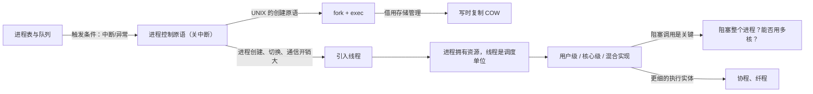

# L05 进程控制与线程模型

[课程目录](../index.md)

有了进程的状态模型和 PCB 之后，还要回答两个问题：操作系统怎样组织和控制成百上千个进程，以及进程为什么还要再细分成线程。本讲先用进程表与队列、进程控制原语说明状态转换如何发生，以 UNIX `fork`/`exec` 和 Linux 的写时复制为例讲进程创建；再从应用、开销、性能三方面引入线程，讲清线程独有与共享的内容、用户级/核心级/混合三种实现，最后延伸到协程、纤程和可再入程序。阅读前应掌握 L04 的进程状态、PCB 与进程地址空间，以及 L03 的中断异常与系统调用；ICS 中的虚存、`mmap` 和并发服务器内容会反复用到。

## 章节导航

- [01 进程表与队列模型](chapters/01-process-table-and-queue-model.md)：PCB 大表加多种指针，五状态队列与触发条件
- [02 进程控制与原语](chapters/02-process-control-and-primitives.md)：原语靠关中断保证原子性；创建、撤销与阻塞唤醒
- [03 fork、exec 与写时复制](chapters/03-unix-fork-exec-and-copy-on-write.md)：fork 加 exec 建进程，Linux 借 COW 优化
- [04 为什么引入线程](chapters/04-why-introduce-threads.md)：应用、开销、性能三个理由与构造服务器的三种方法
- [05 线程的基本概念与属性](chapters/05-thread-concepts-and-attributes.md)：线程是 CPU 调度单位，进程拥有资源；线程栈不设防
- [06 线程的实现模型](chapters/06-thread-implementation-user-kernel-hybrid.md)：用户级、核心级、混合三种线程实现及其取舍
- [07 协程、纤程与可再入](chapters/07-coroutines-fibers-and-reentrant-programs.md)：协程、纤程比线程更细；C10K；可再入程序的条件

## 本讲小结

本讲沿着“进程如何被管理”到“执行实体如何变细”两条线展开：状态转换由中断/异常触发、由原语完成；创建这一种原语在 UNIX 中拆成 `fork`+`exec`，又靠存储管理的 COW 变得廉价；即便如此进程仍然太重，于是把调度属性分给线程，而线程放在哪一层实现，决定了阻塞调用和多核利用的表现。

| 执行实体 | 由谁调度 | 一个实体执行阻塞调用 | 能否利用多核 |
| --- | --- | --- | --- |
| 进程 | 内核 | 只阻塞该进程 | 能 |
| 核心级线程 | 内核 | 只阻塞该线程 | 同进程线程可并行 |
| 用户级线程 | 用户态运行时系统 | 整个进程不能运行 | 不能 |
| 纤程/协程 | 应用或语言运行时 | 所在线程不能运行 | 单个线程内不能 |

## 不确定事项

- Solaris 改为一对一线程模型的版本，课程只凭回忆说“约 Solaris 8 之后”；正文保留这一说法，并用补充解释给出 Solaris 9 起默认、Solaris 8 可选的文档事实。
- “Linux 当时用线程库实现线程”的说法与 LinuxThreads/NPTL 的一对一内核线程史实不符，已在 section-6 的补充解释中更正。
- xv6 阅读任务（p73）的线索根据 xv6-riscv 源码结构整理（struct proc、fork 中的 uvmcopy、sh.c 主循环），课堂没有讲，也没逐行核对当前版本的源码。
- 转写为 ASR 文本，NT 历史（从 DEC VMS 挖人）、华为新概念等闲谈靠推断整理；后者属于背景闲谈，已略去。

> [!info]- 来源
> - slides03.pdf：PDF p.36, 38–47, 49–54, 56–73
> - L05.docx：DOCX body 1–208
