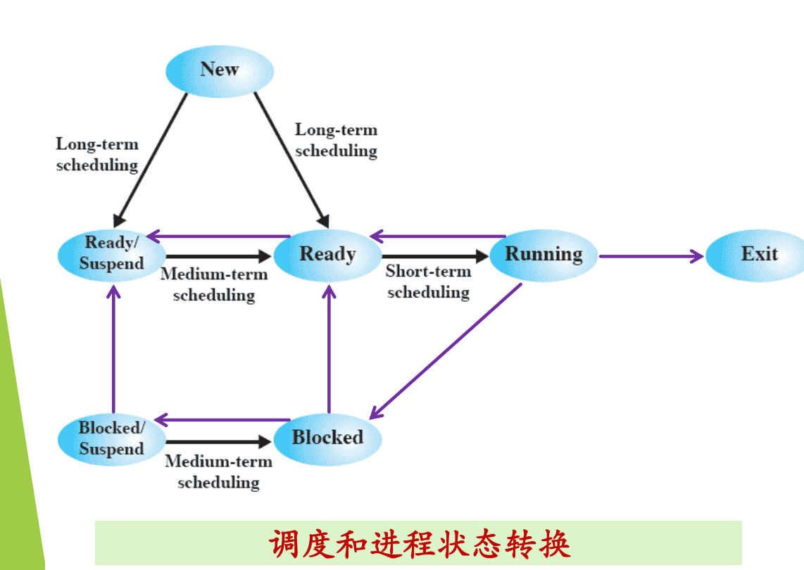
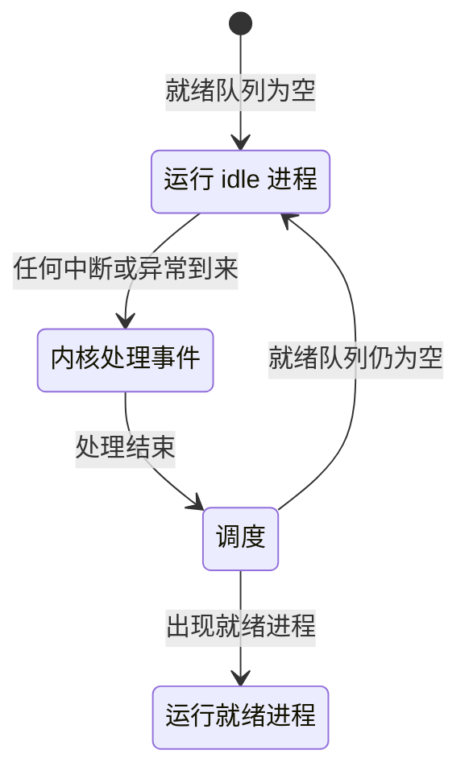

# 02 调度层次与处理器调度

[本讲目录](../index.md) · [课程目录](../../index.md) · [上一节：01 为什么需要调度](01-why-scheduling.md) · [下一节：03 调度时机](03-scheduling-timing.md)

> [!abstract] 本节要点
> - 七状态模型中有三层调度：**长程**（new→ready、new→ready suspend）、**中程**（ready↔ready suspend、blocked↔blocked suspend，即内外存交换）、**短程**（ready→running）。
> - 短程调度的时间尺度是毫秒甚至微秒级，执行极其频繁，算法本身必须高效；本课只讨论短程调度。
> - **处理器调度**（=进程调度，视角不同）：按调度算法从就绪队列选一个进程，把 CPU 使用权交给它；一般场景是 $N$ 个就绪进程、$M \ge 1$ 个 CPU。
> - 就绪队列为空时运行 **idle 进程**，它最重要的性质是可以被任何事件打断。
> - 调度要解决三个问题：What（调度算法）、When（调度时机）、How（调度过程，即上下文切换）。

## 调度的三个层次

调度说白了就是“选人”，而选人可以在不同层次上进行，就像评选可以在班级、年级、学院、学校几个层次上进行。操作系统里同样如此：根据进程模型，存在不同层次的调度。[^s3b3]

图：长程调度把新建（New）进程放入就绪或就绪挂起，中程调度在就绪/阻塞与对应的挂起状态之间换入换出，短程调度在就绪（Ready）与运行（Running）之间选进程上 CPU。

图中是 L04「04 扩展状态与实际系统」中的**七状态进程模型**（New、Ready、Running、Blocked、Ready/Suspend、Blocked/Suspend、Exit）。其中带 scheduling 标注的转换分属三个层次：[^s2p6]

1. **长程调度**（long-term scheduling，也叫作业调度、宏观调度）：创建新进程时，决定它是否进入当前的**活跃进程集合**，对应 New→Ready 和 New→Ready/Suspend。新进程要么直接进入就绪队列竞争 CPU；要么在系统负载太高、排队的进程太多时，先放到就绪挂起状态作为缓冲，等负载减轻再激活。“选它进队列，还是让它先等着”，就是一次选择。[^s3b3]
2. **中程调度**（medium-term scheduling）：进程在内存和外存之间的**交换**，对应 Ready↔Ready/Suspend、Blocked↔Blocked/Suspend。从存储资源管理的角度看，把某些进程的部分或全部换出到外存，可以为当前运行的进程腾出所需的内存空间；把当前需要的部分换入内存，这就是**交换技术**（swapping）。[^s2p6]
3. **短程调度**（short-term scheduling，也叫微观调度）：从处理机资源分配的角度，选择一个就绪进程或线程进入运行状态，对应 Ready→Running。

三者的时间尺度差别很大。长程、中程调度的决策间隔较长；短程调度的时间尺度通常是**毫秒级**，甚至微秒级。由于短程调度算法被频繁使用，要求实现时做到**高效**：调度算法本身也必须又快又实时。[^s2p6][^s3b3]

长程和中程调度一般不作重点：只要采用七状态模型，它们就存在；如果没有挂起状态，也可能只有一个简单的长程调度（决定是否让进程进内存、变成就绪），实现上并不复杂。本课关心的是短程调度。不过要知道，除了 Ready→Running 以外，其他状态转换也可以看作调度问题，调度并不只在一个地方发生。[^s3b3]

> [!warning] 易错点
> Ready/Suspend→Ready 是**中程**调度（换入内存），不是长程调度。长程调度只管“新进程能不能进入活跃集合”，即从 New 出发的两条边；一旦进程已经在系统中，它在内外存之间的移动都属于中程调度。

## 处理器调度

最低一层的短程调度通常称为**处理器调度**（processor scheduling），也叫**进程调度**。两者基本是一回事，只是站的位置不同：处理器调度是“把这个处理器分给谁”，进程调度是“选哪个进程上处理器”。[^s3b3]

**处理器调度**的任务是控制、协调进程对 CPU 的竞争：按一定的调度算法从就绪队列中选择一个进程，把 CPU 的使用权交给被选中的进程。完成这件事的内核函数称为**调度程序**（scheduler），即挑选就绪进程的内核函数。[^s2p7]

一次调度过程因此牵涉三件事：用什么算法、怎样选、最后怎样让选中的进程上 CPU。

更一般的**系统场景**不是只有一个 CPU：[^s2p7]

- 有 $N$ 个进程处于就绪状态，等待上 CPU 运行；
- 有 $M$ 个 CPU，$M \ge 1$；
- 调度要做出的决策是：**给哪一个进程分配哪一个 CPU**。

注意候选者只能是就绪进程。阻塞进程在等待某个条件（如 I/O 完成），条件不成立时，即使把 CPU 给它，它也无法运行。[^s3b3]

## idle 进程

就绪队列有可能为空：所有进程都阻塞了，或者根本没有用户进程。CPU 不会因此停下来，只要开机就一个周期接一个周期地执行指令。所以系统必须规定这时 CPU 执行什么。

**idle 进程**（系统空闲进程）是在没有就绪进程时，系统安排在 CPU 上运行的进程（也可以是线程）。[^s2p7] 早年也叫“闲逛进程”：它不做有用的工作，只是替其他进程“占着” CPU。它**最重要的性质是任何事件都可以把它打断**：一旦中断到来（例如磁盘完成 I/O，唤醒了某个阻塞进程），idle 进程就让出 CPU，调度程序去选那个变为就绪的进程。[^s3b3] idle 进程具体执行什么代码由各系统自己决定。

早年有的机器还会让空闲状态“看得见”：20 世纪 70 年代北大参与研制的一台计算机上运行四道操作系统，系统空闲、闲逛进程在运行时会播放乐曲《东方红》，机房里的人一听到，就知道该给机器“喂活”了。[^s3b4]

## 调度要解决的三个问题

把上面的内容归纳起来，处理器调度要解决三个问题：[^s2p8]

| 问题 | 含义 | 对应内容 |
| --- | --- | --- |
| What | 依据什么原则挑选进程或线程来分配处理器 | 调度算法 |
| When | 何时分配处理器 | 调度时机 |
| How | 如何分配 CPU，即进程的上下文切换 | 调度过程 |

三者中 When 和 How 比较简单、确定，先讲：调度时机见[调度时机](03-scheduling-timing.md)，调度过程见[进程切换与上下文切换](04-process-switch-and-context-switch.md)。What 涉及的目标、指标与设计要点见[调度目标与衡量指标](05-scheduling-goals-and-metrics.md)和[调度算法设计要点](06-scheduling-design-issues.md)。[^s3b4]

> [!question]- 自测：系统负载很高时，新建的进程 P 被放入就绪挂起状态；一段时间后 P 被换入内存变为就绪，随后被选中运行。这三步分别属于哪一层调度？
> New→Ready/Suspend 是长程调度（决定 P 能否进入活跃集合）；Ready/Suspend→Ready 是中程调度（换入内存）；Ready→Running 是短程调度（处理器调度）。

> [!question]- 自测：所有进程都在等磁盘 I/O，这时 CPU 在执行什么？磁盘完成中断到来后会发生什么？
> CPU 在执行 idle 进程。磁盘中断打断 idle 进程，内核处理中断并唤醒等待该 I/O 的进程，使它进入就绪队列；处理结束后调度程序发现有就绪进程，便选它上 CPU，idle 进程让出。

> [!info]- 来源
> - slides04.pdf：PDF p.5–8
> - L06.docx：DOCX body 58–115

[^s3b3]: L06.docx-DOCX body 58-88
[^s2p6]: slides04.pdf-PDF p.6
[^s2p7]: slides04.pdf-PDF p.7
[^s3b4]: L06.docx-DOCX body 89-115
[^s2p8]: slides04.pdf-PDF p.8

[本讲目录](../index.md) · [课程目录](../../index.md) · [上一节：01 为什么需要调度](01-why-scheduling.md) · [下一节：03 调度时机](03-scheduling-timing.md)
