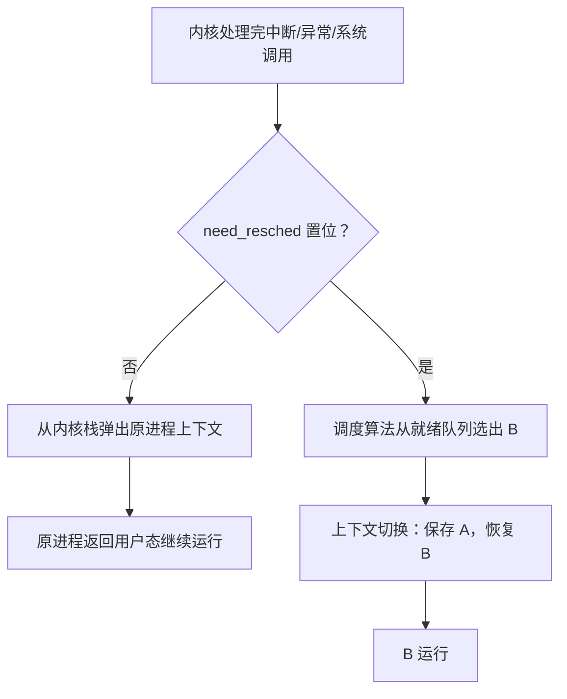

# 04 进程切换与上下文切换

[本讲目录](../index.md) · [课程目录](../../index.md) · [上一节：03 调度时机](03-scheduling-timing.md) · [下一节：05 调度目标与衡量指标](05-scheduling-goals-and-metrics.md)

> [!abstract] 本节要点
> - 调度时先根据 `need_resched` 一类标志决定**要不要换人**：不换人时原进程直接从内核栈恢复返回，不需要进程切换；换人时才用调度算法选新进程并做进程切换。
> - **进程切换**：一个进程让出处理器，由另一个进程占用处理器；具体做的是**上下文切换**。
> - 上下文是 PC、PSW、SP、通用寄存器、控制寄存器等硬件状态；运行时在 CPU 寄存器中，暂停而以后还要运行时保存在 PCB 中。
> - 上下文切换两部分：切换全局页目录（加载新地址空间）；切换内核栈和硬件上下文。步骤必须**先保存 A、再恢复 B**。
> - 开销分直接开销（保存恢复寄存器、切换地址空间的 CPU 时间）和间接开销（Cache、Buffer Cache、TLB 失效后由冷变热）。

## 是否换人与进程切换

到达调度时机后，调度要回答的第一个问题不是“选谁”，而是“要不要换人”。

准确的过程是：[^s3b5]

1. 内核根据一个**标志**决定要不要换人。这个标志就是 L03「07 Linux 系统调用执行」中读 Linux 系统调用代码时见过的 `need_resched`。
2. **不需要换人**：相当于“选中”了刚被暂停的那个进程，让它继续执行。这时**不需要进程切换**：它的上下文还完整地保存在它的内核栈里，直接弹栈、返回用户态即可。
3. **需要换人**：才调用调度算法从就绪队列中选出一个新进程，然后进行**进程切换**。

> [!warning] 易错点
> 常见表述“调度程序从就绪队列选择了要运行的进程，它可以是刚被暂停的进程，也可以是新进程”[^s2p11]不够准确：刚被暂停的进程并不在就绪队列里等着被选。是否换人由 `need_resched` 标志决定；保留原进程时既不经过调度算法，也不发生进程切换。[^s3b5]

**进程切换**（process switch）是指一个进程让出处理器，由另一个进程占用处理器的过程。[^s2p11] 只有真正换人时才发生进程切换。

## 上下文

**上下文**（context）是进程运行所需的 CPU 硬件状态。进程运行时，这些状态保存在 CPU 的寄存器中，包括：[^s2p12]

- 程序计数器（PC）；
- 程序状态寄存器（PSW，程序状态字）；
- 栈指针（SP）；
- 通用寄存器；
- 其他控制寄存器。

进程不运行时，这些寄存器的值保存在它的 **PCB** 中。这里的“不运行”指运行过程中因中断、时间片到、阻塞等原因暂停，但**以后还要继续运行**；进程如果已经结束退出，就不需要保存上下文了。[^s3b5]

把 CPU 的硬件状态从一个进程换到另一个进程的过程，称为**上下文切换**（context switch）。进程切换“A 换 B、B 换 A”，具体落实就是上下文切换。[^s2p12]

上下文切换主要包括两部分工作：[^s2p12]

1. **切换全局页目录**，以加载一个新的地址空间。只要换进程，地址空间就一定换，所以保存页表起始地址的页目录寄存器一定要换，这是重点。[^s3b5]
2. **切换内核栈和硬件上下文**。硬件上下文包括了内核执行新进程需要的全部信息，如 CPU 相关寄存器。

整个切换过程包括对原来运行进程各种状态的**保存**，和对新进程各种状态的**恢复**。

> [!note] 补充解释
> “全局页目录”就是进程页表的最顶层。CPU 用一个专门的寄存器保存当前页表的起始（物理）地址，在 x86 上是 CR3。把它改成新进程的页目录地址，之后的地址翻译就按新进程的页表进行，相当于换了一整个地址空间。

## 上下文切换的具体步骤

> [!info] 可视化资源
> - [OSTEP 第 6 章 Limited Direct Execution（PDF）](https://pages.cs.wisc.edu/~remzi/OSTEP/cpu-mechanisms.pdf)：Figure 6.3 用时间线展示时钟中断触发切换时硬件与操作系统各自保存、恢复哪些寄存器，Figure 6.4 是 xv6 的上下文切换代码。

“保存”和“恢复”要说清**从哪里到哪里**。进程 A 被暂停时，进入内核的过程已经把 A 的寄存器组（register file）压在 A 的内核栈里。如果要换成 B：[^s3b5][^s3b6]

- **保存**：把 A 的上下文保存到 A 的 PCB 中；
- **恢复**：把 B 的上下文从 B 的 PCB 中恢复到 CPU 寄存器；
- 然后内核把控制权交给 B。

场景：进程 A 下 CPU，进程 B 上 CPU。具体步骤如下：[^s2p13]

1. **保存进程 A 的上下文环境**：程序计数器、程序状态字、其他寄存器等。
2. **用新状态和其他相关信息更新进程 A 的 PCB**：例如 A 的状态由运行改为就绪或阻塞。
3. **把进程 A 移至合适的队列**：就绪队列、阻塞队列等。
4. **将进程 B 的状态设置为运行态。**
5. **从进程 B 的 PCB 中恢复上下文**：程序计数器、程序状态字、其他寄存器等。

顺序上必须**先保存、后恢复**。恢复 B 会覆盖寄存器，而且 B 的上下文一装入，下一个周期 CPU 就开始执行 B 的指令，A 的状态如果还没保存就永远丢失了。[^s3b5]

上下文切换代码与体系结构密切相关，要用汇编编写，代码不长但顺序很关键。[^s3b5] xv6 中对应的是 `kernel/swtch.S`，留到之后阅读源码时再讲。

> [!warning] 易错点
> - 不要把“进程切换”和“进入内核”混为一谈。每次中断都会进入内核、在内核栈中保存现场，但只有决定换人时才发生进程切换；不换人时只是从内核栈恢复返回。
> - 被保存的是**以后还要运行**的进程的上下文。退出的进程没有“以后”，不需要保存。

## 上下文切换的开销

**开销**（cost，也叫 overhead）在计算机里无非是 CPU 时间（指令、时钟周期）和空间。像上大学的生活费，除了吃饭等必需开支，还有通信、社交这些额外开支；进程上 CPU 运行所用的时间和空间是“正常该给的”，上下文切换则是额外的开销。如果每个进程运行完才换下一个，就几乎没有这笔开销；但为了提高整个系统的资源利用率，必须频繁切换，这笔开销就不可避免。[^s3b6]

开销分两类：[^s2p15]

1. **直接开销**：内核完成切换所用的 CPU 时间，包括：
   - 保存和恢复寄存器；
   - 切换地址空间（相关指令比较昂贵）。
2. **间接开销**：高速缓存（Cache）、缓冲区缓存（Buffer Cache）和 TLB（Translation Look-aside Buffer）失效。

间接开销容易被忽略。换了进程之后，原则上原来的 Cache 和 TLB 内容对新进程无用、要清空，这时它们是“冷”的（cold）：新进程开始运行时会连续 miss 一段时间，等内容慢慢填进去，才逐渐变“热”。频繁切换意味着经常处在这种冷启动状态。[^s3b6]

新的硬件技术可以减轻这一点：给 TLB 表项或 Cache 行加上进程标识（如 ASID，地址空间标识符），切换时不必清空。某个进程下次再上 CPU 时，它留下的表项还在，仍然能命中。[^s3b6]

> [!note] 补充解释
> Buffer Cache（缓冲区缓存）是操作系统在内存中缓存的磁盘块。它不像 TLB 那样随切换被清空，但新进程访问的是另一批文件和磁盘块，原进程留下的缓存内容对它用处不大，效果上同样是命中率下降。

> [!question]- 自测：进程 A 执行 `read` 系统调用，数据已在缓存中，内核直接完成并准备返回，`need_resched` 为 0。这次系统调用中发生了上下文切换吗？
> 没有。进入内核时 A 的寄存器被保存在 A 的内核栈中，返回时 `need_resched` 未置位，内核直接从内核栈恢复 A 的寄存器返回用户态，不选新进程，也不切换页目录和内核栈。

> [!question]- 自测：测得一次上下文切换的保存恢复只要很短时间，但进程 B 刚上 CPU 的一段时间里运行明显偏慢，原因是什么？怎样的硬件可以缓解？
> 这是间接开销：切换后 Cache 和 TLB 是冷的，B 开始时大量 miss，要等内容重新填入才变快。给 TLB 和 Cache 加进程标识（如 ASID），切换时不清空，B 再次上 CPU 时还能命中它之前留下的内容。

> [!info]- 来源
> - slides04.pdf：PDF p.11–13, 15
> - L06.docx：DOCX body 116–167

[^s3b5]: L06.docx-DOCX body 116-144
[^s2p11]: slides04.pdf-PDF p.11
[^s2p12]: slides04.pdf-PDF p.12
[^s3b6]: L06.docx-DOCX body 145-167
[^s2p13]: slides04.pdf-PDF p.13
[^s2p15]: slides04.pdf-PDF p.15

[本讲目录](../index.md) · [课程目录](../../index.md) · [上一节：03 调度时机](03-scheduling-timing.md) · [下一节：05 调度目标与衡量指标](05-scheduling-goals-and-metrics.md)
