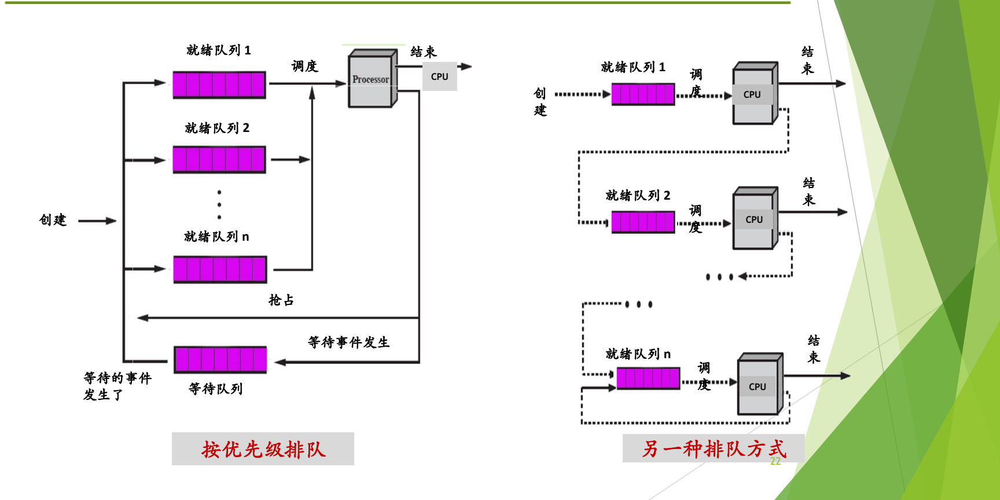
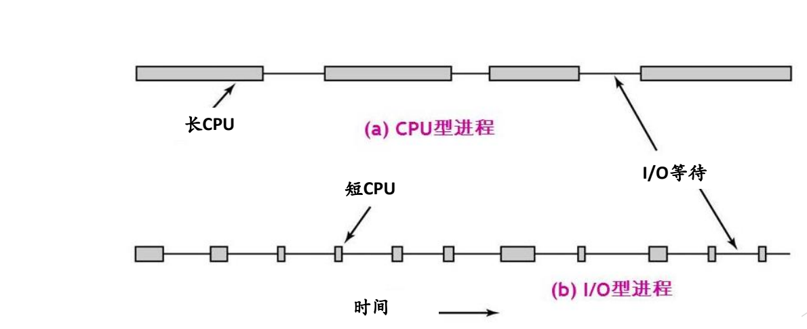

# 06 调度算法设计要点

[本讲目录](../index.md) · [课程目录](../../index.md) · [上一节：05 调度目标与衡量指标](05-scheduling-goals-and-metrics.md)

> [!abstract] 本节要点
> - 调度依据必须在 PCB 中有记录；记录什么取决于调度算法，例如 Windows 记录基本优先级和可变优先级两个字段。
> - **优先级**是重要/紧迫程度，**优先数**只是表示它的数字，数大是高还是低由系统规定；静态优先级创建后不变，动态优先级运行中可变。
> - 按优先级分多个就绪队列时，高级队列空了才调度下一级，低级进程可能**饥饿**；另一种排队让新进程都进第一级、用完时间片就降级，能区分进程行为，但同样会饥饿。
> - **可抢占式**：有更高优先级进程就绪时可强行剥夺当前进程的 CPU；**不可抢占式**：除非自身原因不能运行，否则一直运行。
> - 调度偏好 **I/O 密集型**进程；时间片要在切换开销和响应时间之间取舍，还要决定固定还是可变。

设计调度算法之前，有几个各算法共有的问题要先回答：[^s2p20]

1. 进程控制块 PCB 中需要记录哪些与 CPU 调度有关的信息？
2. 进程优先级及就绪队列的组织；
3. 抢占式调度与非抢占式调度；
4. I/O 密集型与 CPU 密集型进程；
5. 时间片大小的选择。

## PCB 中的调度信息与优先级

调度时考虑的因素必须能在 PCB 中找到数据，“巧妇难为无米之炊”：没有记录的信息，算法无从依据。所以设计算法时首先要决定 PCB 中记录哪些与 CPU 调度有关的信息。[^s3b7]

这个问题没有标准答案，记哪些信息与调度算法密切相关。最常见的是优先级：一般在 PCB 里给优先级一个字段。Windows 则给了两个：[^s3b7]

- **基本优先级**：进程创建时给定；
- **可变优先级**（当前优先级）：运行过程中可以被提升，也可以回落。

有两个字段，调度可依据的信息就更多。（Windows 线程调度的具体设计留到后续课程。）

**优先级**（priority）和**优先数**不是一回事：[^s2p21][^s3b7]

- **优先级**表示重要或紧迫的程度，与日常理解一致：优先级高的先处理，低的后处理。
- **优先数**是计算机中用来表示优先级的那个数字。数字大小与优先级高低的对应关系由系统规定，不是固定的。

日常生活中也有这种现象：运动员等级中一级最高，数越小级别越高；围棋段位中九段（以至十段）最高，数越大级别越高。

按优先级在运行过程中是否改变，分为：[^s2p21]

- **静态优先级**：进程创建时指定，运行过程中不再改变。
- **动态优先级**：进程创建时指定了一个优先级，运行过程中可以动态变化。例如等待时间较长的进程可提升其优先级。

两者也可以并存，像 Windows 那样一个字段不变、一个字段变。[^s3b7]

> [!warning] 易错点
> 看到“进程 P 的优先数是 1”，不能直接判断它优先级最高还是最低，要先看该系统规定的是“数小级高”还是“数大级高”。

## 就绪队列的组织

就绪队列排一个队还是多个队？多个队怎么排？不同系统有不同方案，实际系统选一种即可。下面是两种典型的组织方式。[^s2p22]

图：左侧按优先级设置多条就绪队列（就绪队列 1 到 $n$），调度时从高优先级队列选进程，被抢占的回到就绪队列、等待事件的进入等待队列；右侧是另一种排队方式，进程在一条队列执行完一次后转入下一条队列。

**按优先级排队**（左图）：设置就绪队列 1 到就绪队列 $n$，每个优先级一个队列，进程按自己的优先级进入对应队列。创建的进程按优先级进入某个就绪队列；被调度上 CPU 后，运行结束则离开，被抢占则回到就绪队列，等待某个事件则进入等待队列，等待的事件发生后再回到就绪队列。[^s2p22]

假设队列 1 的优先级最高。调度总是先从最高级开始，队列 1 空了才调度队列 2，依此类推。这个结构天然带来一个问题：如果队列 1、2、3 源源不断地有新进程到来，队列 $n$ 中的进程就可能长期得不到调度，即**饥饿**（starvation）。这正是前面大模型推理调度中提到的饥饿问题，ICS 中也学过这一概念。[^s3b7]

**另一种排队方式**（右图）：[^s3b8]

1. 所有新创建的进程都进入**第一级**就绪队列，一视同仁，都给最高优先级；
2. 进程被调度运行后，若运行结束就离开；若运行完一个时间片还没结束，就**降一级**，进入下一级队列；
3. 每被调度一次、用完一个时间片，就再降一级，越降越低，直到最低一级（第 $n$ 级）在本级内循环。

这种排队给出两个信息：一是它**也会出现饥饿**，低级队列中的进程可能长期轮不到；二是它能把进程的类型、**行为**（behavior）区分出来。这一队列和与之对应的调度框架是后面的重点。[^s3b8]

> [!note] 补充解释
> “能区分行为”的原因：降级只发生在用完一个时间片之后。经常用完时间片的计算型进程会不断降级；时间片没用完就去做 I/O 的进程很少被降级，倾向于留在较高级别。这种调度框架通常称为多级反馈队列（multilevel feedback queue），具体算法在后续课程讲。

> [!tip] 课堂强调
> 右图的排队方式和与之对应的调度框架“是个重点”，后续讲具体调度算法时会展开。[^s3b8]

## 抢占式与非抢占式

**抢占与非抢占**说的是进程占用 CPU 的方式：[^s2p23]

- **可抢占式**（Preemptive，也叫可剥夺式）：当有比正在运行的进程优先级更高的进程就绪时，系统可强行剥夺正在运行进程的 CPU，提供给具有更高优先级的进程使用。
- **不可抢占式**（Non-preemptive，也叫不可剥夺式）：某一进程被调度运行后，除非由于它自身的原因不能运行，否则一直运行下去。

抢占式和非抢占式是加在调度算法前面的**前缀**，与具体算法组合成新的算法，例如“基于优先级的抢占式调度”和“基于优先级的非抢占式调度”。

> [!tip] 课堂强调
> 抢占式和非抢占式调度是调度算法中特别重要的一个概念，要真正理解它们是怎样实现的；真正理解了前面讲的调度时机，就能理解它。[^s3b3]

可抢占是怎样实现的？它完全建立在前面的机制上：事件发生→进入内核处理→处理完后在返回用户态前调度。在可抢占的调度下，如果处理事件后出现了优先级更高的就绪进程，内核就设置重新调度标志（`need_resched`），在出口处换人。**机制**（中断/异常处理与统一的调度出口）保证了这一点，**策略**是在合适的条件下设置该标志。[^s3b9]

> [!example] 例：抢占的条件与“自身原因”
> 题目：① 在什么情况下，会出现“比正在运行进程优先级更高的进程就绪”？写出两个条件。② 不可抢占式中“由于它自身的原因不能运行”，有哪些原因？
>
> 思路：答案都在[调度时机](03-scheduling-timing.md)的 7 种时机里。①找“让就绪队列格局变化、可能出现新的高优先级进程”的时机；②找“当前进程自己导致 CPU 空出”的时机。
>
> 1. **第①问条件一：创建了新进程。** 正在运行的父进程执行 `fork` 创建子进程，并赋予子进程比自己更高的优先级。`fork` 处理完、返回用户态前，就绪队列里出现了比当前进程更高的进程。[^s3b9]
> 2. **第①问条件二：阻塞进程被唤醒。** 某个高优先级进程原先因 `read` 等待磁盘而阻塞；磁盘中断表示读操作完成，内核把它唤醒回到就绪。中断处理完时，它的优先级高于正在运行的进程。[^s3b9]
>
>    在这两种情况下，可抢占式系统设置 `need_resched`，在返回用户态前把当前进程换下；不可抢占式系统则不换，让当前进程继续运行。
> 3. **第②问，自身原因不能运行**：进程执行完毕并退出；进程因错误或异常而终止；进程要等待 I/O 操作或其他资源而进入阻塞态；进程主动放弃 CPU（如 `yield`）。在不可抢占式调度下，只有这些情况会让当前进程下 CPU。

> [!warning] 易错点
> 用 Ctrl+C 或 `kill` 结束一个进程，与抢占无关。Ctrl+C 首先是一个中断，由内核的中断处理程序给目标进程发信号；`kill`（如 `kill -9`）是系统调用，由内核给目标进程设置信号。两条途径进入内核的方式不同，最终都是内核给进程发信号。[^s3b9]

## I/O 密集型与 CPU 密集型进程

调度选人的基本原则应该是公平，大家的机会一样。Linux 此前版本的调度算法 CFS 的核心就是“完全公平”（具体算法留到后续课程）。但任何调度算法都有一些**倾向**或偏好。[^s3b8] 最常讨论的偏好是针对进程行为的。按进程执行过程中的行为，可以把进程分为两类：[^s2p24]

- **I/O 密集型**（I/O-bound，也叫 I/O 型）：频繁地进行 I/O，通常会花费很多时间等待 I/O 操作的完成。
- **CPU 密集型**（CPU-bound，也叫 CPU 型、计算密集型）：需要大量的 CPU 时间进行计算。

图：CPU 密集型进程（a）的 CPU 执行段长、I/O 等待少；I/O 密集型进程（b）的 CPU 执行段很短，大部分时间在等待 I/O 完成。

图中的时间轴把进程的执行画成交替的 CPU 运行段（方块）和 I/O 等待段（细线）：(a) CPU 型进程的 CPU 运行段很长，I/O 等待较少；(b) I/O 型进程的 CPU 运行段很短，频繁进入 I/O 等待。未来对 I/O 密集型进程的调度处理更重要。[^s2p24]

调度算法通常**偏好 I/O 密集型进程**，理由有两个：[^s3b8]

1. **提高所有资源的利用率。** 计算机里的资源不止 CPU，还有各种设备，系统的总体目标是让各种资源的利用率都提高。只顾 CPU，CPU 利用率虽然高，其他设备可能闲着。I/O 型进程上 CPU 一会儿就去做 I/O，既把 CPU 让给别人，又让设备忙起来。
2. **它没用完自己的时间片。** 按时间片分配运行时间时，I/O 型进程往往只用了时间片的 20%~30% 就去做 I/O 了，剩下的没用。它回来排队时，调度算法“有点亏欠它”，应该让它尽快上 CPU。

后面所有的调度算法都把这一点作为重要的考虑。

## 时间片的选择

**时间片**（time slice 或 quantum）是分配给调度上 CPU 的进程的一个时间段，确定了允许该进程在 CPU 上（连续）运行的最长时间。[^s2p25]

选择时间片时要考虑的因素很多：[^s2p25]

- 进程切换的开销；
- 对响应时间的要求；
- 就绪进程个数；
- CPU 能力；
- 进程的行为。

因素太多，实际中通常先用经验值，再调参数。[^s3b8] 设计时要回答两个问题：

1. **时间片长一点还是短一点？** 时间片越短，切换越频繁，[上下文切换的开销](04-process-switch-and-context-switch.md)越大。就像在大学里换宿舍：四年住一间、每年换一次、每学期换一次，直到每周换一次，越频繁越烦。时间片太长，等待中的进程又迟迟得不到回应，影响响应时间。
2. **时间片固定还是可变？** 每个进程的时间片都一样，还是有的长、有的短。

时间片取值与具体算法的详细讨论留到下一次课。[^s3b8]

> [!question]- 自测：在“新进程进第一级、用完时间片降一级”的排队方式中，一个每次只用时间片 20% 就去做 I/O 的进程，和一个一直在计算的进程，分别会停在哪里？
> I/O 型进程每次都没用完时间片就主动让出 CPU，不会被降级，倾向于留在较高级别的队列；计算型进程每次都用完时间片，会被一级级降到低级队列。所以这种排队能把进程行为区分出来，同时也说明低级队列中的进程可能饥饿。

> [!question]- 自测：某系统采用“基于优先级的非抢占式”调度。低优先级进程 L 正在运行，此时高优先级进程 H 因磁盘读完成被唤醒。H 什么时候能上 CPU？如果改为抢占式呢？
> 非抢占式下，H 只是进入就绪队列，L 继续运行，直到 L 因自身原因（退出、出错、阻塞或主动让出）下 CPU，H 才可能被选中。抢占式下，磁盘中断处理完后内核发现 H 优先级更高，设置 `need_resched`，在返回用户态前就把 L 换下、让 H 运行。

> [!info]- 来源
> - slides04.pdf：PDF p.20–25
> - L06.docx：DOCX body 58–88, 168–254

[^s2p20]: slides04.pdf-PDF p.20
[^s3b7]: L06.docx-DOCX body 168-196
[^s2p21]: slides04.pdf-PDF p.21
[^s2p22]: slides04.pdf-PDF p.22
[^s3b8]: L06.docx-DOCX body 197-239
[^s2p23]: slides04.pdf-PDF p.23
[^s3b3]: L06.docx-DOCX body 58-88
[^s3b9]: L06.docx-DOCX body 240-254
[^s2p24]: slides04.pdf-PDF p.24
[^s2p25]: slides04.pdf-PDF p.25

[本讲目录](../index.md) · [课程目录](../../index.md) · [上一节：05 调度目标与衡量指标](05-scheduling-goals-and-metrics.md)
