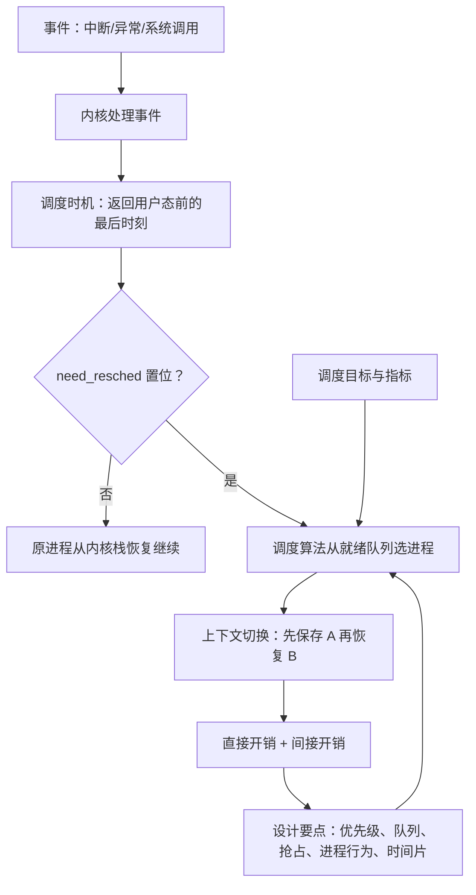

# L06 处理器调度基础

[课程目录](../index.md)

多个进程竞争有限且可被抢占的 CPU，操作系统必须决定谁上 CPU、何时换人、换人代价多大，这就是处理器调度要解决的问题。本讲先说明调度的意义与提纲，再在七状态模型上分出长程、中程、短程三层调度并聚焦处理器调度，接着依次讲调度时机（When）、进程切换与上下文切换（How），最后给出不同系统的调度目标、衡量指标和设计调度算法时的共性问题，为后续具体算法铺路。阅读前需要掌握 L03 的中断/异常/系统调用处理流程，以及 L04、L05 的进程状态模型、PCB 和进程队列。

## 章节导航

- [01 为什么需要调度](chapters/01-why-scheduling.md)：多进程竞争可抢占的 CPU，引出 When/How/What
- [02 调度层次与处理器调度](chapters/02-scheduling-levels-and-processor-scheduling.md)：长程/中程/短程三层调度，短程即处理器调度
- [03 调度时机](chapters/03-scheduling-timing.md)：调度时机：处理完事件、返回用户态前的最后时刻
- [04 进程切换与上下文切换](chapters/04-process-switch-and-context-switch.md)：need_resched 决定是否换人，先保存后恢复上下文
- [05 调度目标与衡量指标](chapters/05-scheduling-goals-and-metrics.md)：三类系统目标不同；吞吐量、周转与响应时间
- [06 调度算法设计要点](chapters/06-scheduling-design-issues.md)：优先级、队列组织、抢占、进程行为与时间片

## 本讲小结

三个问题串起全讲：事件触发调度时机（When），出口处由标志决定是否换人并完成上下文切换（How），选谁则由服务于系统目标的调度算法决定（What）。

### 核心公式

| 指标 | 定义 | 公式 |
| --- | --- | --- |
| 吞吐量 | 单位时间完成的进程数 | ${\rm Throughput} = \frac{n}{T}$ |
| 周转时间 | 从提出请求到运行完成 | $TT = t_{\rm finish} - t_{\rm submit}$ |
| 响应时间 | 从提出请求到第一次回应 | $RT = t_{\rm first} - t_{\rm submit}$ |
| CPU 利用率 | CPU 做有效工作的时间比例 | $\frac{T_{\rm busy}}{T}$ |

## 不确定事项

- s2p18 的用户/系统角度表格是对照联系图核实的（文字提取顺序是乱的），但格子之间的对应只能从缩略图上读出
- 课后答疑（s3b9）中“Ctrl+C 首先是中断、kill 是系统调用，最终都由内核发信号”是老师口头的说法，老师自己也建议查代码确认；ASR 质量差
- 大模型推理调度和资源池化层次表只有老师口述（ASR 中的“ALL”推测为 vLLM），提供的讲义中没有对应的页
- s2p14（xv6 swtch.S）和 s2p26-139 属于 pending，没有为它们写内容

> [!info]- 来源
> - slides04.pdf：PDF p.1–13, 15–25
> - L06.docx：DOCX body 1–254
